# Cirne Rotas — Documento de Arquitetura Fullstack

**Versão:** 1.0 — desenho técnico consolidado em 09/09/2026. **Estado:** pronto para detalhamento das stories de fundação; execução e piloto ainda dependem dos gates indicados na seção 20. Decisões técnicas tomadas autonomamente por autorização do usuário; não representam resultados de testes nem autorização de custos.

## 1. Introdução

Este documento define a arquitetura fullstack unificada do Cirne Rotas, cobrindo frontend, backend, dados, segurança, operação offline, infraestrutura e integração entre as camadas. Ele será a fonte técnica de verdade para o desenvolvimento orientado por stories, derivada do PRD v0.3 e das referências visuais existentes.

A arquitetura respeita a prioridade constitucional **CLI → Observabilidade → UI**. As capacidades críticas deverão ser operáveis e verificáveis por CLI antes de dependerem exclusivamente das interfaces do Vendedor, Gestor ou Administrador.

### 1.1 Estado inicial e fontes

- **Tipo de projeto:** greenfield.
- **Código e repositório:** ainda não existem aplicação ou repositório Git inicializados.
- **Starter existente:** N/A — greenfield project.
- **Fontes:** `Docs/prd.md`, `Docs/BRIEFING_MESTRE_Cirne_Rotas_v0.1.docx`, `Docs/Cirne_Rotas_Apresentacao_Executiva_v0.3.pptx` e `Docs/PACOTE_VISUAL_Cirne_Rotas_v0.1/`.
- **Especificação UX:** `front-end-spec.md` ainda não existe; decisões `UX-A*` permanecem explícitas e não serão promovidas a requisitos confirmados pela arquitetura.

### 1.2 Direção de starter

A base é o starter oficial do Next.js com TypeScript e App Router, adaptado ao monorepo da seção 12. As ferramentas e versões de referência estão na seção 3; compatibilidade integrada deverá ser comprovada pela story de fundação.

### 1.3 Limites de autoridade

Este documento resolve e registra decisões de arquitetura, mas não autoriza implementação, deploy, uso de dados reais ou alteração do n8n existente. Gates de negócio, privacidade, dados, infraestrutura e stories continuam obrigatórios nos pontos definidos pelo PRD.

### 1.4 Change Log

| Data | Versão | Descrição | Autor |
| --- | --- | --- | --- |
| 09/09/2026 | 0.1 | Criação da arquitetura e aprovação da introdução. | Aria (Architect) |
| 09/09/2026 | 0.2 | Definição da arquitetura de alto nível com desenvolvimento local e destino em VPS separada. | Aria (Architect) |
| 09/09/2026 | 1.0 | Consolidação técnica autônoma: seções 3–20, implantação, segurança, desempenho, testes, padrões, erros, observabilidade e revisão de consistência. | Aria; revisão de dados por Dara |

## 2. Arquitetura de alto nível

### 2.1 Resumo técnico

O Cirne Rotas será um **monólito modular**, composto por uma PWA Next.js e serviços gerenciados do Supabase. O navegador manterá rota, visita, anexos pendentes e fila de sincronização em armazenamento local durável. Operações críticas serão processadas por uma camada BFF fina e transações PostgreSQL idempotentes. Supabase fornecerá autenticação, PostgreSQL, autorização por RLS e armazenamento privado. Não haverá microserviços, servidor permanente adicional ou dependência do n8n.

O computador local será usado para desenvolvimento e testes. A aplicação será empacotada desde o início para que o mesmo artefato executável seja promovido posteriormente para uma VPS separada, sem depender de arquivos ou configurações exclusivos da máquina de desenvolvimento.

### 2.2 Plataforma e infraestrutura

**Plataforma de desenvolvimento:** computador local, com runtime e dependências isolados por containers quando aplicável.

**Plataforma-alvo do piloto:** VPS separada e independente da infraestrutura do n8n.

**Serviços principais:**

- Next.js/PWA e BFF executados na máquina local durante o desenvolvimento e em container na VPS durante homologação/piloto;
- Supabase local para testes de integração e Supabase Cloud para ambientes remotos aprovados;
- PostgreSQL, Auth, RLS e Storage privado fornecidos pelo Supabase;
- reverse proxy com HTTPS na VPS;
- GitHub como fonte de verdade do código e das migrações;
- CLI operacional para migrações, importação, diagnóstico, sincronização, backup e restauração.

**Região remota recomendada:** São Paulo para os serviços que permitirem seleção regional, condicionada à disponibilidade e validação de custo no momento do provisionamento.

### 2.3 Resolução do TA-01

O backend do MVP será **Supabase-first com BFF fino em Next.js**. Adaptadores do servidor poderão usar a Data API do Supabase sob o contexto do chamador e RLS; a PWA usa o BFF para dados de negócio, além dos fluxos diretos e restritos de Auth/Storage. Comandos transacionais, privilegiados ou que exijam resposta canônica passarão pelo BFF e por funções transacionais no PostgreSQL.

NestJS fica fora do runtime do MVP. As regras de domínio e contratos permanecerão independentes de framework para permitir extração futura caso escala ou integrações posteriores justifiquem um backend dedicado.

### 2.4 Portabilidade local para VPS

- A configuração varia apenas por variáveis de ambiente validadas; não haverá URLs, credenciais ou caminhos absolutos no código.
- O build de produção será reproduzível e executará a mesma imagem na homologação e no piloto.
- O container da aplicação será stateless; banco e evidências não serão gravados no filesystem efêmero da aplicação.
- Migrações serão versionadas e aplicadas pela CLI. Dados sintéticos locais não serão promovidos para o ambiente do piloto.
- Testes em celular físico exigirão acesso HTTPS ao ambiente de desenvolvimento ou homologação para validar instalação PWA, câmera, GPS e Service Worker.
- Backup, logs, segredos, rede e processos do Cirne Rotas serão independentes do n8n.

### 2.5 Estrutura do repositório

**Estrutura:** monorepo.

**Ferramenta inicial:** npm workspaces, sem orquestrador adicional no MVP.

**Organização conceitual:**

- `apps/web`: PWA, painel e BFF Next.js;
- `apps/cli`: comandos operacionais e diagnósticos;
- `packages/domain`: regras e estados de negócio independentes de infraestrutura;
- `packages/contracts`: schemas e tipos compartilhados;
- `packages/config`: configuração tipada e validada;
- `supabase`: migrações, seeds, políticas, testes de banco e funções SQL;
- `tests`: integração, E2E, offline e restauração;
- `infrastructure`: empacotamento e configuração declarativa da VPS.

### 2.6 Diagrama de alto nível

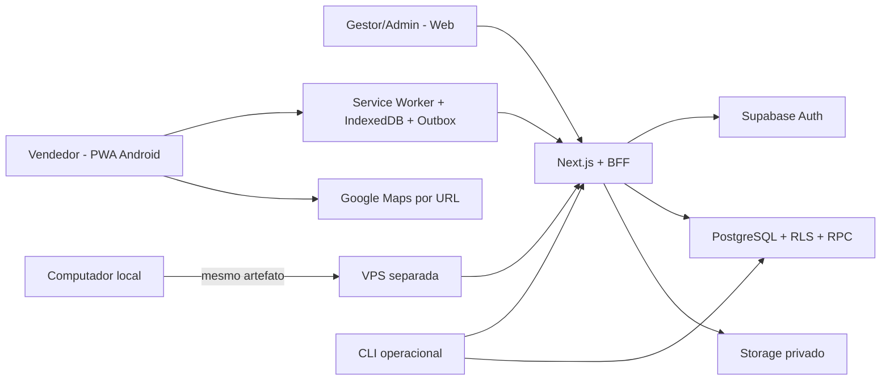

### 2.7 Padrões arquiteturais

- **Monólito modular:** uma unidade de deploy com módulos de domínio explícitos.
- **Offline-first com outbox:** eventos locais duráveis são enviados e confirmados individualmente.
- **Idempotência no servidor:** chaves únicas retornam o resultado canônico de tentativas anteriores.
- **RLS como barreira obrigatória:** autorização não depende apenas da interface ou do BFF.
- **BFF fino:** concentra comandos privilegiados ou transacionais sem duplicar toda a camada de dados.
- **Upload direto para Storage privado:** evita transportar a gravação da fotografia pelo processo da aplicação; a confirmação faz somente a leitura transitória e limitada descrita na seção 15.4.
- **CLI-first:** operações críticas permanecem reproduzíveis e observáveis sem depender da UI.
- **Complexidade progressiva:** filas externas, cache distribuído, microserviços e NestJS não entram no MVP sem requisito e evidência.

### 2.8 Decisão de hospedagem e impacto no PRD

A hospedagem do piloto em VPS substitui a direção de Vercel registrada em `DEC-012` e `NFR-016`. A alteração precisa passar pelo controle de mudança do PRD e pela aprovação do negócio antes do primeiro deploy remoto. A VPS existente do n8n não será usada, pois uma falha ou reinicialização do host compartilhado violaria o requisito de isolamento absoluto.

## 3. Stack tecnológica

As versões abaixo foram consultadas em 09/09/2026 e são referências a fixar no `package-lock.json`. Consulta individual de versão não prova compatibilidade entre todas as bibliotecas; a combinação, licenças, manutenção e vulnerabilidades serão conferidas no bootstrap. Atualizações posteriores exigem story e validação dos quality gates.

| Categoria | Tecnologia | Versão | Finalidade |
| --- | --- | ---: | --- |
| Runtime | Node.js LTS | 24.19.0 | Execução local, CLI, build e servidor Next.js |
| Linguagem | TypeScript | 7.0.2 | Tipagem estrita compartilhada |
| Frontend/BFF | Next.js App Router | 16.3.4 | PWA, painel, SSR e Route Handlers |
| UI | React | 19.2.8 | Componentes e fluxos interativos |
| Componentes | shadcn/ui | 4.21.0 | Base acessível customizável com identidade Cirne |
| CSS | Tailwind CSS | 4.3.3 | Design responsivo e tokens visuais |
| Formulários | React Hook Form | 7.87.0 | Formulários de campo com baixo custo de renderização |
| Validação | Zod | 4.5.4 | Contratos compartilhados e validação em runtime |
| Estado remoto | TanStack Query | 5.102.8 | Consultas, invalidação e recuperação |
| Estado transitório | Zustand | 5.0.15 | Navegação e interface |
| Persistência offline | Dexie/IndexedDB | 4.4.5 | Rascunhos, outbox, anexos e confirmação local |
| Service Worker | Serwist | 9.5.12 | Cache versionado e experiência offline |
| API | REST/JSON + OpenAPI | 3.1.1 | Contrato estável para PWA e CLI |
| Banco | PostgreSQL | 17 | Dados relacionais, transações e idempotência |
| Plataforma de dados | Supabase | Gerenciada | PostgreSQL, Auth, RLS, Storage e Data API |
| Cliente Supabase | `@supabase/supabase-js` | 2.116.0 | Acesso tipado aos serviços |
| Integração SSR | `@supabase/ssr` | 0.12.7 | Sessão segura no Next.js |
| Supabase CLI | `supabase` | 2.117.0 | Ambiente local, migrações, tipos e testes |
| Testes unitários | Vitest | 5.0.0 | Domínio, validações e componentes |
| Testes de componentes | Testing Library | 16.3.3 | Comportamento da interface |
| Testes de banco/RLS | pgTAP via Supabase CLI | CLI 2.117.0 | Políticas, funções e invariantes |
| Testes E2E | Playwright | 1.63.0 | Jornadas online, offline e permissões |
| Acessibilidade | axe-core Playwright | 4.13.0 | Verificação automatizada |
| Logs | Pino | 10.3.1 | Logs JSON correlacionáveis |
| Monorepo | npm workspaces | npm 11.17.0 | Dependências e scripts compartilhados |
| Container local | Rancher Desktop | 1.24.0 | Docker API/Compose no Windows |
| Infraestrutura | Docker Compose | 5.5.1 | Mesmo artefato local e na VPS; validar integração com runtime local |
| CI/CD | GitHub Actions | Serviço gerenciado | Quality gates, imagem e deploy |
| Reverse proxy | Caddy | 2.11.4 | HTTPS e encaminhamento; imagem fixada por digest no bootstrap |

### 3.1 Decisões da stack

- **Sem Prisma:** migrações SQL e tipos gerados pelo Supabase serão a fonte de verdade, evitando modelos de schema concorrentes.
- **Sem Redis no MVP:** uma única instância da aplicação e o volume esperado não justificam cache distribuído.
- **Sem NestJS:** Route Handlers e funções PostgreSQL cobrem o backend previsto.
- **Sem banco na VPS:** a VPS hospeda a aplicação; o Supabase Cloud preserva dados, autenticação e arquivos.
- **Rancher Desktop local:** runtime compatível com Docker APIs e Supabase, sem depender do licenciamento do Docker Desktop.
- **Versões exatas:** o lockfile e as imagens fixadas controlam reprodutibilidade; dependências não usam `latest` em CI ou produção.

### 3.2 Pré-requisitos locais

A máquina de desenvolvimento possui capacidade adequada, mas ainda precisa de WSL2 e Rancher Desktop. A stack local do Supabase será vinculada a `127.0.0.1`, utilizará apenas dados sintéticos e nunca será exposta à internet.

## 4. Modelo conceitual compartilhado

O modelo cobre as entidades funcionais definidas no PRD e explicita contratos técnicos de suporte para sincronização e auditoria. Esta seção define a visão compartilhada; tabelas, índices e políticas RLS são concretizados na seção 9.

### 4.1 Tipos fundamentais

```typescript
type EntityId = string
type ISODate = string
type ISODateTime = string
type DecimalString = string
type MoneyBRL = DecimalString
type WeightKg = DecimalString

type RoleCode = 'seller' | 'manager' | 'administrator'
type RecordStatus = 'active' | 'inactive'
type SyncStatus =
  | 'saved_on_device'
  | 'syncing'
  | 'synced'
  | 'recoverable_error'
  | 'action_required'
```

Valores monetários e pesos atravessam API e armazenamento local como strings decimais, evitando perda de precisão por ponto flutuante.

### 4.2 Identidade e clientes

```typescript
interface User {
  id: EntityId
  authUserId: EntityId
  name: string
  roles: RoleCode[]
  scopeIds: EntityId[]
  status: RecordStatus
}

interface Role {
  code: RoleCode
  permissions: string[]
}

interface Client {
  id: EntityId
  externalReference?: string
  name: string
  address: string
  latitude?: DecimalString
  longitude?: DecimalString
  portfolioReference?: string
  status: RecordStatus
}
```

### 4.3 Rotas e visitas

```typescript
interface Route {
  id: EntityId
  date: ISODate
  sellerId: EntityId
  version: number
  status: 'draft' | 'published' | 'in_progress' | 'closed' | 'cancelled'
  publishedBy?: EntityId
  publishedAt?: ISODateTime
}

interface RouteStop {
  id: EntityId
  routeId: EntityId
  clientId: EntityId
  plannedOrder: number
  executionOrder: number
  priority: number
  status: 'pending' | 'in_visit' | 'completed' | 'not_visited'
  nonVisitReasonId?: EntityId
}

interface Visit {
  id: EntityId
  offlineId: string
  deviceId: string
  routeStopId: EntityId
  routeVersion: number
  clientId: EntityId
  sellerId: EntityId
  parameterSetId: EntityId
  status:
    | 'local_draft'
    | 'in_progress'
    | 'completed_locally'
    | 'synced'
    | 'pending_validation'
  syncStatus: SyncStatus
  deviceStartedAt: ISODateTime
  serverStartedAt?: ISODateTime
  deviceCompletedAt?: ISODateTime
  serverCompletedAt?: ISODateTime
  competitorPriceUnavailableReasonId?: EntityId
}
```

### 4.4 Conteúdo da visita

```typescript
interface LocationEvent {
  id: EntityId
  visitId: EntityId
  kind: 'start' | 'completion'
  deviceCapturedAt: ISODateTime
  serverReceivedAt?: ISODateTime
  latitude?: DecimalString
  longitude?: DecimalString
  accuracyMeters?: DecimalString
  distanceMeters?: DecimalString
  exceptionReason?: string
}

interface StockSnapshot {
  id: EntityId
  visitId: EntityId
  heliarQuantity: number
  mouraQuantity: number
  observation?: string
}

interface CompetitorPrice {
  id: EntityId
  visitId: EntityId
  competitorId: EntityId
  modelOrAmperage: string
  technologyId: EntityId
  priceBRL: MoneyBRL
  conditionId: EntityId
  observation?: string
}

interface CompetitorAction {
  id: EntityId
  visitId: EntityId
  identified: boolean
  competitorId?: EntityId
  actionTypeId?: EntityId
  description?: string
  validUntil?: ISODate
  observation?: string
}

interface ScrapReport {
  id: EntityId
  visitId: EntityId
  declaredNone: boolean
}

interface ScrapCollection {
  id: EntityId
  scrapReportId: EntityId
  actualWeightKg: WeightKg
  collectedAt: ISODateTime
  receiptNumber: string
  collectorId: EntityId
}

interface PickupSchedule {
  id: EntityId
  scrapReportId: EntityId
  clientId: EntityId
  sellerId: EntityId
  estimatedWeightKg: WeightKg
  desiredDate: ISODate
  requestedAt: ISODateTime
  address: string
  status: 'pending' | 'confirmed' | 'completed' | 'cancelled'
}

interface VisitResult {
  id: EntityId
  visitId: EntityId
  resultTypeId: EntityId
  orderReference?: string
  noOrderReasonId?: EntityId
  opportunity?: string
  nextStep?: string
  followUpAt?: ISODateTime
  observation?: string
}
```

Campos condicionais permanecem opcionais no contrato-base, mas serão exigidos por schemas discriminados conforme a resposta selecionada.

### 4.5 Evidências, sincronização e auditoria

```typescript
interface Attachment {
  id: EntityId
  offlineId: string
  targetType: 'visit' | 'location' | 'competitor_action' | 'scrap'
  targetId: EntityId
  storagePath?: string
  contentType: string
  byteSize: number
  checksum: string
  syncStatus: SyncStatus
  capturedAt: ISODateTime
}

interface SyncEvent {
  id: EntityId
  deviceId: string
  idempotencyKey: string
  operation: string
  schemaVersion: number
  sequence: number
  aggregateType: string
  aggregateId: EntityId
  payload: unknown
  payloadHash?: string
  status:
    | 'pending'
    | 'sending'
    | 'confirmed'
    | 'recoverable_error'
    | 'action_required'
  attemptCount: number
  lastErrorCode?: string
  confirmedAt?: ISODateTime
}

interface AuditEvent {
  id: EntityId
  actorId: EntityId
  targetType: string
  targetId: EntityId
  action: string
  before?: Record<string, unknown>
  after?: Record<string, unknown>
  reason?: string
  origin: 'web' | 'pwa' | 'cli' | 'system'
  occurredAt: ISODateTime
}
```

### 4.6 Parâmetros e importação

```typescript
interface ParameterSet {
  id: EntityId
  version: number
  status: 'draft' | 'active' | 'retired'
  validFrom: ISODateTime
  values: Record<string, readonly ParameterValue[]>
}

interface ParameterValue {
  id: EntityId
  code: string
  label: string
  active: boolean
}

interface ImportBatch {
  id: EntityId
  sourceName: string
  sourceChecksum: string
  importedBy: EntityId
  importedAt: ISODateTime
  acceptedCount: number
  rejectedCount: number
  status: 'validating' | 'accepted' | 'partially_accepted' | 'rejected'
}
```

### 4.7 Agregado de sincronização

```typescript
interface VisitSyncAggregate {
  visit: Visit
  locations: LocationEvent[]
  stock: StockSnapshot
  competitorPrices: CompetitorPrice[]
  competitorActions: CompetitorAction[]
  scrapReport: ScrapReport
  scrapCollections: ScrapCollection[]
  pickupSchedules: PickupSchedule[]
  result: VisitResult
  attachments: Attachment[]
}
```

### 4.8 Relações

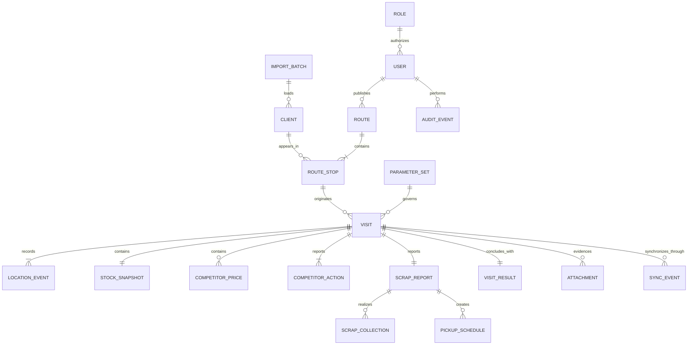

### 4.9 Gates preservados

- `DATA-01`: visitas distintas para a mesma parada não serão mescladas automaticamente.
- `DATA-02`: horários do aparelho e servidor serão preservados; a tolerância continua aberta.
- `DATA-03`: resolvido tecnicamente por versão otimista do agregado, conflito 409 e histórico aditivo (seções 9.11 e 11.9).
- `DATA-04`: resolvido tecnicamente pelo snapshot publicado e copiado à visita, definido na seção 9.11.
- `DATA-05`: anonimização e descarte dependem da política LGPD.
- `AB-04`: o modelo aceita múltiplas coletas e agendas vinculadas a uma única resposta de sucata; a interface pode continuar mutuamente exclusiva.
- `AB-08`: somente o estado `pending` da agenda está garantido no piloto.

A visita é o agregado transacional central, enquanto sincronização e auditoria permanecem fatos independentes. Metadados de anexos ficam separados dos bytes armazenados no Storage. Taxonomias são referenciadas por identificador e versão para impedir que alterações futuras reescrevam visitas antigas.

## 5. Especificação da API

### 5.1 Convenções

- Base: `/api/v1`.
- Formato: JSON sobre HTTPS.
- Contrato: OpenAPI 3.1.1.
- Autenticação: JWT emitido pelo Supabase Auth.
- Web: sessão protegida em cookie seguro.
- CLI: `Authorization: Bearer <token>`.
- Identificadores offline: gerados no aparelho e preservados pelo servidor.
- Comandos reenviáveis individuais: exigem `Idempotency-Key`; em `/sync/batches`, cada evento leva sua própria `idempotencyKey`.
- Datas e horários: ISO 8601 com fuso.
- Dinheiro e pesos: strings decimais.
- Paginação: cursor opaco.
- Escritas administrativas concorrentes: versão esperada; conflito retorna `409`.

### 5.2 Superfície da API

| Método e rota | Papel | Finalidade |
| --- | --- | --- |
| `GET /health/live` | Público limitado | Confirmar processo ativo |
| `GET /health/ready` | Operação | Verificar aplicação e dependências |
| `GET /me` | Todos | Perfil, papéis, capacidades, escopo e situação |
| `GET /me/routes/today` | Vendedor | Carregar rota e versão atuais |
| `GET /clients` | Gestor/Admin | Consultar clientes autorizados |
| `PATCH /clients/{id}` | Admin | Correção auditada de cliente |
| `POST /client-imports/validate` | Admin | Validar arquivo sem persistir |
| `POST /client-imports` | Admin | Executar importação controlada |
| `GET /client-imports/{id}` | Admin | Resultado e rejeições do lote |
| `POST /routes` | Gestor | Criar rota em rascunho |
| `GET /routes/{id}` | Gestor/Vendedor autorizado | Consultar rota e versão |
| `PATCH /routes/{id}` | Gestor | Alterar rascunho com controle de versão |
| `POST /routes/{id}/publish` | Gestor | Publicar nova versão |
| `PUT /routes/{id}/execution-order` | Vendedor | Reordenar execução sem mudar composição |
| `POST /route-stops/{id}/non-visit` | Vendedor | Registrar parada não visitada |
| `POST /visits` | Vendedor | Iniciar ou reconhecer visita pelo ID offline |
| `PUT /visits/{offlineId}/sections/{section}` | Vendedor | Salvar etapa de forma idempotente |
| `POST /visits/{offlineId}/complete` | Vendedor | Validar e concluir no servidor |
| `POST /sync/batches` | Vendedor | Sincronizar eventos locais ordenados |
| `POST /attachments/upload-intents` | Vendedor | Autorizar upload direto ao Storage privado |
| `POST /attachments/{offlineId}/confirm` | Vendedor | Confirmar arquivo enviado e checksum |
| `GET /attachments/{id}/download-url` | Gestor autorizado | Gerar acesso temporário à evidência |
| `GET /management/day` | Gestor | Visão operacional do dia |
| `GET /visits/{id}` | Gestor/Vendedor autorizado | Detalhe completo autorizado |
| `POST /visits/{id}/corrections` | Gestor/Admin | Correção aditiva e auditada |
| `GET /reports/field-intelligence` | Gestor | Estoque, concorrência, sucata e resultado |
| `GET /pickup-schedules` | Gestor | Agenda básica de sucata |
| `PATCH /pickup-schedules/{id}` | Papel a definir | Alteração condicionada ao `AB-08` |
| `POST /reports/exports` | Gestor/Admin | Exportação P1 condicionada ao `AB-16` |
| `GET /parameter-sets/current` | Todos | Listas válidas para preenchimento |
| `POST /parameter-sets` | Admin | Criar versão de parâmetros |
| `POST /users` | Admin | Criar vínculo de usuário |
| `PATCH /users/{id}` | Admin | Alterar escopo ou bloquear acesso |

Login, logout, renovação de sessão e recuperação de acesso usam os contratos do Supabase Auth; não serão duplicados por endpoints próprios.

### 5.3 Contrato principal de sincronização

O trecho abaixo formaliza o envelope e seus resultados. O OpenAPI executável da fundação declarará, por operação, as duas formas da seção 5.1: sessão web concreta gerenciada pelo adaptador SSR e Bearer para CLI. Ele não poderá herdar uma política global “Bearer apenas”.

```yaml
openapi: 3.1.1
info:
  title: Cirne Rotas API
  version: 1.0.0
servers:
  - url: http://localhost:3000/api/v1
    description: Desenvolvimento
  - url: https://{host}/api/v1
    description: Homologação ou piloto
    variables:
      host:
        default: invalid.local
paths:
  /sync/batches:
    post:
      operationId: synchronizeBatch
      summary: Sincroniza eventos locais ordenados
      requestBody:
        required: true
        content:
          application/json:
            schema:
              $ref: '#/components/schemas/SyncBatchRequest'
      responses:
        '200':
          description: Resultado individual de cada evento
          content:
            application/json:
              schema:
                $ref: '#/components/schemas/SyncBatchResponse'
        '401':
          $ref: '#/components/responses/Unauthorized'
        '422':
          $ref: '#/components/responses/ValidationError'
components:
  responses:
    Unauthorized:
      description: Sessão ausente, inválida ou expirada
      content:
        application/json:
          schema:
            $ref: '#/components/schemas/ErrorResponse'
    ValidationError:
      description: Envelope inválido
      content:
        application/json:
          schema:
            $ref: '#/components/schemas/ErrorResponse'
  schemas:
    ErrorResponse:
      type: object
      required: [error]
      properties:
        error:
          type: object
          required: [code, message, requestId, recoverable, timestamp]
          properties:
            code:
              type: string
            message:
              type: string
            requestId:
              type: string
              format: uuid
            recoverable:
              type: boolean
            timestamp:
              type: string
              format: date-time
            details:
              type: object
    SyncBatchRequest:
      type: object
      required: [deviceId, events]
      properties:
        deviceId:
          type: string
        events:
          type: array
          minItems: 1
          items:
            $ref: '#/components/schemas/SyncCommand'
    SyncCommand:
      type: object
      required: [eventId, idempotencyKey, operation, schemaVersion, sequence, aggregateType, aggregateId, occurredAt, payload]
      properties:
        eventId:
          type: string
        idempotencyKey:
          type: string
        operation:
          type: string
          description: Comando reconhecido e autorizado pelo servidor
        schemaVersion:
          type: integer
          minimum: 1
        sequence:
          type: integer
          minimum: 1
        aggregateType:
          type: string
        aggregateId:
          type: string
        occurredAt:
          type: string
          format: date-time
        payload:
          type: object
    SyncBatchResponse:
      type: object
      required: [requestId, results]
      properties:
        requestId:
          type: string
        results:
          type: array
          items:
            $ref: '#/components/schemas/SyncResult'
    SyncResult:
      type: object
      required: [eventId, status]
      properties:
        eventId:
          type: string
        status:
          enum: [confirmed, recoverable_error, rejected]
        canonicalId:
          type: string
        confirmedAt:
          type: string
          format: date-time
        error:
          $ref: '#/components/schemas/ApiError'
```

O lote inicia com limite técnico de 25 eventos e corpo JSON de 1 MiB (seção 15.3), sujeito a ensaio. Somente eventos individualmente confirmados sairão da outbox. `sequence` é por agregado; os bytes de anexos não integram o lote.

### 5.4 Regras de idempotência

- Mesma chave e mesmo conteúdo retorna o resultado canônico anterior.
- Mesma chave com conteúdo diferente retorna `409 IDEMPOTENCY_KEY_REUSED`.
- Um evento inválido não desfaz eventos independentes já confirmados no mesmo lote.
- Se a resposta for perdida depois da persistência, o reenvio retorna a confirmação original.
- A unicidade é `(actor_id, device_id, operation, idempotency_key)`; o hash canônico é armazenado e comparado, nunca incluído na chave única.
- Fato de negócio, confirmação e auditoria são persistidos atomicamente.

### 5.5 Fluxo de anexos

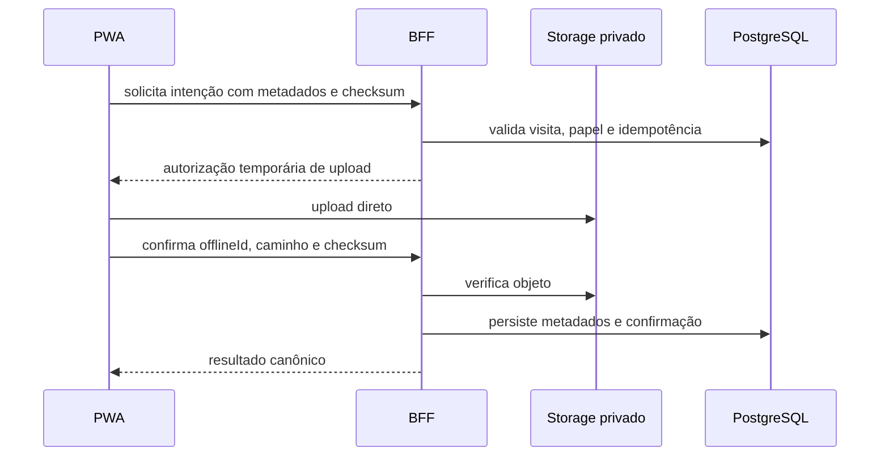

O upload passa diretamente ao Storage. Na confirmação, o BFF lê o objeto de forma limitada e transitória para verificar hash e formato (seção 15.4); os bytes não são persistidos no PostgreSQL nem em disco efêmero.

### 5.6 Formato unificado de erro

```typescript
interface ApiErrorResponse {
  error: {
    code: string
    message: string
    details?: Record<string, unknown>
    recoverable: boolean
    timestamp: string
    requestId: string
  }
}
```

- `400`: estrutura inválida.
- `401`: sessão ausente ou expirada; outbox permanece intacta.
- `403`: papel ou escopo insuficiente.
- `404`: recurso inexistente ou invisível ao escopo.
- `409`: versão concorrente, chave reutilizada ou duplicidade que exige análise.
- `422`: regra de negócio não atendida.
- `429`: limite temporário; cliente aplica espera progressiva.
- `503`: dependência indisponível; tentativa permanece recuperável.

### 5.7 Segurança e exposição

- Chaves administrativas do Supabase nunca chegam ao navegador.
- BFF e banco repetem a verificação de capacidades e escopo.
- Adaptadores server-side só acessam a Data API com contexto do chamador e RLS testada; testes também exercitam diretamente a superfície exposta.
- CORS é restrito ao domínio do sistema.
- URLs de evidências são temporárias e emitidas apenas após autorização.
- Logs não registram JWT, credenciais, bytes de fotos ou conteúdo sensível integral.

O endpoint de lote reflete o comportamento real de redes instáveis: a unidade de confirmação é cada evento, não a requisição inteira. A API também pode ser exercitada pela CLI antes da interface.

## 6. Componentes do sistema

| Componente | Responsabilidade | Interfaces principais | Dependências |
| --- | --- | --- | --- |
| PWA Shell | Instalação, navegação, layout, atualização e conectividade | App Router, manifest, Service Worker | React, Next.js, Serwist |
| Acesso e Sessão | Login, renovação, bloqueio, capacidades e escopo | Supabase Auth, `GET /me` | Supabase Auth, RLS |
| Rota Diária | Carregar, exibir e reordenar a rota do Vendedor | `/me/routes/today`, `/execution-order` | Offline Store, BFF |
| Planejamento de Rotas | Criar, editar, versionar e publicar rotas | `/routes/*` | BFF, autorização, auditoria |
| Execução da Visita | Início, etapas, revisão e conclusão | `/visits/*` | Domínio, Offline Store |
| Offline Store | Persistir rota, rascunhos, anexos e outbox | Repositórios Dexie tipados | IndexedDB |
| Sync Engine | Ordenar tentativas, aplicar retry e confirmar eventos | `/sync/batches` | Offline Store, sessão, conectividade |
| Attachment Pipeline | Comprimir, persistir, enviar e confirmar evidências | `/upload-intents`, Storage | IndexedDB, BFF, Storage privado |
| Gestão e Inteligência | Visão diária, detalhe e indicadores | `/management/*`, `/reports/*` | Read models, RLS |
| Agenda de Sucata | Consultar pendências sem misturar estimado e realizado | `/pickup-schedules` | Visitas, auditoria |
| Administração | Usuários, clientes, parâmetros e importações | `/users`, `/clients`, `/parameter-sets`, `/client-imports` | BFF, autorização |
| BFF/API Shell | Autenticar, validar, correlacionar e responder | REST `/api/v1` | Serviços de aplicação |
| Serviços de Aplicação | Orquestrar casos de uso sem conhecer UI ou HTTP | Contratos TypeScript | Domínio, repositórios |
| Domínio Compartilhado | Invariantes, estados e validações puras | `packages/domain` | Nenhuma infraestrutura |
| Contratos Compartilhados | Schemas Zod, DTOs e tipos da API | `packages/contracts` | Zod |
| Adaptadores Supabase | Persistência, Auth, RPC, Storage e consultas | Repositórios | Supabase |
| Transações PostgreSQL | Idempotência, concorrência e atomicidade | Funções SQL/RPC | PostgreSQL |
| Auditoria | Registrar mudanças e acessos sensíveis | Eventos append-only | Serviços e banco |
| CLI Operacional | Migrações, importação, diagnóstico, backup e simulação | API e comandos Supabase | Contratos compartilhados |
| Observabilidade | Health checks, logs e métricas correlacionadas | `/health/*`, logs JSON | Pino, host, Supabase |
| Runtime da VPS | Executar e proteger a aplicação | HTTPS e container health check | Compose, reverse proxy |

### 6.1 Limites internos

```text
UI / Route Handlers
        |
        v
Serviços de aplicação
        |
        v
Domínio e contratos
        |
        v
Portas de repositório
        |
        v
Adaptadores Supabase
```

- UI não consulta tabelas diretamente fora dos adaptadores autorizados.
- Domínio não importa Next.js, React, Supabase ou Dexie.
- Serviços não recebem objetos HTTP; recebem comandos tipados.
- Route Handlers não contêm regras de negócio.
- Repositórios não decidem regras ou permissões.
- A outbox local usa os mesmos contratos aceitos pela API.
- Outros módulos importam somente a API pública de cada feature.

### 6.2 Diagrama de componentes

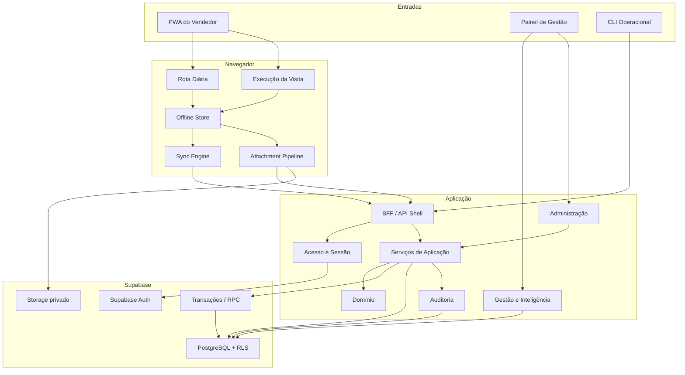

### 6.3 Decisões de composição

- Sync Engine é componente próprio, não efeito colateral dos formulários.
- Attachment Pipeline sincroniza independentemente da visita e usa checksum.
- Indicadores usam read models derivados da mesma fonte transacional.
- Auditoria é síncrona nas operações críticas; falha ao auditar impede confirmação.
- Eventos internos não serão usados como fila distribuída no MVP.
- A aplicação inicia com uma instância; módulos permanecem isolados para testes e evolução.

Essa divisão mantém a complexidade offline isolada, impede dependência direta entre UI e banco e fornece unidades pequenas para futuras stories.

## 7. APIs e serviços externos

### 7.1 Supabase

- **Finalidade:** autenticação, PostgreSQL/Data API, RPC transacional e arquivos privados.
- **Base:** `https://{project-ref}.supabase.co`.
- **Autenticação:** chave publicável acompanhada do JWT do usuário.
- **Privilégio administrativo:** chave secreta somente no BFF/CLI autorizado; nunca no navegador.
- **Interfaces:** `/auth/v1/*`, `/rest/v1/*` e `/storage/v1/*`.
- **Falha:** operações online retornam erro recuperável e dados da outbox permanecem no aparelho.
- **Plano gratuito:** consumo de banco, Storage, egress, Auth e eventual pausa por inatividade será acompanhado pelo `TA-04`.

Adaptadores server-side do chamador acessarão apenas recursos protegidos por RLS. A PWA não consultará tabelas pela Data API; acesso direto do navegador fica restrito a Auth e ao fluxo temporário de Storage. A chave secreta, que ignora RLS, permanecerá restrita ao servidor e aos casos de uso explicitamente privilegiados.

### 7.2 Google Maps URLs

- **Finalidade:** abrir navegação externa para o endereço ou coordenadas do cliente.
- **Endpoint:** `https://www.google.com/maps/dir/`.
- **Autenticação:** não exige API key.
- **Formato:** `https://www.google.com/maps/dir/?api=1&destination={destinoCodificado}`.
- `api=1` é obrigatório e o destino é codificado pela API padrão de URL.
- A origem é omitida para que o Google Maps use a localização atual.
- Indisponibilidade não impede registrar ou concluir a visita.
- Directions API, tráfego em tempo real e navegação incorporada não serão usados.

### 7.3 Serviço SMTP — pendente

Fluxos de convite, confirmação e recuperação de senha precisam de SMTP para uso real. O serviço padrão do Supabase é adequado apenas a desenvolvimento, sem garantias para o piloto.

- Desenvolvimento local usa Mailpit, incluído no Supabase local.
- O piloto não dependerá do SMTP padrão do Supabase.
- Provedor e remetente institucional serão definidos antes do onboarding.
- Caso o negócio escolha provisionamento manual, deverá aprovar um processo seguro de entrega e recuperação das credenciais.

Nenhum fornecedor SMTP foi escolhido nesta etapa.

### 7.4 OpenStreetMap — somente P1

Leaflet poderá apresentar o mapa gerencial P1. Os tiles públicos do OpenStreetMap são best-effort, não possuem SLA e não admitem download de mapas para uso offline.

- Nenhum mapa integra o fluxo crítico P0.
- Não haverá cache offline ou download antecipado de tiles.
- A URL do provedor não será fixada no código.
- Atribuição será sempre visível.
- Um provedor compatível com o volume e uso empresarial será escolhido antes da ativação.

### 7.5 Integrações explicitamente ausentes

- n8n: nenhuma chamada, credencial, webhook, banco, volume ou fluxo compartilhado.
- Orion: sem integração automática; entrada por importação controlada de arquivo.
- Nenhum serviço de otimização de rotas, tráfego em tempo real ou geocodificação automática.
- IA, Power BI e notificações push permanecem fora do MVP.

### 7.6 Política de falha externa

```text
Serviço externo indisponível
├── persistência crítica: manter localmente e tentar novamente
├── navegação externa: informar sem bloquear visita
├── mapa ou relatório P1: degradar sem afetar operação
└── autenticação: preservar sessão válida; novo login requer conectividade
```

O MVP possui apenas duas integrações externas de runtime confirmadas: Supabase e Google Maps por URL. SMTP continua pendente e OpenStreetMap permanece opcional.

## 8. Fluxos críticos

### 8.1 Planejamento, publicação e carregamento da rota

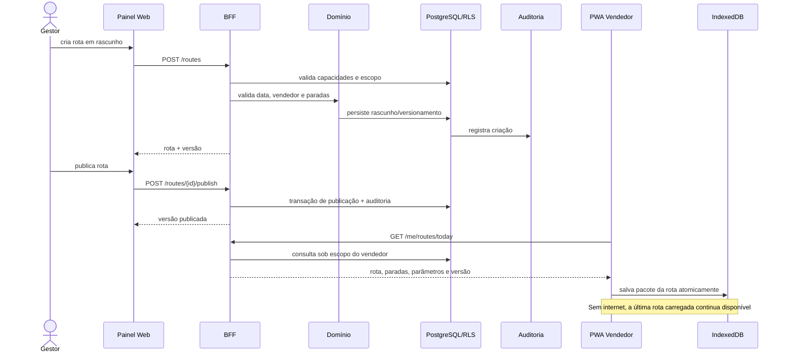

Alteração posterior da composição cria nova versão. Uma visita iniciada permanece vinculada à versão original.

### 8.2 Visita offline e sincronização idempotente

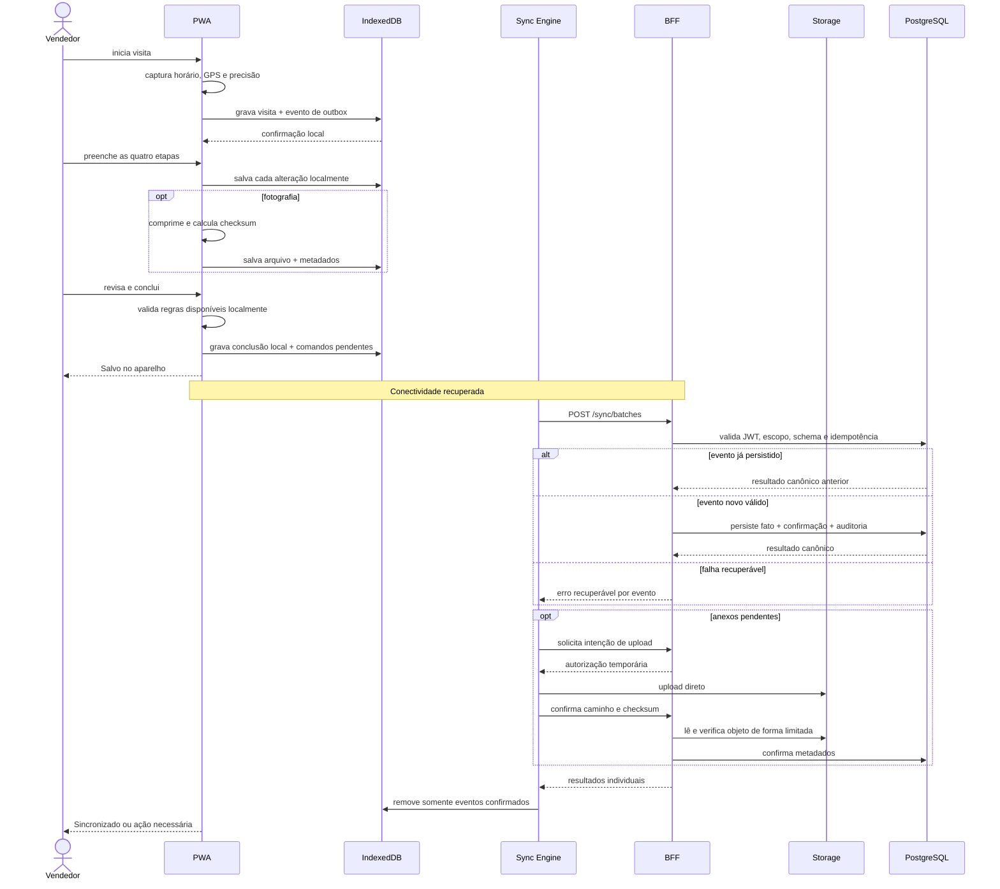

Se a resposta for perdida após a persistência, o evento continua na outbox. O reenvio da mesma chave recupera a confirmação anterior.

### 8.3 Ordem de eventos com evidências obrigatórias

1. Criar ou reconhecer a visita.
2. Sincronizar etapas e metadados.
3. Obter autorização de upload.
4. Enviar anexo diretamente ao Storage.
5. Confirmar objeto e checksum.
6. Solicitar conclusão da visita.
7. Validar etapas e evidências exigidas no servidor.
8. Persistir conclusão e auditoria.
9. Retornar confirmação canônica.

Uma visita pode estar concluída localmente, mas somente será sincronizada quando todos os requisitos aplicáveis forem confirmados pelo servidor.

### 8.4 Sessão expirada durante sincronização

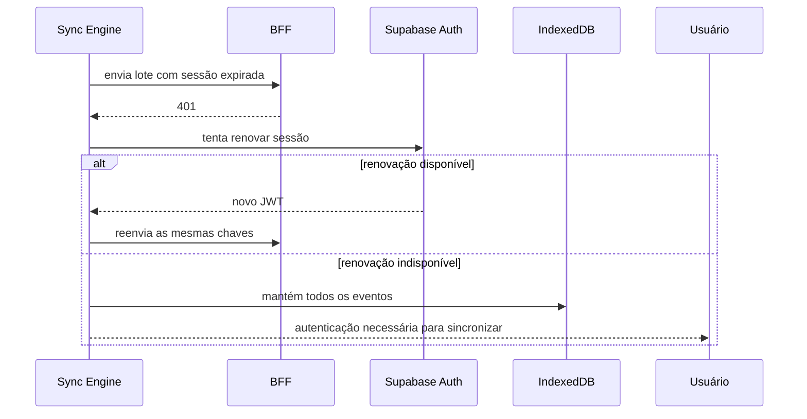

O trabalho local não é apagado por falha de autenticação. A duração do acesso offline será fechada na seção de segurança.

### 8.5 Correção auditada

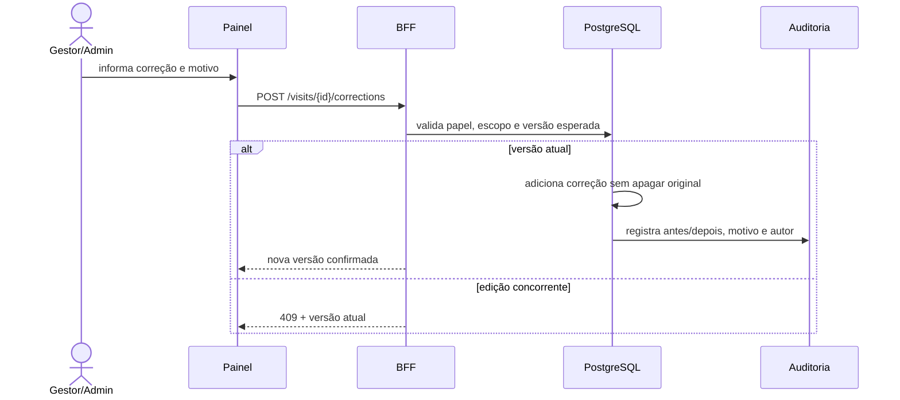

### 8.6 Consulta gerencial

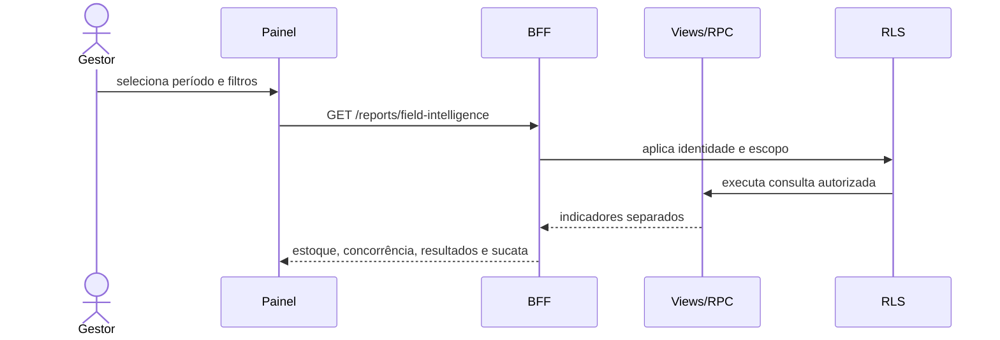

Quilos coletados e agendados são calculados por expressões e campos distintos.

### 8.7 Falhas e recuperação

| Falha | Comportamento |
| --- | --- |
| Aplicação fechada durante preenchimento | Recupera o último rascunho transacionado no IndexedDB |
| Internet perdida durante envio | Mantém evento em estado recuperável |
| Resposta perdida | Reenvia a mesma chave |
| Anexo enviado sem confirmação | Verifica objeto/checksum antes de reenviar bytes |
| Rota alterada enquanto offline | Preserva versão vinculada à visita |
| Regra mudou após preenchimento | Mantém versão usada e sinaliza conflito |
| Sessão expirada | Mantém dados e solicita autenticação para sincronizar |
| Servidor indisponível | Aplica espera progressiva e oferece tentativa manual |
| Erro definitivo | Preserva registro e mostra ação necessária |

O banco local confirma primeiro a durabilidade no aparelho; o servidor confirma depois a persistência canônica. Essa separação impede que “enviado” seja exibido como “sincronizado”.

## 9. Esquema do banco de dados

O desenho físico será PostgreSQL 17 no Supabase, normalizado e orientado à preservação histórica.

### 9.1 Organização dos schemas

- `api`: tabelas, views e funções deliberadamente expostas à aplicação.
- `private`: idempotência, auditoria, staging de importação e funções internas.
- `auth`: identidade gerenciada pelo Supabase.
- `storage`: objetos e políticas de evidências.
- `extensions`: PostGIS e demais extensões.
- `public`: sem tabelas próprias do domínio.

Um schema dedicado permite auditar explicitamente a superfície da Data API. Todo objeto exposto combinará permissões mínimas com RLS; tabelas internas não serão expostas.

### 9.2 Convenções estruturais

Todas as tabelas terão, ressalvada a identidade gerenciada de `user_profiles`:

- `id uuid primary key default gen_random_uuid()`;
- `created_at timestamptz not null default now()`;
- `updated_at timestamptz not null default now()`;
- nomes em `snake_case`;
- chaves estrangeiras indexadas;
- `lock_version integer` em agregados sujeitos a concorrência;
- `archived_at` somente em cadastros inativáveis.

Regras adicionais:

- `ON DELETE RESTRICT` será o padrão para fatos históricos.
- Usuários e clientes serão inativados, nunca removidos em cascata.
- Tabelas append-only rejeitarão `UPDATE` e `DELETE`.
- Pesos usarão `numeric`; a escala final depende de `AB-05`.
- Valores em BRL usarão `numeric(12,2)` e deverão ser positivos.
- Estoques usarão inteiros não negativos.
- Estados estáveis usarão `CHECK`; taxonomias configuráveis usarão `parameter_values`.
- Localizações usarão `geography(Point,4326)`.

`user_profiles.id` recebe o ID existente de `auth.users`, sem default aleatório próprio. `version_number` identifica publicações; `schema_version` identifica formatos. Diagramas de conteúdo 1:1 representam a visita completa; em rascunhos, uma etapa pode ainda não existir.

### 9.3 Catálogo físico

Os campos comuns `id`, `created_at` e `updated_at` estão omitidos abaixo.

#### Identidade e autorização

| Tabela | Campos específicos | Restrições principais |
| --- | --- | --- |
| `api.user_profiles` | `id → auth.users.id`, `display_name`, `status`, `blocked_at` | Relação 1:1; exclusão do usuário autenticável restrita |
| `api.roles` | `code`, `name` | `code` único: `seller`, `manager`, `administrator` |
| `api.role_permissions` | `role_id`, `permission_code` | Único por papel e permissão |
| `api.user_role_assignments` | `user_id`, `role_id`, `assigned_by`, `revoked_at` | Uma atribuição ativa por usuário/papel |
| `api.user_seller_scopes` | `manager_user_id`, `seller_user_id`, `revoked_at` | Implementa o escopo gerencial sem listas JSON |

#### Clientes, importação e parâmetros

| Tabela | Campos específicos | Restrições principais |
| --- | --- | --- |
| `api.clients` | `external_reference`, `name`, `address`, `location`, `portfolio_reference`, `status`, `created_from_import_batch_id`, `archived_at` | Referência externa única quando informada; histórico preservado |
| `api.import_batches` | `source_name`, `source_checksum`, `imported_by`, `status`, `accepted_count`, `rejected_count`, `completed_at` | Reenvio do mesmo arquivo detectável pelo checksum |
| `private.import_batch_rows` | `import_batch_id`, `row_number`, `payload`, `status`, `error_codes` | Único por lote e número da linha; retenção depende de `AB-15` |
| `api.parameter_sets` | `version`, `status`, `valid_from`, `published_at`, `published_by` | Versão única; conjunto ativo imutável |
| `api.parameter_values` | `parameter_set_id`, `category`, `code`, `label`, `sort_order`, `is_active` | Único por conjunto, categoria e código |

#### Rotas versionadas

| Tabela | Campos específicos | Restrições principais |
| --- | --- | --- |
| `api.routes` | `service_date`, `seller_id`, `status` | Uma raiz lógica por vendedor/data |
| `api.route_versions` | `route_id`, `version_number`, `status`, `published_by`, `published_at`, `superseded_at` | Versão única por rota; conteúdo publicado imutável |
| `api.route_version_stops` | `route_version_id`, `client_id`, `planned_order`, `priority` | Ordem planejada única dentro da versão |
| `api.route_stop_executions` | `route_version_stop_id`, `execution_order`, `status`, `non_visit_reason_id`, `lock_version` | Estado operacional separado da composição publicada |

Separar `route_version_stops` de `route_stop_executions` permite ao vendedor reordenar a execução sem reescrever a rota publicada.

#### Visita e suas etapas

| Tabela | Campos específicos | Restrições principais |
| --- | --- | --- |
| `api.visits` | `offline_id`, `device_id`, `route_version_stop_id`, `client_id`, `seller_id`, `parameter_set_id`, `status`, `context_schema_version`, `context_snapshot`, horários do aparelho/servidor, `lock_version` | Único por vendedor, aparelho e ID offline; várias visitas podem apontar para a mesma parada |
| `api.location_events` | `visit_id`, `kind`, `device_captured_at`, `server_received_at`, `position`, `accuracy_m`, `distance_m`, `exception_reason` | Append-only; `kind` início ou conclusão; sem rastreamento contínuo |
| `api.stock_snapshots` | `visit_id`, `heliar_quantity`, `moura_quantity`, `observation` | Um por visita; quantidades inteiras e não negativas |
| `api.competitor_price_reports` | `visit_id`, `availability`, `unavailable_reason_id` | Uma resposta explícita por visita |
| `api.competitor_prices` | `report_id`, `competitor_id`, `model_or_amperage`, `technology_id`, `price_brl`, `condition_id`, `observation` | Preço maior que zero |
| `api.competitor_action_reports` | `visit_id`, `identified` | Uma resposta explícita por visita |
| `api.competitor_actions` | `report_id`, `competitor_id`, `action_type_id`, `description`, `valid_until`, `observation` | Detalhes exigidos quando uma ação for identificada |
| `api.scrap_reports` | `visit_id`, `declared_none` | Uma resposta explícita; o modelo aceita múltiplos eventos |
| `api.scrap_collections` | `scrap_report_id`, `actual_weight_kg`, `collected_at`, `receipt_number`, `collector_id` | Peso positivo, recibo e coletor obrigatórios |
| `api.pickup_schedules` | `scrap_report_id`, `client_id`, `seller_id`, valores originais e atuais de peso/data/endereço, `status`, `lock_version` | Coleta agendada nunca representa peso realizado |
| `api.pickup_schedule_revisions` | `pickup_schedule_id`, valores anteriores/novos, `reason`, `actor_id`, `occurred_at` | Append-only; preserva todas as mudanças e cancelamentos |
| `api.visit_results` | `visit_id`, `result_type_id`, `order_reference`, `no_order_reason_id`, `opportunity`, `next_step`, `follow_up_at`, `observation` | Um resultado por visita; campos condicionais validados na conclusão |
| `api.visit_corrections` | `visit_id`, `expected_version`, `result_version`, `before_data`, `after_data`, `reason`, `actor_id` | Append-only; versões crescentes e motivo obrigatório |

O `context_snapshot` preservará o contexto histórico da rota, cliente e parâmetros conforme a composição e origem verificável da seção 9.11 (`DATA-04` resolvido tecnicamente).

#### Evidências, sincronização e auditoria

| Tabela | Campos específicos | Restrições principais |
| --- | --- | --- |
| `api.attachments` | `actor_id`, `device_id`, `offline_id`, `visit_id`, referências opcionais ao evento específico, `storage_path`, `content_type`, `byte_size`, `checksum`, `status`, `captured_at` | Caminho único; bytes permanecem no Storage privado |
| `private.sync_events` | `actor_id`, `device_id`, `event_id`, `idempotency_key`, `operation`, `schema_version`, `sequence`, `payload_hash`, `aggregate_type`, `aggregate_id`, `status`, `attempt_count`, `canonical_result`, `confirmed_at` | Chave idempotente única; payload diferente com mesma chave gera conflito |
| `private.audit_events` | `actor_id`, `target_type`, `target_id`, `action`, `before_data`, `after_data`, `reason`, `origin`, `request_id`, `occurred_at` | Append-only; acesso direto negado a usuários comuns |

Não haverá relacionamento polimórfico sem integridade em `attachments`: a visita será sempre uma FK obrigatória e as referências especializadas serão colunas opcionais com FKs reais.

### 9.4 Relações principais

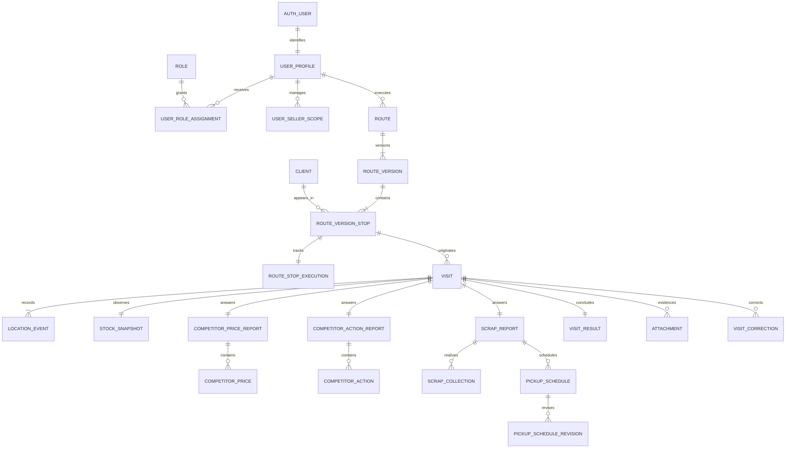

A cardinalidade `ROUTE_VERSION_STOP → VISIT` permanece 1:N por causa de `DATA-01`; o banco não mesclará visitas automaticamente.

### 9.5 Invariantes transacionais

A função interna `private.complete_visit(...)` executará uma única transação que:

1. bloqueia a visita e valida sua versão;
2. confirma evento de início;
3. exige estoque preenchido;
4. exige cotação válida ou indisponibilidade justificada;
5. exige resposta explícita sobre ação concorrente;
6. exige resposta explícita de sucata;
7. impede mistura entre peso coletado e agendado;
8. exige resultado comercial válido;
9. aplica as regras de GPS e fotografias do conjunto imutável vinculado à visita e a autorização atual do ator;
10. grava conclusão, auditoria e resultado idempotente.

Regras que cruzam tabelas não dependerão apenas da interface. Serão aplicadas por funções transacionais e testadas no banco.

### 9.6 Índices orientados às consultas

Principais índices planejados:

- `routes(seller_id, service_date)`;
- `route_versions(route_id, version_number desc)`;
- `route_version_stops(route_version_id, planned_order)`;
- `route_stop_executions(status, execution_order)`;
- `clients(external_reference)` e `lower(name)`;
- GiST em `clients.location`;
- `visits(seller_id, server_started_at desc)`;
- `visits(route_version_stop_id, created_at desc)`;
- `location_events(visit_id, kind)`;
- `competitor_prices(competitor_id, created_at desc)`;
- `pickup_schedules(status, current_desired_date)`;
- `attachments(visit_id, status)`;
- `sync_events(actor_id, device_id, status, updated_at)`;
- `audit_events(target_type, target_id, occurred_at desc)`;
- `user_seller_scopes(manager_user_id, seller_user_id)`.

Não haverá particionamento nem materializações no piloto. O volume esperado de aproximadamente 300–480 visitas não justifica essa complexidade antes de medições reais.

### 9.7 RLS e superfície de escrita

- Vendedor: somente suas rotas, clientes relacionados e visitas próprias.
- Gestor: vendedores presentes em `user_seller_scopes`.
- Administrador: capacidades administrativas auditadas; sem acesso implícito a evidências ou dados comerciais fora da matriz do PRD.
- Taxonomias ativas: leitura autenticada.
- Tabelas `private`: sem acesso direto de `anon` ou `authenticated`; grants de funções estritamente limitados conforme seção 9.12.
- Evidências: autorização simultânea no metadado e no caminho do Storage.
- Escritas críticas: somente por funções estreitas como `publish_route`, `sync_event`, `complete_visit` e `apply_visit_correction`. O BFF coordena o lote HTTP, com uma chamada transacional por evento.
- Serviço administrativo: credencial secreta apenas no servidor e fora do fluxo normal.

Funções `SECURITY DEFINER`, quando inevitáveis, ficarão no schema privado, usarão `search_path` vazio e terão permissões explícitas. Chaves que ignoram RLS nunca serão expostas ao navegador.

### 9.8 Views e funções de leitura

Views `security_invoker` previstas:

- `api.my_route_today_v`;
- `api.management_day_v`;
- `api.visit_details_v`;
- `api.field_intelligence_v`;
- `api.pickup_schedule_current_v`.

Quilos coletados e agendados terão colunas e agregações distintas. Não será criada uma métrica que os some.

Realtime não integra o MVP; atualização por consulta periódica é suficiente para o piloto.

### 9.9 Ordem das migrações

1. extensões, schemas e privilégios padrão;
2. identidade, papéis e escopos;
3. parâmetros, importação e clientes;
4. rotas e versionamento;
5. visitas e suas etapas;
6. evidências, idempotência e auditoria;
7. triggers e funções transacionais;
8. RLS e políticas do Storage;
9. views e geração dos tipos TypeScript;
10. seeds aprovados das taxonomias.

Cada mudança terá migração versionada e teste. Migrações aplicadas não serão editadas posteriormente.

### 9.10 Decisões ainda preservadas

- `DATA-02`: tolerância entre relógio do aparelho e servidor.
- `DATA-04`: resolvido tecnicamente na seção 9.11; acesso e retenção permanecem sujeitos a AB-15.
- `DATA-05`/`AB-15`: retenção, anonimização e descarte.
- `AB-01`: unidade e eventual detalhamento do estoque.
- `AB-02`, `AB-03` e `AB-09`: taxonomias iniciais.
- `AB-04`: simultaneidade de coleta e agendamento na interface.
- `AB-05`: casas decimais, limites e tolerâncias de peso.
- `AB-06`: foto, formato e unicidade do canhoto.
- `AB-07`: datas permitidas, urgência, alteração/cancelamento e endereço alternativo.
- `AB-08`: ativação dos estados logísticos além de pendente, incluindo cancelamento e seu responsável.
- `AB-10`: obrigatoriedade de fotografias.
- `AB-11`: política operacional das exceções de GPS.

Essas decisões não serão preenchidas com valores presumidos. O esquema reserva a estrutura necessária, enquanto seeds e restrições específicas aguardam aprovação.

### 9.11 Histórico e integridade do agregado — revisão especializada

**DATA-04 resolvido tecnicamente.** Na publicação da rota, persistir o contexto do cliente em cada parada (`client_context_snapshot`) e do vendedor na versão (`seller_context_snapshot`). O pacote offline recebe esses valores imutáveis. Ao reconhecer uma visita, o servidor reconstrói seu `context_snapshot` a partir dessa versão e do conjunto de parâmetros; nomes/endereço fornecidos pelo aparelho não substituem a origem publicada.

| Grupo do snapshot | Campos preservados |
| --- | --- |
| Formato/origem | schemaVersion, sourceRouteVersionId, snapshotCreatedAt |
| Rota/parada | IDs, número da versão, data de serviço, publicação, ordem planejada, prioridade |
| Cliente | ID, referência externa, nome, endereço, coordenadas de referência, carteira |
| Vendedor | ID e nome exibido na versão publicada |
| Regras | ID e versão do conjunto de parâmetros |

Parâmetros/valores publicados, fatos observados, eventos GPS, evidências e correções permanecem referenciados por IDs imutáveis; não copiar o catálogo inteiro para cada visita. Aposentar parâmetros muda seu ciclo de vida, não seu conteúdo publicado. O snapshot representa o contexto carregado e mostrado ao vendedor, não o cadastro atual no instante posterior da sincronização. Não recalcular distâncias antigas usando novas coordenadas. Leitores de snapshots continuam suportando versões anteriores.

Papéis, capacidades, bloqueio e escopos são sempre atuais para autorização; nunca obtidos do snapshot. Coordenadas dentro de JSON continuam sensíveis: views/RPCs devem omiti-las para quem não possua a capacidade aprovada. Não conceder SELECT indiscriminado do JSON bruto.

**DATA-03 resolvido tecnicamente.** Reordenar uma rota usa `lock_version` do agregado de execução e atualiza todas as posições numa transação. A comparação por parada isolada não evita ordens conflitantes. Correção de visita trava o agregado e exige expected_version; versão divergente retorna 409. Fatos originais ficam imutáveis após conclusão; a correção guarda before/after completos do agregado lógico corrigível, IDs estáveis, schema_version, motivo, ator e versões. Unicidade `(visit_id, result_version)` e incremento unitário.

Detalhes e relatórios usam uma única projeção efetiva por visita: última correção autorizada ou original. Nunca somar original e correção como visitas adicionais. O histórico original continua consultável por capacidade. Agenda mantém revisões próprias; correção comercial não sobrescreve mudanças logísticas posteriores. Campos efetivamente corrigíveis seguem capacidades da matriz do PRD e parâmetros aprovados.

Constraints mínimas adicionais, a concretizar por migrações e pgTAP:

- Visita/parada/cliente: FK composta que garante que o client_id corresponde à parada; vendedor conferido pela cadeia imutável rota → versão → parada.
- Conteúdo/visita/regras: FK composta de `visit_id, parameter_set_id`; taxonomias validam ID, conjunto e categoria. Não aceitar tecnologia onde se espera motivo.
- Agenda/informe/visita: garantir mesmo agregado por FK composta; cliente/vendedor derivados da visita.
- Anexo/alvo: FK composta de ID especializado e visit_id; no máximo um alvo especializado não nulo; visita obrigatória.
- Conteúdos 1:1: UNIQUE(visit_id) para estoque, respostas de preço/ação/sucata e resultado.
- Execução: UNIQUE(route_version_stop_id), posição única por versão e escrita em lote; draft/published com versionamento consistente, no máximo uma versão publicada corrente.
- Escopo ativo: unicidade parcial por gestor/vendedor quando revoked_at é nulo.
- Idempotência: UNIQUE(actor_id, device_id, operation, idempotency_key) e UNIQUE(actor_id, device_id, event_id); operation, schema_version, sequence e payload_hash persistidos. Hash não pertence à chave única.
- Anexo offline: UNIQUE(actor_id, device_id, offline_id), caminho imutável único. ID nunca é prova de autorização.

Não usar CHECK com consulta a outra tabela; usar FK/UNIQUE, função transacional ou trigger apropriada. Recibo não terá unicidade global presumida (AB-06); precisão/limites de peso permanecem AB-05. Coletor deve ser identificado; o contrato não obriga que todo coletor tenha login. Se houver conta associada, usar FK; modo de identificação operacional depende da definição aprovada.

Referências: [constraints PostgreSQL 17](https://www.postgresql.org/docs/17/ddl-constraints.html), PRD FR-005/042/052/053 e DATA-03/04. A revisão é documental; migrações e testes de integridade ainda serão implementados.

### 9.12 Grants e funções internas

Uma função `api.* SECURITY INVOKER` delega a uma função `private.* SECURITY DEFINER` de entrada. Para esse arranjo, authenticated recebe USAGE no schema private e EXECUTE somente nas funções de entrada previstas; não recebe acesso às tabelas privadas. Helpers internos não recebem esse grant. Revogar EXECUTE padrão de PUBLIC/anon e definir grants individualmente na mesma migração.

Funções de entrada derivam identidade de `auth.uid()`, validam usuário ativo, capacidade, escopo e parentesco, usam search_path vazio e nomes qualificados. Seu dono é role dedicada NOLOGIN/NOBYPASSRLS, diferente da dona das tabelas, com privilégios e políticas mínimos. Não presumir herança automática da RLS do chamador. Testar também chamada direta ao wrapper via Data API. Views security_invoker exigem grants de leitura mínimos; campos sensíveis usam projeções autorizadas, sem conceder leitura integral da base só para viabilizar uma view.

Autorização que consulta papéis deve evitar ciclos recursivos de políticas. Contas bloqueadas não acessam linhas pelo BFF, Data API ou emissão Storage. Referências: [funções Supabase](https://supabase.com/docs/guides/database/functions), [RLS](https://supabase.com/docs/guides/database/postgres/row-level-security).

#### Implementação verificada nas Stories 3.1–3.2

Os wrappers estreitos `api.start_visit`, `api.save_visit_stock` e `api.sync_event` usam `SECURITY DEFINER` com `search_path` vazio. Esta variante mantém `anon` e `authenticated` sem `USAGE` no schema `private` e sem DML nas tabelas; somente `authenticated` executa os wrappers públicos. Os helpers privados recebem grants explícitos entre executores. As funções revalidam identidade ativa, papel, capacidade e ownership, inclusive em replay.

Os executores dedicados são `NOLOGIN`, `NOSUPERUSER` e `NOBYPASSRLS`. Nesta implementação eles também possuem suas tabelas de capability; `FORCE ROW LEVEL SECURITY` e políticas restritas aos executores delimitam o acesso interno, enquanto a autorização por vendedor ocorre obrigatoriamente nas funções. Esta é uma decisão documentada para o arranjo RPC existente, não uma dependência da RLS do chamador. A alteração futura de owner, grants ou wrapper exige repetir os testes de chamadas diretas e isolamento.

Revisão local de 18/09/2026: a migração `20260918170000_visit_stock_contract_acl.sql` revoga o `EXECUTE` padrão dos helpers de estoque no contexto do owner; `20260918173000_visit_stock_replay_result.sql` preserva a resposta da intenção original após edições posteriores. Decisão: `Docs/architecture/decisions/001-visit-rpc-executor-boundary.md`. Evidência: `Docs/qa/evidence/3.1-3.2-specialized-review.md`.

## 10. Arquitetura frontend

### 10.1 Estratégia de renderização

O frontend usará Next.js App Router com duas estratégias:

- **Gestão:** Server Components por padrão, com Client Components apenas para filtros, formulários e interações.
- **Vendedor:** shell PWA executado no cliente, preparado para carregar rota, visita e sincronização pelo IndexedDB.

Server Components são o padrão do App Router e reduzem o JavaScript enviado ao navegador. A fronteira cliente será aplicada somente onde houver interação ou operação offline.

```text
Next.js
├── área pública
│   └── autenticação e recuperação
├── PWA do vendedor
│   ├── shell cliente instalável
│   ├── rota carregada
│   ├── visita em etapas
│   └── sincronização
└── painel gerencial
    ├── páginas renderizadas no servidor
    └── ilhas interativas
```

### 10.2 Organização dos componentes

```text
src/
├── app/
│   ├── (public)/
│   ├── (seller)/
│   ├── (management)/
│   ├── api/v1/
│   ├── manifest.ts
│   └── sw.ts
├── features/
│   ├── auth/
│   ├── route/
│   ├── visit/
│   │   ├── stock/
│   │   ├── competitor-prices/
│   │   ├── competitor-actions/
│   │   ├── scrap/
│   │   └── result/
│   ├── sync/
│   ├── attachments/
│   ├── management/
│   ├── clients/
│   └── administration/
├── components/
│   ├── ui/
│   ├── feedback/
│   └── layout/
├── lib/
│   ├── api/
│   ├── auth/
│   ├── offline/
│   ├── validation/
│   └── observability/
└── styles/
```

Cada feature poderá conter:

```text
feature/
├── components/
├── hooks/
├── schemas/
├── services/
├── repositories/
├── types/
└── tests/
```

Regras de composição:

- `components/ui`: componentes visuais sem regra de negócio.
- `features/*/components`: composição específica do caso de uso.
- Páginas e layouts: carregamento, autorização e montagem.
- Hooks: coordenação da interface, nunca persistência isolada.
- Repositórios: único acesso permitido ao IndexedDB.
- Serviços: único acesso permitido ao BFF; o transporte dedicado de anexos usa apenas a autorização temporária do Storage, sem consultar tabelas.
- Schemas Zod: compartilhados entre formulário, persistência e resposta da API.

### 10.3 Padrão de componente de etapa

```typescript
'use client'

type StockStepProps = {
  visitId: string
  initialValue: StockInput
}

export function StockStep({
  visitId,
  initialValue,
}: StockStepProps) {
  const form = useForm<StockInput>({
    resolver: zodResolver(stockSchema),
    defaultValues: initialValue,
  })

  const autosave = useDurableAutosave({
    visitId,
    section: 'stock',
    watch: form.watch,
  })

  const saveAndContinue = form.handleSubmit(async (input) => {
    await autosave.flushPending() // evitar rascunho antigo sobrepor este commit
    await visitDraftRepository.saveSectionAndEnqueue({
      visitId,
      section: 'stock',
      input,
    })

    visitNavigation.goTo('competitor-prices')
  })

  return (
    <StepForm
      title="Estoque"
      state={form.formState}
      onSubmit={saveAndContinue}
    >
      <StockFields control={form.control} />
    </StepForm>
  )
}
```

O componente não chama `fetch`, Supabase ou Dexie diretamente. Salvar a etapa e criar o evento de outbox ocorrerão na mesma transação local.

### 10.4 Arquitetura de rotas

```text
/
├── login
├── auth/callback
├── route                         # entrada principal do vendedor
├── visit/[offlineId]             # wizard offline
│   └── ?step=start|stock|prices|actions|scrap|result|review
├── sync
├── profile
├── management/
│   ├── day
│   ├── routes
│   ├── routes/[routeId]
│   ├── visits/[visitId]
│   ├── intelligence
│   ├── pickup-schedules
│   ├── clients
│   ├── client-imports/[batchId]
│   ├── users
│   └── parameters
└── ~offline                      # fallback de navegação
```

A visita será um wizard sob uma única rota dinâmica. A etapa corrente ficará na URL e no rascunho local, permitindo restaurar o ponto exato após fechamento ou falha.

Os grupos `(seller)` e `(management)` possuem layouts próprios, mas não representam fronteiras de segurança. Autorização será novamente verificada no servidor e em cada operação de dados.

### 10.5 Estado frontend

Cada categoria terá um único responsável:

| Categoria | Tecnologia | Conteúdo |
| --- | --- | --- |
| Estado remoto | TanStack Query | Consultas online, invalidação e paginação |
| Formulário | React Hook Form + Zod | Entrada, validação e mensagens |
| Estado local durável | Dexie/IndexedDB | Rotas, rascunhos, anexos e outbox |
| Estado transitório | Zustand | Modais, banners e estado visual |
| Estado navegável | URL | Etapa, filtros, período e paginação |
| Estado do servidor | Server Components | Dados gerenciais iniciais e autorização |

Zustand não duplicará dados de visitas, rotas ou sincronização.

```typescript
interface LocalRouteBundle {
  userId: string
  routeId: string
  routeVersion: number
  parameterSetVersion: number
  payload: RouteBundle
  cachedAt: string
}

interface LocalVisitDraft {
  offlineId: string
  userId: string
  deviceId: string
  routeVersionStopId: string
  currentStep: VisitStep
  sections: VisitSections
  localStatus: 'draft' | 'completed_locally'
  updatedAt: string
}

interface OutboxEvent {
  userId: string
  deviceId: string
  eventId: string
  idempotencyKey: string
  operation: string
  schemaVersion: number
  aggregateId: string
  sequence: number
  payload: unknown
  status: 'pending' | 'sending' | 'recoverable_error' | 'action_required'
  attemptCount: number
  nextAttemptAt?: string
}

interface LocalAttachment {
  userId: string
  deviceId: string
  offlineId: string
  visitOfflineId: string
  blob: Blob
  checksum: string
  status:
    | 'pending'
    | 'uploading'
    | 'uploaded_unconfirmed'
    | 'verified'
    | 'recoverable_error'
    | 'action_required'
}
```

Todos os registros locais serão particionados por `userId`. Trocar de usuário não disponibilizará os dados locais da sessão anterior.

### 10.6 Persistência e sincronização offline

A operação local seguirá estas regras:

1. baixar rota, parâmetros e versão em uma transação;
2. persistir cada alteração relevante do formulário;
3. salvar seção e evento de outbox atomicamente;
4. preservar eventos até confirmação individual do servidor;
5. ordenar eventos por agregado e sequência;
6. impedir dois sincronizadores simultâneos por uma trava local;
7. aplicar espera progressiva somente a falhas recuperáveis;
8. manter erros definitivos visíveis e acionáveis;
9. nunca remover rascunhos ou outbox durante atualização da aplicação;
10. tratar falta de espaço do navegador como erro crítico visível.

Gatilhos de sincronização:

- abertura da aplicação;
- retorno ao primeiro plano;
- recuperação de conectividade;
- conclusão local;
- ação manual “Tentar novamente”.

A aplicação não dependerá exclusivamente de Background Sync, pois sua execução não é garantida em todos os contextos.

### 10.7 Service Worker e cache

Serwist será configurado com escopo deliberadamente restrito:

- precache do shell, CSS, JavaScript, ícones e fallback offline;
- versionamento dos ativos pelo build;
- páginas gerenciais com estratégia online;
- `/api/v1/**`, autenticação e URLs assinadas do Storage em `NetworkOnly`;
- respostas autenticadas não serão armazenadas no Cache Storage;
- dados de rota e visita serão persistidos explicitamente no IndexedDB;
- Google Maps e tiles do OpenStreetMap não serão armazenados offline.

Uma nova versão do Service Worker não assumirá o controle durante uma visita ativa sem antes confirmar que o rascunho e a outbox estão duráveis. A interface mostrará “Atualização disponível” e fará ativação controlada.

### 10.8 Comunicação com a API

A PWA usará exclusivamente `/api/v1` para dados e comandos de negócio. As exceções deliberadas são a sessão pelo SDK do Supabase Auth e o envio dos bytes ao Storage depois de obter autorização no BFF. Server Components gerenciais chamarão a camada de aplicação diretamente no servidor, evitando uma requisição HTTP de retorno ao próprio Next.js.

```typescript
async function apiRequest<T>(
  path: string,
  options: RequestInit & {
    responseSchema: ZodType<T>
    idempotencyKey?: string
  },
): Promise<T> {
  const { responseSchema, idempotencyKey, ...request } = options
  const headers = new Headers(request.headers)
  headers.set('x-request-id', crypto.randomUUID())
  if (request.body) headers.set('content-type', 'application/json')
  if (idempotencyKey) headers.set('idempotency-key', idempotencyKey)
  if (isMutation(request.method)) {
    headers.set('x-csrf-token', await csrfProvider.getToken())
  }
  const timeout = AbortSignal.timeout(30_000)
  const response = await fetch(`/api/v1${path}`, {
    ...request,
    credentials: 'same-origin',
    headers,
    signal: request.signal ? AbortSignal.any([request.signal, timeout]) : timeout,
  })

  const raw = await response.text()
  const body = parseJsonOrUndefined(raw) // HTML e JSON inválido são tratados abaixo

  if (!response.ok) {
    throw ApiError.fromResponse(response.status, body) // fallback seguro se não for JSON
  }

  return responseSchema.parse(body) // usar schema de undefined para 204, se aplicável
}
```

Características:

- validação de respostas com Zod;
- cookies de sessão enviados apenas para mesma origem;
- identificador de correlação por requisição;
- chave idempotente preservada em retentativas;
- timeout e classificação entre falha recuperável e definitiva;
- nenhum segredo Supabase no bundle;
- bytes de evidências enviados diretamente ao Storage após autorização temporária.

### 10.9 Proteção de navegação

No Next.js 16, `proxy.ts` substitui a convenção antiga `middleware.ts`. Ele fará renovação de sessão e redirecionamento preliminar nas rotas online. O shell estático de campo e o fallback offline são excluídos de qualquer exigência de sessão no servidor.

```typescript
export default function SellerLayout({
  children,
}: LayoutProps) {
  return <LocalSessionGate>{children}</LocalSessionGate>
}
```

`LocalSessionGate` é uma fronteira cliente: usa `/me` online e a política local da seção 15.1 quando offline. O layout não injeta dados privados no shell. Layouts gerenciais continuam chamando `requireAuthenticatedActor()` no servidor. A autorização definitiva de operações remotas permanece na aplicação e no RLS.

### 10.10 Formulários e validação

- Um schema Zod por comando, compartilhado com os contratos.
- Validação progressiva sem impedir salvamento de rascunho incompleto.
- Validação completa somente na tentativa de conclusão.
- Respostas explícitas para “indisponível”, “nenhuma ação” e “sem sucata”.
- Campos condicionais preservados ao navegar entre etapas.
- Erros apresentados junto ao campo e também no resumo.
- Foco movido para o primeiro erro após validação.
- Prevenção de duplo envio sem desabilitar a recuperação.
- Conflitos `409` nunca serão resolvidos silenciosamente.

### 10.11 Estados de interface

Cada tela crítica deverá representar explicitamente:

```text
idle
├── loading
├── ready
│   ├── saved_on_device
│   ├── syncing
│   ├── synced
│   └── action_required
├── empty
├── recoverable_error
└── forbidden
```

“Concluída localmente” e “Sincronizada” continuarão sendo estados diferentes.

### 10.12 Decisões e limites

- O piloto móvel será validado prioritariamente em Android/Chrome.
- O painel gerencial pressupõe conectividade.
- A rota precisa ter sido carregada ao menos uma vez para uso offline.
- Um login inteiramente novo exige internet.
- O prazo de acesso local segue a janela técnica de 24 h da seção 15.1, sujeita à revisão de privacidade antes de dados reais.
- A política de limpeza dos dados locais dependerá de `AB-15`.
- A obrigatoriedade das evidências continuará parametrizada por `AB-10`.
- O frontend não implementará mapa offline, roteirização automática, push ou atualização em tempo real.

## 11. Arquitetura backend

### 11.1 Estilo arquitetural

O backend será um monólito modular executado no runtime Node.js do Next.js:

```text
Cliente → HTTPS → Route Handler → Adaptador HTTP
  → Serviço de aplicação → Domínio e contratos
  → Porta de repositório → Supabase/PostgreSQL/Storage
```

Não haverá NestJS, microsserviços, Redis ou servidor de filas no MVP. Route Handlers fornecem a superfície `/api/v1`, enquanto funções PostgreSQL executam operações transacionais que envolvem várias tabelas.

### 11.2 Organização dos módulos

```text
src/server/
├── core/
│   ├── auth/
│   ├── errors/
│   ├── http/
│   ├── idempotency/
│   ├── observability/
│   └── validation/
├── modules/
│   ├── users/
│   ├── clients/
│   ├── parameters/
│   ├── routes/
│   ├── visits/
│   ├── sync/
│   ├── attachments/
│   ├── pickup-schedules/
│   ├── reporting/
│   └── imports/
├── infrastructure/
│   ├── supabase/
│   ├── postgres/
│   ├── storage/
│   └── clock/
└── bootstrap/
    ├── config.ts
    └── container.ts
```

Estrutura interna de um módulo:

```text
visits/
├── domain/
│   ├── visit.ts
│   ├── visit-rules.ts
│   └── visit-errors.ts
├── application/
│   ├── start-visit.ts
│   ├── save-visit-section.ts
│   ├── complete-visit.ts
│   └── correct-visit.ts
├── ports/
│   ├── visit-repository.ts
│   └── audit-writer.ts
├── infrastructure/
│   └── supabase-visit-repository.ts
└── contracts/
    ├── visit-command.schema.ts
    └── visit-response.schema.ts
```

Dependências: HTTP → application → domain/ports. Infrastructure implementa as portas. O domínio não importará Next.js, Supabase, React ou objetos HTTP.

### 11.3 Organização dos Route Handlers

```text
src/app/api/v1/
├── health/
│   ├── live/route.ts
│   └── ready/route.ts
├── me/route.ts
├── routes/
│   ├── route.ts
│   └── [routeId]/
├── route-stops/[stopId]/
├── visits/
│   ├── route.ts
│   └── [visitRef]/
│       ├── route.ts
│       ├── sections/[section]/route.ts
│       ├── complete/route.ts
│       └── corrections/route.ts
├── sync/batches/route.ts
├── attachments/
├── management/
├── pickup-schedules/
├── reports/
├── client-imports/
├── parameter-sets/
└── users/
```

Nota de concretização: o diretório dinâmico de visitas usa um único nome, `[visitRef]`, para evitar duas definições concorrentes do mesmo segmento. Os contratos da seção 5 permanecem: etapas/conclusão resolvem `offlineId` sob a identidade do vendedor; detalhe/correção resolvem o ID canônico. Cada handler define seu resolvedor explicitamente.

Cada arquivo `route.ts` será apenas um adaptador, sem SQL nem regras comerciais.

```typescript
export const runtime = 'nodejs'
export const dynamic = 'force-dynamic'

export const POST = routeHandler({
  auth: { roles: ['seller'] },
  body: syncBatchRequestSchema,
  idempotency: 'per-event',
  async execute({ actor, body, requestId }) {
    return syncVisitBatch.execute({
      actor,
      batch: body,
      requestId,
    })
  },
})
```

A fábrica `routeHandler` centralizará identificação/correlação, autenticação, autorização preliminar, validação de método/conteúdo/corpo, parsing Zod, idempotência, timeout, logs estruturados, conversão de erros, cabeçalhos de segurança e resposta JSON padronizada.

Route Handlers são endpoints públicos e sempre precisam validar credenciais, autorização e payload. Referência: [Next.js BFF](https://nextjs.org/docs/app/guides/backend-for-frontend).

### 11.4 Contexto da requisição

```typescript
interface RequestContext {
  requestId: string
  actor: {
    userId: string
    roles: RoleCode[]
    capabilities: string[]
    status: 'active' | 'inactive'
    sellerScopeIds: string[]
  }
  authMode: 'cookie' | 'bearer'
  deviceId?: string
  receivedAt: Date
}
```

O contexto será criado uma vez e propagado explicitamente. Nenhum serviço aceitará `userId`, papel ou escopo enviados no corpo como prova de identidade.

### 11.5 Autenticação

- Navegador: cookies gerenciados por `@supabase/ssr`.
- CLI: JWT em `Authorization: Bearer`.

O adaptador SSR ficará isolado e com versão fixada. Referência: [SSR no Supabase](https://supabase.com/docs/guides/auth/server-side).

```mermaid
sequenceDiagram
    actor U as Usuário
    participant B as Navegador
    participant P as proxy.ts
    participant N as Next.js
    participant A as Supabase Auth
    participant DB as PostgreSQL/RLS
    U->>B: informa credenciais
    B->>A: autenticação; PKCE nos fluxos com redirecionamento
    A-->>B: sessão
    B->>P: requisição com cookie
    P->>A: renova sessão quando necessário
    P->>N: encaminha requisição
    N->>A: valida claims/usuário
    N->>DB: carrega perfil, papéis, capacidades e escopo
    DB-->>N: ator autorizado
    N-->>B: página ou resposta
```

- `getSession()` não será usado sozinho para autorizar operações.
- O servidor validará claims ou consultará o usuário no Auth.
- Papéis, capacidades e escopo serão carregados das tabelas da aplicação.
- Rotas autenticadas usarão `private, no-store`.
- Respostas que alterem cookies nunca serão armazenadas pelo proxy reverso.
- Usuários bloqueados terão acesso negado mesmo com JWT ainda válido.

Referência: [Cliente SSR para Next.js](https://supabase.com/docs/guides/auth/server-side/creating-a-client).

### 11.6 Autorização em profundidade

1. Route Handler exige autenticação.
2. Serviço de aplicação exige capacidade funcional.
3. Função PostgreSQL valida ator e escopo.
4. RLS restringe as linhas acessíveis no contexto do chamador.

```typescript
await authorization.require(actor, {
  capability: 'visit.complete',
  resource: { sellerId: visit.sellerId },
})
```

Papel exibido pela interface ou claims customizadas não substituirá as atribuições armazenadas no banco. Operações privilegiadas precisam verificar autorização explicitamente, pois não podem presumir a proteção RLS do chamador.

### 11.7 Acesso a dados

```typescript
interface DataClients {
  callerScoped: SupabaseClient<Database>
  system?: SupabaseClient<Database>
}
```

- `callerScoped`: utiliza o JWT do usuário e respeita RLS.
- `system`: utiliza chave secreta apenas em operações internas explicitamente autorizadas; não será disponibilizado genericamente aos módulos.
- Tipos serão gerados pelo Supabase CLI após cada migração.
- Não haverá consultas SQL montadas por concatenação.
- Leituras usarão views, queries tipadas ou RPCs.
- Escritas multi-tabela usarão funções PostgreSQL transacionais.

O `supabase-js` não agrupa chamadas independentes numa única transação. Referência: [Transações e RPC](https://supabase.com/docs/reference/javascript/using-modifiers-rollback).

```typescript
export class SupabaseVisitRepository implements VisitRepository {
  constructor(private readonly db: SupabaseClient<Database>) {}

  async complete(command: CompleteVisitCommand) {
    const { data, error } = await this.db
      .schema('api')
      .rpc('complete_visit', {
        command: commandSchema.parse(command),
      })
      .single()

    if (error) throw mapSupabaseError(error)
    return completedVisitSchema.parse(data)
  }
}
```

Funções RPC expostas serão wrappers estreitos. Operações privilegiadas serão delegadas a funções endurecidas no schema `private`, com `search_path` vazio, autorização explícita e auditoria.

### 11.8 Idempotência e sincronização

```text
BEGIN
  validar identidade ativa, capacidade, acesso ao alvo e formato
  tentar reservar chave idempotente
  ├── chave nova
  │   ├── validar ordem e versão esperada
  │   ├── executar comando
  │   ├── persistir auditoria
  │   └── salvar resultado canônico
  └── chave existente
      ├── mesmo payload → retornar resultado anterior
      └── payload diferente → conflito 409
COMMIT
```

O hash cobre operação, schemaVersion, agregado, sequência, horário e payload canônicos. A busca do resultado idempotente ocorre antes da validação da versão/ordem atual, permitindo repetir um evento já confirmado. A autorização atual é sempre conferida antes de retornar dados.

O BFF fará uma chamada `api.sync_event` por evento, sequencialmente por agregado; cada RPC tem transação própria. Uma RPC única de lote não fornece commits independentes por evento. Se um evento falha, seus dependentes aguardam; agregados independentes continuam. O envelope não recebe chave idempotente própria: `eventId` e `idempotencyKey` individuais garantem a não duplicação. Nenhum evento será marcado confirmado só porque o envelope foi recebido. Fonte: [transações PostgREST](https://docs.postgrest.org/en/stable/references/transactions.html).

Retentativas automáticas serão limitadas, registradas e classificadas como recuperáveis ou definitivas. São permitidas para leituras idempotentes e comandos que mantenham a mesma chave; proibidas para escritas não idempotentes.

### 11.9 Concorrência

Agregados mutáveis usarão controle otimista:

```sql
update api.route_stop_executions
set execution_order = new_execution_order,
    lock_version = lock_version + 1
where id = execution_id
  and lock_version = expected_version;
```

Após validar existência e autorização, nenhuma linha alterada representa conflito `409`. Aplica-se à composição/publicação de rota, ordem de execução, agenda, administração de usuários e correções de visita.

Visitas offline não serão mescladas por conteúdo. Cada `offline_id` identifica um registro independente.

### 11.10 Evidências

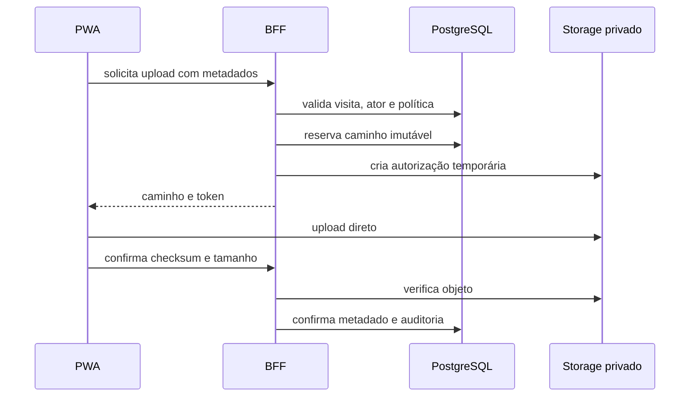

- Caminhos incluem ambiente, usuário, visita e UUID do arquivo.
- Objetos não serão sobrescritos.
- MIME, extensão, tamanho e checksum serão verificados.
- Download usará URL curta e assinada.
- Acesso a evidência será auditado.
- Upload de bytes é direto ao Storage; a leitura de verificação pelo Next.js é limitada e transitória, conforme seção 15.4.

Referência: [Uploads assinados](https://supabase.com/docs/guides/storage/uploads/resumable-uploads). A confirmação calcula o checksum do objeto por leitura limitada no servidor; repetir o checksum declarado pelo cliente não comprova integridade.

### 11.11 Erros

| Erro | HTTP | Recuperável |
| --- | ---: | --- |
| `ValidationError` | 400/422 | Não, exige correção |
| `AuthenticationRequired` | 401 | Sim, após login |
| `Forbidden` | 403 | Não |
| `NotFound` | 404 | Não |
| `VersionConflict` | 409 | Exige revisão |
| `IdempotencyConflict` | 409 | Não com a mesma chave |
| `RateLimited` | 429 | Sim |
| `DependencyUnavailable` | 503 | Sim |
| `UnexpectedError` | 500 | Possivelmente |

Respostas não incluirão stack trace, SQL, nomes internos, tokens ou payload sensível.

### 11.12 Configuração e segredos

```typescript
const serverConfigSchema = z.object({
  NODE_ENV: z.enum(['development', 'test', 'production']),
  APP_BASE_URL: z.url(),
  SUPABASE_URL: z.url(),
  SUPABASE_PUBLISHABLE_KEY: z.string().min(1),
  SUPABASE_SECRET_KEY: z.string().min(1),
  LOG_LEVEL: z.enum(['debug', 'info', 'warn', 'error']),
})
```

- Variáveis públicas e privadas terão módulos separados.
- Configuração inválida impedirá o processo de iniciar.
- Segredos não terão fallback.
- Produção não carregará `.env` do repositório.
- Ambiente local e VPS usarão nomes equivalentes, mas valores distintos.
- Nenhuma variável, rede ou credencial do n8n será compartilhada.

### 11.13 Saúde e observabilidade

- `/health/live`: confirma processo ativo; não consulta dependências.
- `/health/ready`: verifica configuração e acesso mínimo ao Supabase.
- Logs JSON via Pino com `requestId`, rota-modelo, código e duração. IDs brutos de ator, visita e evento ficam fora do log operacional padrão; a trilha autorizada permanece no banco.
- Senhas, tokens, bytes, URLs assinadas e corpos completos não serão registrados.
- GPS, conteúdo de visita e dados pessoais não aparecerão em logs operacionais; investigação usa acesso auditado aos dados autorizados.
- Falhas de sincronização terão código estável e contagem de tentativas.
- Nenhum health check tocará o n8n.

### 11.14 Processamento assíncrono

O MVP não terá worker ou fila no servidor. Sincronização é iniciada pelo cliente. Importações pequenas serão processadas dentro do comando, com validação prévia. Exportações P1 poderão ser síncronas enquanto testes comprovarem limites seguros.

Limpezas e retenção somente serão automatizadas após `AB-15`. Se um processo exceder os limites medidos, uma story futura poderá introduzir fila sem alterar os contratos públicos.

### 11.15 Fundamentação

O monólito modular permite chamar os mesmos casos de uso pela API e por Server Components. Transações PostgreSQL preservam atomicidade entre fatos, auditoria e resultado idempotente. Uma transação por evento permite sucesso parcial seguro no lote. Separar clientes do chamador e de sistema limita o uso cotidiano de credenciais privilegiadas.

## 12. Estrutura unificada do projeto

```text
Cirne_Rotas/
├── apps/
│   ├── web/
│   │   ├── src/
│   │   │   ├── app/                 # Páginas e API /api/v1
│   │   │   ├── features/            # Fluxos da interface
│   │   │   ├── components/          # Componentes reutilizáveis
│   │   │   ├── lib/                 # Cliente HTTP e persistência local
│   │   │   ├── server/              # Backend modular da seção 11
│   │   │   └── styles/
│   │   ├── public/
│   │   ├── next.config.ts
│   │   └── package.json
│   └── cli/
│       ├── src/
│       │   ├── commands/
│       │   └── api-client/
│       └── package.json
├── bin/                            # Entradas da CLI
├── packages/
│   ├── domain/                     # Regras puras usadas offline e no servidor
│   ├── contracts/                  # Schemas Zod, DTOs e contratos
│   ├── database-types/             # Tipos gerados pelo Supabase
│   └── config/                     # TypeScript e lint compartilhados
├── supabase/
│   ├── config.toml
│   ├── migrations/
│   ├── tests/                      # Funções, restrições e RLS
│   └── seed.sql                    # Dados sintéticos
├── tests/
│   ├── integration/
│   ├── e2e/
│   └── fixtures/
├── infrastructure/
│   ├── docker/
│   │   └── Dockerfile
│   └── compose/
│       ├── compose.local.yaml
│       └── compose.vps.yaml
├── scripts/                        # Automação de desenvolvimento
├── Docs/
│   ├── prd.md
│   ├── architecture.md
│   ├── stories/
│   └── runbooks/                   # Operação, backup e restauração
├── .github/workflows/
│   ├── ci.yaml
│   └── deploy.yaml
├── .aiox-core/                     # Framework existente
├── .codex/                         # Configuração existente
├── AGENTS.md
├── .env.example
├── .gitignore
├── package.json
├── package-lock.json
└── README.md
```

Os caminhos `src/` das seções anteriores ficam sob `apps/web/`. Frontend e backend compartilham o mesmo aplicativo Next.js e a mesma imagem de implantação.

A CLI chama `/api/v1`, exercitando os mesmos casos de uso e permissões da PWA. Operações de infraestrutura, como migrações e backup, ficam em scripts próprios com credenciais operacionais.

`packages/contracts` será a fonte única dos contratos compartilhados e `packages/domain` das regras puras usadas pelo formulário offline e servidor. Pastas `contracts/` e `domain/` dos módulos organizam suas importações/exports e especializações estritamente locais, sem duplicar regras compartilhadas. Testes unitários ficam próximos ao código; testes de integração e jornadas completas ficam nas pastas indicadas.

Manteremos a pasta existente `Docs/`. No preparo para Linux, scripts e configurações deverão usar essa capitalização de maneira consistente. Os arquivos serão criados pelas respectivas stories; esta etapa define sua localização.

A configuração AIOX atual ainda referencia `docs/` e documentos fragmentados. O bootstrap deverá alinhar os caminhos e indicadores de fragmentação aos artefatos efetivamente existentes, incluindo `Docs/stories/`, sem presumir que o PRD ou a arquitetura já foram fragmentados.

## 13. Fluxo de desenvolvimento local

### 13.1 Ambiente e preparo

O computador de desenvolvimento executará Next.js, PostgreSQL, autenticação e armazenamento locais. A instalação inicial usará WSL2 e Rancher Desktop, configurado com uma engine compatível com a API Docker. O Supabase reconhece Rancher Desktop como opção para desenvolvimento local: [documentação oficial](https://supabase.com/docs/guides/local-development).

1. Instalar e validar WSL2 e Rancher Desktop.
2. Criar os workspaces e fixar dependências conforme a stack aprovada.
3. Configurar o Supabase local e suas portas restritas ao computador.
4. Aplicar migrações e carregar dados sintéticos.
5. Validar os casos de uso pela CLI.
6. Iniciar a aplicação e testar as jornadas no navegador.
7. Validar a PWA no celular usando o build de produção.

### 13.2 Comandos previstos

Os comandos abaixo serão disponibilizados pela story de fundação; ainda não existem no projeto.

| Comando | Finalidade |
| --- | --- |
| `npm ci` | Instalar as dependências do lockfile |
| `npm run local:doctor` | Verificar ferramentas, portas e configuração |
| `npm run db:start` | Iniciar o Supabase local na rede configurada |
| `npm run db:migrate:local` | Aplicar migrações pendentes localmente |
| `npm run db:seed:local` | Carregar dados sintéticos de forma repetível |
| `npm run db:types` | Atualizar tipos gerados |
| `npm run dev` | Iniciar frontend e BFF juntos |
| `npm run build` | Gerar o build de produção |
| `npm run start` | Executar esse build para testes |
| `npm run db:stop` | Parar serviços preservando os dados |

### 13.3 Configuração de ambiente

A configuração local da aplicação ficará em `apps/web/.env.local`, ignorada pelo Git:

```dotenv
APP_BASE_URL=http://localhost:3000
SUPABASE_URL=http://127.0.0.1:54321
SUPABASE_PUBLIC_URL=http://127.0.0.1:54321
SUPABASE_PUBLISHABLE_KEY=<chave-publica-local>
SUPABASE_SECRET_KEY=<chave-privilegiada-local>
LOG_LEVEL=debug
```

`SUPABASE_URL` atende ao servidor; `SUPABASE_PUBLIC_URL` identifica o endereço alcançável pelo navegador. Somente os valores públicos necessários serão disponibilizados ao cliente. Os arquivos `.env` existentes serão preservados.

### 13.4 Testes no celular

Para testar no celular, usaremos HTTPS com certificado confiável pelo aparelho. A exceção de segurança de `localhost` vale para o próprio dispositivo; acessar o computador por um IP HTTP na rede não oferece a mesma condição para recursos da PWA. Referência: [contextos seguros](https://developer.mozilla.org/en-US/docs/Web/Security/Defenses/Secure_Contexts).

O perfil de teste móvel terá endereços HTTPS locais para a aplicação e para Auth/Storage. O acesso será limitado à rede de testes; PostgreSQL, Studio e demais ferramentas administrativas continuarão restritos ao computador.

A validação offline usará `build` e `start`, com o Service Worker habilitado. Para a integração escolhida com `@serwist/next`, adotaremos inicialmente o caminho documentado com Webpack e validaremos sua compatibilidade com as versões fixadas. Referência: [integração Serwist](https://serwist.pages.dev/docs/next/getting-started).

### 13.5 Verificação por story

Os testes de aceitação locais incluirão:

- carregar a rota, ficar offline, registrar a visita e reabrir a aplicação;
- recuperar conexão e confirmar sincronização sem duplicidade;
- interromper upload e retomá-lo;
- expirar a sessão preservando dados pendentes;
- atualizar a aplicação preservando rascunhos;
- verificar o isolamento entre usuários.

Cada story terminará com `npm run lint`, `npm run typecheck`, `npm test` e `npm run build`, além dos testes de banco ou E2E aplicáveis.

### 13.6 Preparação para implantação

Esse fluxo permite desenvolver com dados sintéticos e verificar o comportamento de produção antes da VPS. A implantação remota promoverá migrações e a imagem validada; os dados locais de teste permanecerão no ambiente de desenvolvimento.

## 14. Arquitetura de implantação

### 14.1 Distribuição e ambiente

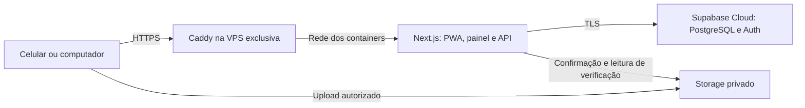

Docker Compose executará Caddy e uma instância da aplicação. Caddy 2.11.4 e Compose 5.5.1 são referências verificadas em 09/09/2026; imagens e ferramentas serão fixadas por versão/digest no bootstrap e submetidas a teste de compatibilidade. Fontes: [Caddy](https://github.com/caddyserver/caddy/releases/tag/v2.11.4), [Compose](https://github.com/docker/compose/releases/tag/v5.5.1).

Somente o proxy publicará portas web 80/443. A aplicação escutará na rede dos containers, sem porta pública própria. SSH usará chave e origem restrita; API administrativa do Caddy e socket Docker não serão publicados. Dados dos certificados serão persistentes, com permissões restritas. Caddy administra certificados e redirecionamento HTTPS: [documentação](https://caddyserver.com/docs/automatic-https).

Dimensionamento inicial para ensaio: Linux x86-64 suportado, 2 vCPU, 4 GiB de RAM e 40 GiB de disco. Isso é um orçamento de recursos para testar aplicação/proxy, não uma compra nem garantia de capacidade. O build roda no CI, não na VPS. Medir memória, CPU, disco e latência antes da contratação; escolher distribuição e imagens suportadas nessa data. A VPS será independente do n8n.

| Ambiente | Aplicação | Dados |
| --- | --- | --- |
| Desenvolvimento | Computador com hot reload | Supabase local, dados sintéticos |
| Homologação inicial | Imagem de produção no computador, HTTPS para celular | Base local isolada |
| Piloto | VPS exclusiva e domínio HTTPS | Supabase Cloud, dados autorizados |

Não será criado projeto remoto de preview por pull request. Uma homologação remota futura exige projeto de dados e credenciais separados, com cota/custo conferidos.

### 14.2 Imagem e configuração

Build multi-stage com Node fixado, dependências pelo lockfile e runtime não-root. `output: 'standalone'` empacotará a aplicação; o Dockerfile deve copiar também `public` e `.next/static`, incluindo o worker gerado, e testar o caminho do servidor no monorepo. O processo Next.js não terá acesso ao socket Docker. Cache de runtime é descartável e não contém fatos operacionais.

Imagem identificada pelo commit e digest, construída uma vez em CI confiável e testada antes de promoção. O registry será GHCR privado com credencial de leitura na VPS; conferir limites/licença da conta antes de publicar. Actions de terceiros serão fixadas por SHA completo. Pull requests não receberão segredos de produção nem publicarão imagens de release.

URLs e chaves públicas variáveis por ambiente serão fornecidas por configuração runtime explicitamente permitida, carregada online no bootstrap do navegador e preservada apenas no contexto local correspondente. Nenhum segredo integra essa configuração. `NEXT_PUBLIC_*` é embutido no build; portanto não será usado para valores que mudam entre local e piloto. Referência: [Next.js self-hosting](https://nextjs.org/docs/app/guides/self-hosting).

Credenciais privadas ficam em arquivo de ambiente com acesso restrito no host, fora do repositório e da imagem. Não se imprime ambiente em logs. Na VPS, `SUPABASE_URL` e `SUPABASE_PUBLIC_URL` apontam ao projeto Cloud aprovado; `APP_BASE_URL` corresponde ao domínio HTTPS. O build não acessa dados do piloto.

### 14.3 Pipeline e publicação

Contrato de automação, a ser implementado em workflows pela story de fundação:

```yaml
integracao:
  - instalar_dependencias_do_lockfile
  - executar_lint_typecheck_testes_e_build
  - testar_migracoes_rls_e_fluxos_criticos
  - construir_imagem_identificada_por_digest
  - verificar_imagem_com_dados_sinteticos
implantacao:
  acionamento: manual_por_operador_autorizado
  concorrencia: uma_implantacao_por_ambiente
  etapas:
    - conferir_digest_validado_e_ambiente_destino
    - verificar_backup_e_compatibilidade_das_migracoes
    - aplicar_migracoes_compativeis
    - implantar_imagem
    - verificar_saude_login_e_sincronizacao
    - registrar_resultado
```

PRs seguem branch curta por story e revisão antes de integrar. No GitHub Free privado, não presumir disponibilidade de ambientes protegidos ou regras de revisão: conferir recursos da conta e registrar revisão manual quando necessário. O script de implantação confere commit confiável e checks aprovados, não aceita digest arbitrário. Fonte: [ambientes GitHub](https://docs.github.com/en/actions/how-tos/deploy/configure-and-manage-deployments/manage-environments).

Uma troca de container pode causar breve indisponibilidade; a outbox mantém eventos e reutiliza as mesmas chaves. Deploy não cancela requisições ativas abruptamente: timeout de encerramento e drenagem serão testados. Não se promete zero downtime com uma instância. Monitorar readiness e smoke test pela URL pública; live não testa dependências.

### 14.4 Compatibilidade e recuperação

Migrações seguem expand/contract: primeiro estrutura aditiva compatível com a aplicação atual, depois código; remoção de campos só após eliminar dependências, inclusive comandos offline antigos. Durante o piloto, `/api/v1` aceitará comandos de todas as versões efetivamente distribuídas, com `schemaVersion` persistido na outbox.

Na falha da aplicação, restaurar o digest anterior se compatível com o schema. Manter a imagem anterior disponível. Não executar automaticamente uma migração destrutiva de reversão. Recuperação de dados é procedimento separado, sujeito à avaliação dos registros posteriores ao backup. Registrar operador, versão, migrações, início/fim e resultado.

### 14.5 Backup e restauração

Referência técnica inicial: exportação diária do banco e cópia incremental diária dos objetos imutáveis, além de backup antes de migração relevante. Meta de ensaio: RPO de até 24 h e RTO de até 4 h. Essas metas não comprovam recuperação nem substituem a expectativa de zero perda do NFR-005; qualquer perda de registro confirmado continua incidente crítico. A aceitabilidade da janela de perda residual deve ser explicitada no go/no-go operacional.

Manter cópias criptografadas externas à VPS e ao projeto Supabase, manifesto por caminho/tamanho/SHA-256 e versão do schema. A rotina deverá incluir dados de aplicação e procedimento suportado de recuperação de identidades Auth, grants, funções, políticas, buckets e configuração. Um dump padrão que omite schemas gerenciados não será declarado backup completo. Guardar segredos de recuperação separadamente; testar recuperação de login e RLS.

Sincronizar primeiro os objetos referenciados no snapshot do banco e só marcar o backup completo após conferir seu manifesto. Objetos em upload ficam identificados; não apontar metadados restaurados a objetos ausentes. Não automatizar expurgo de backups antes de fechar retenção/AB-15. Destino externo e responsável operacional são pendências de negócio/infraestrutura.

No plano gratuito, o Supabase recomenda exportações externas; backups de banco não incluem os bytes do Storage. Fonte: [backups Supabase](https://supabase.com/docs/guides/platform/backups). O teste de restauração acontece em ambiente isolado autorizado, com identidades e artefatos sintéticos antes de dados reais. Registrar tempo, contagens, integridade, acesso a arquivos, permissões e reconciliação da sincronização.

### 14.6 Cotas e condições para o piloto

Consulta em 09/09/2026: Supabase Free inclui 500 MB de banco, 1 GB de arquivos, 5 GB de egress e 5 GB de cached egress; projetos gratuitos podem pausar por inatividade e há limite de dois projetos ativos. Essas cotas devem ser novamente conferidas na conta antes de provisionar. Fonte: [preços Supabase](https://supabase.com/pricing).

Estimativa conservadora: 2 vendedores × 8 visitas × 30 dias = 480 visitas. Com três fotos por visita e média de 350 KiB por foto, são aproximadamente 516 MB decimais de objetos. Cinco fotos médias chegam a aproximadamente 860 MB; a quantidade obrigatória depende de AB-10. Verificação do upload, consultas e cópias externas também consomem egress. A estimativa não reserva capacidade e não pressupõe que o limite máximo de 2 MiB será a média.

No GitHub, medir minutos de CI, artifacts e uso do registry; consultar [Actions](https://docs.github.com/en/billing/concepts/product-billing/github-actions) e [Packages](https://docs.github.com/en/billing/concepts/product-billing/github-packages). Releases anteriores necessárias para rollback não serão removidas por uma limpeza genérica. Nenhum upgrade pago será automático.

Antes do primeiro deploy: conferir domínio, VPS, SMTP, região/cotas, destino de backup e alinhamento formal do PRD que ainda menciona Vercel. Nenhuma contratação ou publicação é executada por este documento.

## 15. Segurança e desempenho

### 15.1 Sessões, capacidades e autorização

Login e recuperação usam Supabase Auth; senha mínima técnica de 12 caracteres, colagem/gerenciadores permitidos, sem credenciais compartilhadas. Cadastro público desabilitado; provisionamento administrativo. PKCE apenas nos fluxos que o suportam. JWT com validade de referência de 1 h e renovação pelo SDK; validar assinatura/emissor/audiência/expiração. Verificar perfil ativo e capacidade na operação, independentemente do JWT.

O padrão escolhido de `@supabase/ssr` compartilha cookies com o cliente browser: não será descrito como HttpOnly. Cookies `Secure` em HTTPS e `SameSite=Lax`, sem domínio amplo. Não copiar tokens para IndexedDB, URLs ou logs. Referência: [guia SSR](https://supabase.com/docs/guides/auth/server-side/advanced-guide). Cliente Supabase do chamador deve ser criado por requisição, nunca compartilhado globalmente.

Revogação no servidor bloqueia próximas operações autorizadas. Offline não permite descobrir bloqueio remoto imediatamente. Padrão técnico de acesso local: até 24 h após a última validação online do usuário ativo, no dispositivo e contexto já associados; ao expirar, bloquear leitura/edição e preservar pendências para reautenticação da mesma identidade. Detectar recuo relevante do relógio local e exigir validação online, sem alterar horários coletados. Isso não é prova inviolável de tempo em aparelho controlado pelo usuário; sua exposição residual deve integrar AB-15. Logout limpa estado em memória e acesso à partição, sem apagar silenciosamente outbox pendente.

Autorização por capacidades, não apenas por um papel global. Administração de cadastros não concede automaticamente leitura de fotos ou GPS (PRD seção 6/AB-15). Usuários podem ter atribuições múltiplas; o contexto carrega `roles`, capacidades e escopos atuais. A permissão sensível deve estar aprovada antes de liberar dados reais. Banco e Storage aplicam escopo atual inclusive a URLs de emissão de evidência.

### 15.2 Fronteiras HTTP, CSP e validação

- Mutação por cookie: exigir Origin igual a `APP_BASE_URL`, tipo JSON nos endpoints JSON e cabeçalho CSRF próprio emitido pela aplicação; checar Fetch Metadata como proteção adicional. Formulários Auth seguem validação de origem/PKCE do fluxo aplicável. Bearer da CLI é validado separadamente; rejeitar credenciais conflitantes. CORS não substitui CSRF. Referência: [OWASP CSRF](https://cheatsheetseries.owasp.org/cheatsheets/Cross-Site_Request_Forgery_Prevention_Cheat_Sheet.html).
- CORS do BFF limitado às origens de teste/piloto configuradas, nunca wildcard com cookies. Downloads de evidências verificam capacidade em cada emissão; URL assinada de leitura por 60 s, não persistida nem logada. Bloqueio de usuário não revoga magicamente uma URL já emitida.
- CSP por allowlist: `default-src 'self'`, `object-src 'none'`, `base-uri 'self'`, `frame-ancestors 'none'`, `form-action 'self'`, scripts por hash no shell estático ou nonce em páginas dinâmicas. Não usar `unsafe-eval` em produção. CSS por hashes/nonces/arquivos próprios; exceções de estilo inline devem ser mínimas e testadas. `connect-src` contém somente aplicação e Supabase configurado; `img-src` admite `blob:` para prévias locais. Nunca usar nonce dinâmico num HTML compartilhado em cache.
- `Referrer-Policy: no-referrer`, `X-Content-Type-Options: nosniff`; câmera e geolocalização apenas self, microfone desabilitado. HSTS no domínio depois de validar HTTPS; sem incluir subdomínios não controlados.
- Texto de usuário renderizado como texto; sem HTML arbitrário. Validar UUIDs, enums, finitude de números, limites e campos condicionais. Importações e exportações neutralizam fórmulas de planilha. Endereços de Storage são construídos no servidor, nunca obtidos de URLs arbitrárias enviadas pelo cliente.

### 15.3 Limites técnicos iniciais

Valores operacionais ajustáveis por configuração e ensaios; não são novas regras comerciais:

| Limite | Valor inicial | Tratamento |
| --- | --- | --- |
| Corpo JSON | 1 MiB | Rejeitar 413 antes de alocar corpo ilimitado |
| Eventos por lote | 25 | Particionar outbox, preservar sequência |
| Concorrência cliente | 1 lote e 1 upload por aparelho | Evitar disputa e sobrecarga |
| Consultas paginadas | 50 padrão, 100 máximo | Cursor com ordenação estável |
| Chamadas comuns BFF | 120/min por usuário, burst 30 | 429 + Retry-After |
| Sincronização | 30 lotes/min por usuário, burst 5 | Espera, sem descarte |
| Confirmação de anexos | 20/min por usuário | Limita verificação e egress |
| Falhas de Auth | Limites nativos Supabase; testar antes do piloto | Resposta genérica, sem revelar conta |
| Timeout de leitura | 10 s | Erro recuperável |
| Timeout de lote | 30 s | Sucesso já confirmado permanece; reenviar mesmas chaves |
| Foto comprimida | 2 MiB máximo; alvo médio 350 KiB | JPEG/WebP, até 1600 px no lado maior |

Limiter por usuário em memória é suficiente à instância única do BFF, reinicia com o processo e não é uma barreira global. A superfície exposta pela Data API também precisa impor limites de lote/escopo e controlar emissão de objetos no banco/Storage, mesmo sem ser usada pela PWA como API de negócio. Não presumir que Caddy padrão oferece rate limiter por usuário. Fotos cuja compressão prejudique legibilidade deverão ser reportadas em ensaio antes de fechar AB-10.

### 15.4 Evidências e verificação de integridade

Upload continua direto ao Storage privado, sempre com caminho reservado e sem sobrescrita. Para provar o SHA-256 do conteúdo, a confirmação lerá o objeto pelo servidor em fluxo limitado a 2 MiB, calculará hash/tamanho e verificará assinatura de formato/decodificação. A leitura é transitória em memória, sem gravar bytes no banco ou em disco efêmero. Esta é uma exceção técnica deliberada às afirmações anteriores de que nenhum byte atravessa o BFF: o envio não atravessa; a leitura de verificação atravessa. Evita depender de ETag ou metadados declarados como se fossem SHA-256 comprovado.

Somente depois da conferência o anexo vira verificado. Divergência preserva a pendência, sinaliza erro e impede conclusão que exija a evidência; nova captura cria novo ID/caminho. Estado verificado e caminho não podem ser editados pelo cliente. Verificar hash comprova identidade dos bytes recebidos, não autenticidade do acontecimento fotografado. Remover EXIF desnecessário durante compressão, mantendo eventos GPS estruturados sujeitos à política.

### 15.5 Abertura offline e armazenamento local

`/~offline` será um shell completo e genérico do vendedor, sem identidade, credenciais ou dados privados no HTML, pré-cacheado com todos os módulos necessários à visita. `/route`, `/visit/*` e `/sync` carregam esse mesmo núcleo cliente; navegação interna do wizard usa estado/History API e nunca exige uma resposta RSC para avançar offline. Hard refresh offline de uma rota de campo recebe o shell estático, que resolve a URL e lê a partição local autorizada. O fallback não atende `/management`, `/api`, Auth ou arquivos externos.

O layout vendedor não faz `requireAuthenticatedActor()` durante renderização do shell: `LocalSessionGate` consulta `/me` online e aplica a política local ao abrir offline. Páginas gerenciais continuam autenticadas no servidor. Só mostrar "Disponível offline" depois de confirmar instalação do worker, ativos exigidos e commit do pacote da rota. Versão nova do worker aguarda salvamento de rascunhos; migração IndexedDB preserva outbox e anexos. Atualizar cache não autoriza apagar registros locais.

Dados estruturados e Blobs serão persistidos pelo mesmo repositório Dexie; compressão e hash ocorrem antes de abrir a transação de escrita. Falha de quota/commit mantém formulário e apresenta erro; não mostrar "Salvo no aparelho" antes do commit. Usar `navigator.storage.estimate()` e solicitar `persist()` quando disponível, verificando o retorno. Persistência solicitada não garante proteção contra limpeza pelo usuário, modo privado, perda do aparelho ou comportamento do navegador. Fonte: [StorageManager.persist](https://developer.mozilla.org/en-US/docs/Web/API/StorageManager/persist).

Partição por usuário não é criptografia nem protege contra XSS ou acesso ao perfil do navegador. Exigir dispositivo de teste controlado e proteção do sistema operacional antes de uso real, nos termos de AB-14/15. Não inventar promessa de proteção em repouso com uma chave gravada ao lado dos dados. Sessões bloqueadas preservam pendências sem expô-las a outra identidade. Nunca usar dados reais em desenvolvimento sem processo aprovado.

### 15.6 Metas mensuráveis de desempenho

Fechamento técnico inicial de NFR-009: medir em build de produção, aparelho Android representativo, 480 visitas sintéticas e teste separado de 5.000 visitas para crescimento. Rede de referência: 4G simulada com 150 ms RTT, 1,6 Mbps download/750 kbps upload; repetir no aparelho/rede reais de AB-14.

| Métrica | Meta de engenharia | Medição |
| --- | --- | --- |
| JS inicial do vendedor | Até 300 KiB comprimidos | Relatório de build, excluindo imagens |
| Abrir rota já carregada | p95 ≤ 1 s | Primeiro quadro útil a partir do cache local |
| Trocar etapa local | p95 ≤ 200 ms | Entrada até renderização |
| Salvar etapa sem foto | p95 ≤ 300 ms | Entrada até commit IndexedDB |
| Carregar rota online | p95 ≤ 3 s | Clique até renderização útil |
| Leitura BFF | p95 ≤ 750 ms | Tempo servidor, sem rede do cliente |
| Comando simples BFF | p95 ≤ 1,5 s | Inclui transação, sem upload |
| Lote de 25 eventos sem foto | p95 ≤ 10 s | Até resposta do BFF |

São metas a comprovar, não resultados medidos. Teste com 3 usuários concorrentes e rajada de 10; coletar p50/p95/erros, memória e tempo de banco. Otimizar índices existentes com planos de execução, paginação, projeções pequenas e filtros antes de agregação. Evitar N+1, índices redundantes e cache compartilhado de respostas privadas. Bibliotecas de exportação/mapas P1 entram por carregamento tardio; componentes de formulário observam só os campos necessários.

Escalar verticalmente se memória sustentada ultrapassar 75%, ocorrer OOM ou metas falharem após otimização. Escala horizontal exige redesenho explícito de rate limiting/cache/coordenadores e ensaios; não é ativada automaticamente. Metas de disponibilidade 99% e sincronização 98%/24 h são objetivos do PRD, sem SLA de fornecedor implícito.

## 16. Estratégia de testes

### 16.1 Pirâmide e organização

Predominam testes unitários de regras puras e componentes; testes de integração exercitam banco/RLS/RPC reais locais; poucos E2E completos cobrem riscos de campo. Arquitetura frontend integrada na seção 10 substitui a necessidade de outro documento duplicado de frontend.

| Camada | Ferramenta e localização | Responsabilidade |
| --- | --- | --- |
| Domínio/contratos | Vitest, `packages/*/src/**/*.test.ts` | Decimais, estados, validação, serialização |
| UI | Testing Library, `apps/web/src/features/**/*.test.tsx` | Resposta explícita, foco, falha de persistência |
| Serviços/API | Vitest, `tests/integration/` | Auth, CSRF, conflitos, erros, uploads |
| Banco/RLS | pgTAP, `supabase/tests/` | Grants, escopos, transações, invariantes |
| Jornadas | Playwright, `tests/e2e/` | Online/offline, instalação, retomada |
| Acessibilidade | axe + inspeção manual | Semântica, foco, teclado, TalkBack |
| Recuperação/carga | CLI e ensaios documentados | Backup, restauração, latência e recursos |

Fixtures só sintéticas: vendedor A, vendedor B, gestor de A, administrador sem permissão de evidência e usuário bloqueado. Testar HTTP e chamadas diretas à Data API/Storage com os mesmos atores; não limitar segurança à interface. SQL de teste não roda em projeto remoto do piloto.

### 16.2 Cenários obrigatórios e rastreabilidade

| Cenário | Evidência exigida | Requisitos |
| --- | --- | --- |
| Login, bloqueio e escopo | Usuário B não lê/altera visita de A; admin sem capacidade não vê fotos/GPS | FR-001/002, NFR-010, AC-029 |
| Publicar/reordenar | Nova versão preserva contexto antigo; reordenação apenas operacional | FR-004..010, FR-053 |
| Quatro etapas | Zero é válido; vazio não é; indisponibilidade exige motivo | FR-011..039 |
| Primeiro início e reabertura offline | Shell completo com deep link nunca antes acessado online | FR-040/041, NFR-005 |
| Commit local falha | Quota/erro não produz confirmação visual falsa | FR-041/044 |
| Resposta perdida após commit | Reenvio devolve resultado anterior; uma visita, um peso e uma agenda | FR-042/043, NFR-006 |
| Chave concorrente | Mesmo payload concorrente sem duplicidade; payload diferente dá 409 | NFR-006 |
| Lote parcialmente inválido | Eventos independentes confirmados; dependentes aguardam pai | FR-042/043 |
| Ordem e edição concorrente | Versão obsoleta dá 409; nenhum campo atualizado silenciosamente | DATA-03, FR-033/052 |
| Evidência | Sem overwrite, hash adulterado rejeitado, URL expirada e acesso negado | FR-016, NFR-014 |
| Atualização PWA | Outbox/Blobs preservados após worker e migração IndexedDB | FR-040..044 |
| Sucata e relatórios | Coletado e estimado separados; correção preserva original e projeção | FR-027..035, FR-045..053 |
| Backup/restauração | Identidades, tabelas, políticas e arquivos recuperados | NFR-019, AC-036 |
| Isolamento n8n | Configurações/rede/volumes/segredos não referenciam a infraestrutura existente | NFR-018, AC-035 |

### 16.3 Exemplos de comportamento

Pseudocódigo de teste, adaptado aos helpers da story:

```typescript
// Componente: promessa só existe após persistência local.
it('não avança nem mostra salvo se o commit local falhar', async () => {
  repository.saveSectionAndEnqueue.mockRejectedValue(new Error('QUOTA'))
  renderStockStep({ repository })
  await fillValidStockAndContinue()
  expect(screen.getByRole('alert')).toHaveTextContent('Não foi possível salvar')
  expect(navigation.goTo).not.toHaveBeenCalled()
})

// API/banco real: repetir um comando não repete seu efeito.
it('recupera a confirmação canônica após perda da resposta', async () => {
  const first = await sendCommand(actorA, command, 'same-key')
  const repeated = await sendCommand(actorA, command, 'same-key')
  expect(repeated.canonicalId).toBe(first.canonicalId)
  expect(await countEffects(command)).toBe(1)
})

// E2E: usar outro contexto equivale a outro armazenamento; reabrir
// a página precisa manter o MESMO contexto/perfil persistente.
test('retoma visita por deep link offline', async ({ page, context }) => {
  await loginAndPrepareOfflineRoute(page)
  const url = await startVisitAndSaveStock(page)
  await context.setOffline(true)
  await page.close()
  const reopened = await context.newPage()
  await reopened.goto(url)
  await expect(reopened.getByLabel('Heliar')).toHaveValue('0')
})
```

Playwright cobre rede e navegador; complemento obrigatório no Android físico para persistência após encerramento, confiança HTTPS, câmera, GPS, cotas e instalação (AB-14). Não confundir navegação em contexto novo com reabertura do mesmo banco local.

### 16.4 Gates e limitações

Executar `npm run lint`, `npm run typecheck`, `npm test`, `npm run build`, testes pgTAP e E2E selecionados conforme a story. Cobertura não substitui cenários de perda, fraude de escopo e concorrência. Critérios ainda dependentes de AB usam parâmetros sintéticos explicitamente rotulados, sem aprovar regras reais.

NFR-003: alvos de toque de pelo menos 44 px, preferindo 48 px; estados com texto/ícone e não apenas cor; fluxo inteiro por teclado; foco restaurado ao mudar etapa e levado ao resumo de erro. Testar leitor de tela e zoom de 200%. WCAG 2.2 AA permanece meta recomendada de NFR-004, não declaração de conformidade obtida. Regressão visual usa referências do pacote visual para hierarquia, não seus dados ilustrativos como requisitos.

Critério para fundação: stack sobe limpa, contrato mínimo/CLI, autenticação/RLS, health checks e round-trip idempotente sintético. Critério para campo: gates do PRD, métricas no aparelho, recuperação e regras operacionais aprovadas. Neste documento nenhum teste executável da aplicação foi rodado porque o código ainda não existe.

## 17. Padrões de implementação

### 17.1 Regras críticas

Estas regras são obrigatórias em toda story. Uma exceção exige decisão arquitetural registrada, risco explícito e teste correspondente.

| Regra | Aplicação prática | Verificação |
| --- | --- | --- |
| Contrato único | Schemas Zod e DTOs compartilhados residem em `packages/contracts`; não criar cópias manuais na UI, CLI ou servidor | Typecheck e teste de serialização |
| Domínio puro | Estados, transições, decimais e regras condicionais ficam em `packages/domain`, sem Next.js, Supabase, relógio ou rede globais | Testes unitários sem infraestrutura |
| Fronteira de dados | Componentes não chamam Supabase, `fetch` ou Dexie; usam serviços e repositórios tipados | Lint de imports e revisão |
| Escrita segura | Toda mutação reenviável carrega identidade do evento, chave idempotente e versão esperada quando houver edição concorrente | Integração e pgTAP |
| Confirmação durável | A UI só anuncia salvamento/sincronização depois do commit local/canônico correspondente | Componente, E2E e falhas injetadas |
| Menor privilégio | Cliente privilegiado existe somente em adaptador específico e caso de uso permitido; nunca é exportado por helper genérico | Busca de imports, RLS e teste negativo |
| Tempo explícito | Casos de uso recebem uma porta `Clock`; horário do aparelho, recebimento do servidor e confirmação permanecem campos distintos | Unitário com relógio controlado |
| Decimal exato | Dinheiro e peso cruzam JSON como string decimal canônica e usam `numeric` no banco; não usar ponto flutuante para cálculo de negócio | Contrato e propriedade |
| Privacidade por padrão | Não registrar tokens, URLs assinadas, fotos, GPS ou corpos completos; auditoria de acesso sensível é separada e autorizada | Teste de redaction |
| Migração progressiva | Migração aplicada não é reescrita; mudanças seguem expand/contract e preservam eventos offline suportados | Banco limpo e upgrade |
| Configuração validada | Acesso a ambiente passa por `packages/config`; processo falha no início se variável obrigatória for inválida | Teste de configuração |
| CLI primeiro | Capacidade operacional crítica ganha comando/script e saída legível por máquina antes de depender de uma tela administrativa | Aceite da story |

A direção de dependências é `UI/Route Handler/CLI → casos de uso → domínio e contratos`. Adaptadores de HTTP, IndexedDB, Supabase e Storage implementam portas voltadas para dentro. `packages/domain` não importa código de `apps/*`, banco ou navegador; `packages/contracts` não importa UI. Dependências circulares são bloqueadas no lint.

### 17.2 TypeScript, React e API

- TypeScript usa modo estrito; `any`, asserção não comprovada e `@ts-ignore` são proibidos no código de produto. Exceção localizada precisa explicar o motivo e validar a fronteira em runtime.
- Server Components são o padrão nas visões online. `'use client'` aparece somente em ilhas que necessitem estado, efeitos ou APIs do navegador. Fluxos de campo continuam inteiramente operáveis pelo shell cliente offline.
- Efeitos não executam comandos de negócio implicitamente durante renderização. Retentativas preservam a mesma chave; uma nova intenção produz novo identificador.
- Toda entrada externa é `unknown` até passar por schema. Respostas também são validadas no cliente, e OpenAPI 3.1 é gerado ou conferido contra os mesmos contratos.
- Route Handlers contêm apenas composição de contexto, validação e chamada ao caso de uso. SQL, política de autorização e regra condicional não ficam no handler.
- Consultas usam paginação por cursor e ordenação total estável. É proibido retornar `select *` em endpoint de produto.
- Erros não são usados como estados normais de formulário. Campos inválidos retornam detalhes estruturados; indisponibilidade explícita permanece valor do domínio.

### 17.3 Nomes e organização

| Elemento | Convenção | Exemplo |
| --- | --- | --- |
| Arquivo TypeScript | `kebab-case.ts` / `.tsx` | `save-stock-section.ts` |
| Componente e tipo | `PascalCase` | `StockStep`, `SyncCommand` |
| Função e variável | `camelCase` | `confirmAttachment` |
| Constante de domínio | `UPPER_SNAKE_CASE` somente quando verdadeiramente constante | `MAX_SYNC_BATCH_SIZE` |
| Tabela, coluna e função SQL | `snake_case` | `route_versions`, `sync_event` |
| Endpoint | substantivo plural em `kebab-case` | `/api/v1/scrap-schedules` |
| Evento/operação | verbo no passado ou comando explícito versionado | `visit.started.v1` |
| Teste | comportamento observável em português ou inglês consistente por arquivo | `rejeita payload diferente...` |

Cada módulo expõe uma API pública por `index.ts`, mas não cria arquivos-barrel globais que escondam ciclos. Código compartilhado só sobe para `packages/*` após existir uso legítimo em mais de uma fronteira; sem pasta genérica de utilitários de negócio.

### 17.4 Documentação e disciplina por story

Código público ou comportamento não óbvio recebe comentário sobre a razão e as invariantes, não uma tradução da linha. Toda mudança de contrato atualiza schema, OpenAPI, exemplo, teste e consumidor na mesma story. Decisão que altera implantação, segurança, persistência ou dependência ganha ADR curto em `Docs/architecture/decisions/` e referência nesta arquitetura.

Antes de concluir uma story, atualizar seus critérios, checklist, lista de arquivos e evidências de teste. Rodar os gates da seção 16.4. Dependências novas exigem justificativa, licença compatível, versão fixada, avaliação de manutenção/segurança e impacto no bundle ou runtime.

## 18. Tratamento de erros e recuperação

### 18.1 Fluxo unificado

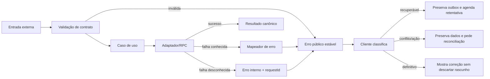

O envelope da seção 5.6 é a única forma pública de erro da API. Exceções de biblioteca, SQL, stack traces e nomes internos não atravessam a fronteira. O servidor registra `requestId`, código estável, rota-modelo, duração e causa sanitizada. A auditoria de negócio é gravada somente quando a transação que representa o fato assim determina; log de aplicação não substitui auditoria.

### 18.2 Taxonomia inicial

| Código | HTTP/estado | Classe no cliente | Conduta |
| --- | --- | --- | --- |
| `AUTH_REQUIRED` | 401 | ação necessária | Renovar uma vez; depois preservar pendências e reautenticar a mesma identidade |
| `FORBIDDEN` | 403 | definitiva enquanto não mudar permissão | Não revelar existência do recurso |
| `VALIDATION_FAILED` | 422 | corrigível | Associar erros aos campos e manter formulário |
| `VERSION_CONFLICT` | 409 | reconciliação | Buscar projeção atual, mostrar diferenças e nunca sobrescrever silenciosamente |
| `EVENT_OUT_OF_ORDER` | 409 | bloqueada por dependência | Manter evento e priorizar o antecessor |
| `IDEMPOTENCY_KEY_REUSED` | 409 | definitiva | Não gerar nova chave automaticamente para a mesma intenção divergente |
| `ATTACHMENT_MISMATCH` | 422 | corrigível | Manter pendência; exigir novo objeto/caminho |
| `RATE_LIMITED` | 429 | recuperável | Respeitar `Retry-After` |
| `DEPENDENCY_UNAVAILABLE` | 503 | recuperável | Continuar offline quando possível |
| `INTERNAL_ERROR` | 500 | recuperável limitada | Mensagem neutra com `requestId`; alertar operação |
| `LOCAL_STORAGE_UNAVAILABLE` | estado local | bloqueante no aparelho | Não avançar; manter campos em memória e orientar liberação/exportação autorizada |

Uma restrição de banco ou erro de RPC é convertido por um mapa exaustivo de códigos conhecidos. Erro desconhecido termina como `INTERNAL_ERROR`, nunca como sucesso parcial implícito. No lote, cada evento tem seu próprio resultado; falha de transporte deixa todos sem confirmação local, e o reenvio recupera confirmações já persistidas pela idempotência.

### 18.3 Retentativa e degradação

Retentar automaticamente apenas timeout/rede, HTTP 408, 429, 502, 503 e 504. Intervalos nominais para sincronização são 2 s, 5 s, 15 s, 1 min e 5 min, sempre com jitter e limite de uma execução por aparelho; depois manter cadência máxima de cinco minutos enquanto a aplicação estiver ativa. Abertura, retorno ao primeiro plano, evento `online` e ação manual antecipam uma tentativa, sem criar concorrência. `Retry-After` prevalece. Reiniciar a aplicação não zera `attemptCount` nem cria nova chave.

401 permite uma única renovação de sessão antes de exigir login. 403, 409 e 422 não entram em loop cego. Um conflito de ordem aguarda o pai; conflito de versão exige decisão explícita; validação exige correção. Erros de confirmação do anexo não apagam o Blob local até confirmação canônica.

Quando Supabase estiver indisponível, o BFF falha rápido pelos timeouts da seção 15.3 e a PWA degrada para o pacote local já autorizado. Não existe réplica alternativa no MVP, portanto um circuit breaker distribuído não traria recuperação; caso os ensaios mostrem cascata, poderá ser adicionado um guard local de curta duração por story. Google Maps degrada para endereço copiável. Falha de SMTP não bloqueia visitas já autenticadas, mas recuperação de senha fica indisponível e gera alerta. Nenhuma dessas degradações é apresentada como sincronização concluída.

### 18.4 Recuperação de falhas parciais

- Objetos reservados mas não confirmados ficam em estado identificável. Um comando CLI lista órfãos; remoção só ocorre após prazo de retenção aprovado e prova de ausência de referência.
- Resultado confirmado no servidor e ainda pendente no aparelho é reconciliado reenviando a mesma chave e persistindo a resposta canônica antes de remover a outbox.
- Migração local falha fechada: conserva banco anterior, registra diagnóstico e bloqueia escrita até recuperação; nunca recria IndexedDB silenciosamente.
- Uma implantação falha volta à imagem anterior compatível; não desfaz migração destrutiva automaticamente.
- Restauração de backup só encerra após smoke tests de Auth, RLS, leitura de objeto, idempotência e contagens do manifesto.

Runbooks ficam em `Docs/runbooks/`, identificam gatilho, pré-condições, comandos, evidência, escalonamento e critério de encerramento. No primeiro release de campo são obrigatórios: aplicação indisponível, sincronização atrasada, armazenamento local cheio, anexo órfão, sessão bloqueada, quota próxima, rollback e restauração.

## 19. Observabilidade e operação

### 19.1 Sinais e privacidade

Pino emitirá logs JSON para `stdout/stderr`; Caddy emitirá acesso em JSON. O host aplica rotação por tamanho/tempo e limite de disco. Campos mínimos da aplicação: `timestamp`, `level`, `service`, `environment`, `version`, `requestId`, `routeTemplate`, `method`, `status`, `durationMs`, `errorCode` e `dependency` quando aplicável. IP, user-agent e identificadores de usuário não entram por padrão no log de acesso; auditoria autorizada mantém autor e alvo no banco.

Produção usa `info`; `debug` exige janela temporária e nunca desativa redaction. Corpos, query strings livres, cookies, cabeçalhos de autorização, chaves, URLs assinadas, coordenadas e conteúdo de arquivos são sempre removidos. Retenção e acesso aos logs dependem de AB-15; até sua aprovação, nenhum dado real será coletado.

Métricas derivadas de logs e consultas agregadas:

- HTTP: volume, p50/p95, 4xx/5xx e timeout por rota-modelo;
- sincronização: eventos confirmados, recuperáveis, rejeitados, idade do pendente mais antigo e proporção em até 24 h;
- evidências: reservas, uploads confirmados, divergências, órfãos e bytes armazenados;
- banco/Auth: latência, falhas de conexão, ocupação e negações agregadas;
- aplicação/VPS: CPU, memória, disco, reinícios, versão e validade do certificado;
- continuidade: idade do último backup válido, último teste de restauração e integridade do manifesto;
- cliente: tempo de abertura/commit, quota estimada e falha local, enviados somente com política aprovada e sem conteúdo de visita/GPS.

Disponibilidade segue NFR-007: minutos em que a URL pública apta a servir o shell ou a API essencial respondeu com sucesso, divididos pelos minutos previstos da janela do piloto, excluindo somente manutenção previamente registrada na política aprovada. Sincronização segue NFR-008 usando `confirmed_at - occurred_at`, com relógio do aparelho marcado como suspeito tratado em coorte separada; fórmula final e exceções permanecem subordinadas ao PRD.

### 19.2 Saúde, diagnóstico e comandos

| Interface | Exposição | Semântica |
| --- | --- | --- |
| `GET /api/v1/health/live` | pública, resposta mínima | Processo atende; não consulta dependências nem expõe versão/configuração |
| `GET /api/v1/health/ready` | rede interna/operador | Aplicação pronta e dependências essenciais alcançáveis |
| `npm run ops:status -- --json` | CLI autorizada | Versão, readiness, recursos e dependências |
| `npm run ops:sync:summary -- --json` | CLI autorizada | Estados/idades agregadas, sem payload |
| `npm run ops:quota -- --json` | CLI autorizada | Banco, Storage, egress disponível quando o provedor expuser |
| `npm run ops:backup:verify -- --manifest ...` | CLI operacional | Assinatura/hash, idade e cobertura do backup |
| `npm run ops:smoke -- --environment ...` | CLI com ator sintético | Auth, RLS, idempotência e Storage no ambiente permitido |

`live` alimenta o proxy; `ready` retira a instância de uso durante inicialização/falha essencial, mas não executa escrita. O smoke test profundo é separado para não gerar fatos a cada verificação. Saídas de CLI têm código de processo significativo, modo JSON estável e modo humano conciso.

### 19.3 Alertas iniciais

| Condição | Severidade e gatilho | Resposta |
| --- | --- | --- |
| URL pública indisponível | crítica após 3 verificações consecutivas de 1 min | Confirmar VPS/Caddy/app; comunicar e seguir runbook |
| 5xx/timeout | alta se >5% por 5 min e ao menos 20 requisições; também alertar 5 falhas consecutivas | Correlacionar por versão/rota/dependência |
| Sincronização envelhecida | aviso >1 h; alta >12 h; crítica ao risco de 24 h | Separar aparelho, Auth, rede, contrato e servidor |
| Divergência de anexo | alta em qualquer ocorrência real repetida; crítica se sistêmica | Suspender expurgo e verificar pipeline |
| Banco ou Storage | aviso em 70% da cota; alta em 85% | Projetar crescimento e pedir decisão antes de cobrança |
| Disco da VPS | aviso em 75%; alta em 85% | Ver logs/imagens; limpeza somente por retenção segura |
| Backup | alta se último válido >30 h; crítica após falha de restauração | Refazer cópia, preservar anteriores e escalar |
| Certificado | aviso se expira em <14 dias | Conferir DNS, portas e renovação Caddy |
| Reinício/OOM | alta em qualquer OOM ou 3 reinícios/15 min | Capturar recursos, reverter se associado ao release |
| Auth/permissão | alta por pico anormal de negações ou alteração privilegiada inesperada | Preservar auditoria e investigar sem bloquear usuários em massa |

Um monitor sintético deve executar fora da VPS para detectar falha do host/rede. A escolha do serviço, destinatários e canal de plantão é gate operacional porque envolve conta, privacidade e possível custo; não será substituída por um monitor no mesmo host. Até o piloto, os limiares serão testados por injeção de falha e ajustados para o baixo volume esperado. Alertas agrupam ocorrências para evitar tempestade e sempre apontam para um runbook.

### 19.4 Painel e revisão operacional

Não será implantada uma plataforma completa de observabilidade no MVP sem necessidade medida. O painel inicial pode ser gerado de métricas agregadas e logs estruturados, mas a CLI é o contrato primário. Uma revisão diária do piloto confere disponibilidade, sincronização, quotas, backups e erros; uma revisão por release compara latência, bundle, recursos e regressões.

O operador registra incidente, início/fim, impacto, versão, causa provável, ação e dados recuperados. Incidentes de perda confirmada, acesso indevido, evidência exposta ou restauração inválida interrompem o go-live até análise. A adoção futura de OpenTelemetry/collector ou serviço gerenciado exige story própria, orçamento, retenção e redaction validados.

## 20. Validação arquitetural e gates

### 20.1 Resultado executivo

O projeto é **fullstack** e todas as dez áreas do checklist de arquitetura foram avaliadas, inclusive frontend e acessibilidade. A prontidão é **alta para decompor e executar as stories de fundação local**, **média para implementar todo o MVP** e **não aprovada para piloto com dados reais** enquanto os gates de negócio, privacidade e operação permanecerem abertos.

O desenho é forte em fronteiras modulares, operação offline durável, idempotência, autorização em profundidade, histórico e portabilidade local→VPS. Os principais riscos não estão escondidos como decisões técnicas: política de campo, privacidade/retenção, origem de dados, dispositivos, recuperação e operação do piloto continuam vinculados aos `AB-*` do PRD.

### 20.2 Resumo do checklist

`Atendidos` significa que existe uma decisão técnica concreta neste documento; não significa que código ou teste já exista. Itens parciais não são contados como aprovados.

| Área | Atendidos | Estado | Evidência/gap principal |
| --- | ---: | --- | --- |
| 1. Alinhamento de requisitos | 13/15 (87%) | Parcial | Modelo/fluxos/testes nas seções 4–16 e matriz detalhada no PRD §11; stories e gates de negócio ainda ausentes |
| 2. Fundamentos arquiteturais | 20/20 (100%) | Atendido no desenho | Componentes, fluxos, limites e padrões nas seções 2, 6 e 8 |
| 3. Stack e decisões | 18/20 (90%) | Parcial | Versões e razões definidas; compatibilidade/licenças e schema executável dependem da fundação |
| 4. Frontend | 27/30 (90%) | Parcial | Offline, rotas, estado, componentes e integração definidos; falta `front-end-spec.md` e validação visual/dispositivo |
| 5. Resiliência/operação | 17/20 (85%) | Parcial | Recuperação, implantação e alertas definidos; faltam provedor externo, runbooks executáveis e ensaio |
| 6. Segurança/conformidade | 18/20 (90%) | Parcial | Controles técnicos definidos; retenção, bases e acessos reais dependem de AB-15 |
| 7. Guia de implementação | 22/25 (88%) | Parcial | Estrutura, padrões e testes definidos; repositório, stories e automações ainda não existem |
| 8. Dependências/integrações | 12/15 (80%) | Parcial | Serviços e falhas mapeados; SMTP, monitor, licenças e cotas precisam de validação operacional |
| 9. Adequação a agentes de IA | 18/20 (90%) | Parcial | Limites e exemplos explícitos; faltam stories pequenas e artefatos executáveis |
| 10. Acessibilidade | 10/10 (100%) | Atendido no desenho | Critérios e testes nas seções 10, 15 e 16 |
| **Total** | **175/195 (90%)** | **Pronto para fundação, condicionado** | Nenhum item implementado foi presumido como validado |

### 20.3 Situação das decisões técnicas do PRD

| Decisão | Situação arquitetural | Pendência para fechamento |
| --- | --- | --- |
| `TA-01` | Resolvida: Supabase-first, BFF fino Next.js, sem NestJS no MVP | Registrar no PRD junto da troca Vercel→VPS |
| `TA-02` | Resolvida: PostgreSQL, Auth, RLS e Storage; sem funções externas obrigatórias | Provar permissões no bootstrap |
| `TA-03` | Resolvida: monorepo npm workspaces | Criar estrutura/lockfile |
| `TA-04` | Dimensionada inicialmente na seção 14.6 | Recalcular com AB-10, conta e carga reais |
| `TA-05` | Estratégia e RPO/RTO de ensaio definidos | Escolher destino externo e passar restauração |
| `TA-06` | Superada pela decisão de VPS; limites Vercel deixam de se aplicar | Controle de mudança do PRD |
| `TA-07` | Supabase Storage privado, compressão, hash e capacidade inicial definidos | Fechar AB-10/15/18 formalmente e ensaiar backup/egress |
| `TA-08` | Ambientes, ausência de preview remoto e segregação de segredos definidos | Provisionar sem cobrança automática |
| `TA-09` | PostGIS e eventos pontuais, sem rastreamento contínuo | Medir consultas e fechar tolerância DATA-02/AB-11 |
| `TA-10` | Pipeline, digest, promoção manual e gates definidos | Implementar CI e confirmar proteções disponíveis na conta |

`AB-18` recebe nesta arquitetura a escolha técnica de Supabase Storage privado. O gate só pode ser marcado fechado no PRD depois de aceitar capacidade, retenção e recuperação junto de AB-10/15 e do ensaio de TA-05/07.

### 20.4 Cinco riscos prioritários

| Prioridade | Risco | Impacto | Mitigação/gate |
| ---: | --- | --- | --- |
| 1 | Regras `AB-01..12` e política de foto/GPS sem aprovação | Fluxos errados ou coleta indevida | Fechar cada gate antes da story funcional correspondente; parametrizar apenas o que o PRD permite |
| 2 | LGPD, retenção e perfis sensíveis (`AB-15`) | Exposição e uso não autorizado de fotos/localização | Não usar dados reais; aprovar finalidade, aviso, acesso, retenção, descarte e resposta a incidente |
| 3 | Durabilidade prometida versus backup/cotas do plano | Perda confirmada ou restauração incompleta | Destino externo, manifesto e ensaio de restauração; resolver a tolerância residual antes do go-live |
| 4 | Aparelho/navegador/armazenamento não validados (`AB-14`) | Falha offline em campo | Matriz física, HTTPS, encerramento, quota, câmera/GPS e atualização PWA em teste real |
| 5 | VPS diverge do NFR-016/DEC-012 e falta operação nomeada | Deploy sem aprovação ou resposta a incidente | Controle de mudança do PRD, VPS exclusiva, monitor externo, responsáveis, SMTP, domínio e runbooks |

As cotas de fotos/egress, o arquivo real de clientes (`AB-13`) e a definição de filtros (`AB-16`) permanecem riscos altos dentro desses grupos. Escala horizontal, mapas e exportações P1 não são bloqueadores do núcleo.

### 20.5 Gates de avanço

| Marco | Condições mínimas |
| --- | --- |
| Escrever stories de fundação | Este documento como fonte técnica; cada story com critério, checklist e lista de arquivos |
| Iniciar implementação local | Inicializar repositório, lockfile e ambientes; validar combinação/licenças das versões; criar contratos e migração base |
| Implementar módulo funcional | Gates `AB-*` diretamente associados fechados ou comportamento explicitamente bloqueado/configurável |
| Homologar no celular | `AB-14`, HTTPS confiável, pacote offline, falhas de quota/rede/sessão e matriz física aprovados |
| Implantar na VPS | Mudança do PRD aprovada, VPS/domínio/SMTP/segredos, CI, backup externo, monitor e rollback testados |
| Usar dados reais | `AB-13`, `AB-15`, perfis sensíveis, retenção, suporte e resposta a incidente aprovados |
| Iniciar piloto | Todos os P0 aplicáveis, critérios de aceite, restauração, cotas, observabilidade e go/no-go do responsável |

### 20.6 Sequência recomendada de implementação

1. Story de bootstrap: Git, workspaces, ferramentas locais, contratos mínimos, CI e imagem reproduzível.
2. Story de identidade e barreiras: Auth, perfis/capacidades, RLS/grants, atores sintéticos e CLI de diagnóstico.
3. Story de núcleo offline: shell, banco Dexie versionado, pacote de rota sintético, rascunho/outbox e estados visíveis.
4. Story de sincronização: RPC por evento, idempotência, ordem, conflitos e round-trip pela CLI antes da UI completa.
5. Stories verticais por etapa da visita, somente após os respectivos `AB-*`, incluindo testes local/banco/E2E.
6. Planejamento e gestão, depois inteligência/agenda; exportação e mapa permanecem P1.
7. Hardening: anexos, observabilidade, backup/restauração, segurança, carga e dispositivo físico.
8. Empacotamento VPS e ensaio de piloto, sem tocar no n8n.

O próximo artefato correto é a primeira story de fundação em `Docs/stories/`. Ela não deve implementar o domínio inteiro: deve provar a stack, o contrato CLI/API, o ambiente local e os quality gates com dados sintéticos.
