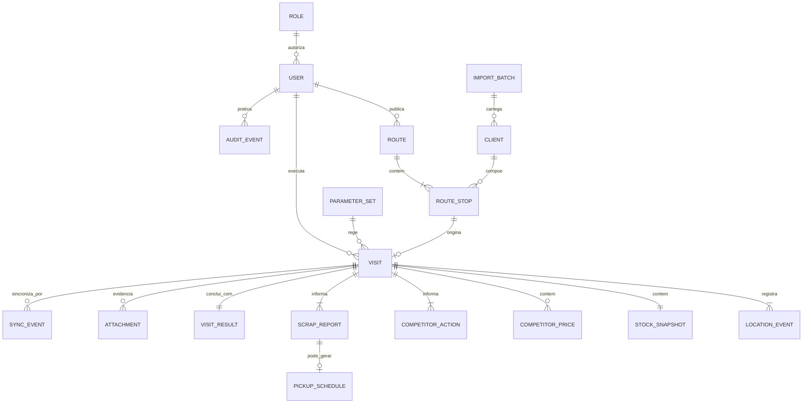

# Cirne Rotas - Product Requirements Document (PRD)

## Controle do documento

| Campo | Valor |
| --- | --- |
| Produto | Cirne Rotas - Piloto Simplificado |
| Versão | 0.4 |
| Data | 17/09/2026 |
| Status | Rascunho completo para revisão e aprovação de negócio |
| Autoria | Morgan (Product Manager) |
| Fonte principal | `BRIEFING_MESTRE_Cirne_Rotas_v0.1.docx` |
| Fontes complementares | `Cirne_Rotas_Apresentacao_Executiva_v0.3.pptx` e `PACOTE_VISUAL_Cirne_Rotas_v0.1/` |
| Limite de autoridade | Este PRD não autoriza implementação, deploy, uso de dados reais, alteração da VPS ou intervenção no n8n. |

### Legenda de maturidade

- **CONFIRMADO:** decisão tomada pelo negócio e obrigatória no PRD.
- **RECOMENDADO:** direção proposta que ainda requer validação explícita.
- **EM ABERTO:** decisão com gate, responsável e prazo a definir antes da etapa indicada.
- **FORA DO MVP:** item excluído do piloto, salvo mudança formal de escopo.

### Change Log

| Data | Versão | Descrição | Autor |
| --- | --- | --- | --- |
| 03/09/2026 | 0.1 | Estruturação inicial a partir do Briefing Mestre v0.1, apresentação executiva v0.3 e pacote visual v0.1. | Morgan (PM) |
| 03/09/2026 | 0.2 | Infraestrutura do piloto alterada para GitHub, Supabase e Vercel em planos gratuitos, por decisão do negócio. | Morgan (PM) |
| 03/09/2026 | 0.3 | PRD consolidado com requisitos, UX, premissas técnicas, epics, jornadas, dados, critérios de aceite, métricas, riscos, decisões, rastreabilidade e checklist. | Morgan (PM) |
| 17/09/2026 | 0.4 | `AB-12` encerrada: somente o Gestor altera a composição publicada, com motivo, nova versão e histórico; o Vendedor apenas reordena pendências e não possui fluxo de solicitação no MVP. | Morgan (PM) |

## 1. Goals and Background Context

### 1.1 Resumo executivo

O Cirne Rotas será uma PWA mobile-first para organizar a rota diária dos vendedores e transformar cada visita em um registro comercial e operacional confiável. O vendedor acessará sua lista de clientes, abrirá a navegação externa, iniciará a visita e preencherá um roteiro curto de Estoque, Concorrência, Sucata e Resultado. O gestor planejará rotas simples e acompanhará execução, inteligência de mercado e agenda de sucata.

O piloto terá duração de referência de 30 dias, com 2 vendedores, 1 gestor, região limitada e 5 a 8 clientes por vendedor/dia. O objetivo é gerar evidência de adoção, qualidade dos dados, valor comercial e viabilidade operacional antes de ampliar o investimento.

### 1.2 Problema

O planejamento das visitas é fragmentado; a execução não possui rastreabilidade consolidada; estoque, preços e ações da concorrência chegam de forma tardia ou não estruturada; e sucata coletada é confundida com sucata aguardando logística. A internet móvel instável também pode provocar perda, repetição ou atraso no envio dos registros.

O produto deve criar uma rotina de campo simples e não punitiva. Seu valor não está em apenas exibir um mapa, mas em devolver à gestão dados acionáveis sobre execução, presença Heliar/Moura, concorrência, sucata e resultado comercial.

### 1.3 Objetivos

- Planejar e publicar uma lista diária de clientes por vendedor.
- Permitir ao vendedor executar a rota com autonomia e abrir o destino no Google Maps.
- Padronizar a coleta de estoque Heliar/Moura, preços e ações da concorrência.
- Separar de forma absoluta sucata coletada imediatamente de sucata agendada para a logística.
- Garantir evidência temporal e geográfica suficiente para interpretar a visita, sem rastreamento contínuo.
- Manter a rota carregada e o registro completo da visita disponíveis em internet instável.
- Produzir indicadores claros para decidir se o produto deve ser ampliado após o piloto.

### 1.4 Princípios e não negociáveis

- **Simplicidade antes de abrangência:** poucas telas, linguagem direta e uma ação principal por etapa.
- **Ver rota como entrada principal:** o vendedor não terá módulos de negócio paralelos no menu.
- **A rota orienta, não engessa:** ela é uma lista diária de clientes; não exige ponto de saída, retorno ou sequência rígida.
- **Uma visita, um registro:** início, roteiro obrigatório e conclusão pertencem ao mesmo objeto de negócio.
- **Resposta explícita:** zero, “preço não disponível”, “nenhuma ação observada” e “sem sucata” são respostas válidas; campo vazio não é resposta.
- **Sem mistura semântica:** coletado é realizado; agendado é estimado e pendente; esses valores não podem ser somados como se fossem equivalentes.
- **Offline como comportamento de produto:** dados essenciais devem sobreviver à instabilidade e sincronizar sem duplicidade.
- **Localização com finalidade restrita:** captura apenas nos eventos profissionais necessários, sem vigilância contínua.
- **Isolamento absoluto do n8n:** banco, volumes, credenciais, rede, backups e fluxos críticos próprios.

### 1.5 Escopo do MVP

| Capacidade | Prioridade | Maturidade | Entrega mínima |
| --- | --- | --- | --- |
| Acesso | P0 | CONFIRMADO | Login individual, perfis e bloqueio de usuário. |
| Rota diária | P0 | CONFIRMADO | Lista de clientes, status, ordem, detalhe e navegação externa. |
| Execução da visita | P0 | CONFIRMADO | Iniciar, preencher roteiro, revisar e concluir. |
| Estoque | P0 | CONFIRMADO | Totais Heliar e Moura por visita. |
| Concorrência | P0 | CONFIRMADO | Preços repetíveis e informe obrigatório de ações comerciais. |
| Sucata | P0 | CONFIRMADO | Coleta imediata, agendamento ou declaração explícita de ausência. |
| Resultado | P0 | CONFIRMADO | Desfecho, observação, oportunidade e próximo passo. |
| Operação offline | P0 | CONFIRMADO | Rota e formulário disponíveis; fila durável e sincronização idempotente. |
| Gestão | P0 | CONFIRMADO | Planejamento simples, acompanhamento do dia e inteligência básica. |
| Exportação | P1 | CONFIRMADO | CSV/XLSX com filtros essenciais. |
| Mapa gerencial | P1 | CONFIRMADO | Apoio visual com OpenStreetMap/Leaflet, sem ser dependência do planejamento. |

### 1.6 Fora do MVP

- Otimização avançada de rotas, trânsito em tempo real e janelas complexas.
- Navegação dentro do aplicativo e mapas offline completos.
- Rastreamento contínuo de vendedores.
- Aplicativo nativo e publicação em lojas.
- Integração automática com Orion; o piloto utilizará importação controlada.
- Sistema logístico completo de despacho, alocação, roteirização e reconciliação de coletas.
- Construtor genérico de pesquisas.
- Power BI, inteligência artificial e previsões.
- SaaS multiempresa e microserviços.

## 2. Requirements

Cada requisito contém ID único, prioridade e maturidade. Regras dependentes de decisão são vinculadas a um gate `AB-*` e não devem ser tratadas como aprovadas antes de seu fechamento.

### 2.1 Functional Requirements

#### Acesso, papéis e cadastros

- **FR-001 [P0 | CONFIRMADO] - Autenticação individual:** o sistema deve autenticar cada usuário individualmente e impedir acesso de usuário bloqueado. **Racional/regra:** toda ação de campo e gestão precisa ter autor identificável.
- **FR-002 [P0 | CONFIRMADO] - Autorização por papel e escopo:** o sistema deve restringir ações e dados conforme os papéis Vendedor, Gestor e Administrador. **Racional/regra:** o vendedor acessa sua operação de campo; o gestor planeja e acompanha; o administrador mantém usuários, clientes e parâmetros.
- **FR-003 [P0 | CONFIRMADO] - Administração essencial:** o Administrador deve importar e corrigir clientes, manter usuários, bloquear acessos e administrar listas configuráveis autorizadas. **Racional/regra:** o piloto depende de cadastros controlados, sem integração automática com Orion.

#### Rota diária

- **FR-004 [P0 | CONFIRMADO] - Criar rota:** o Gestor deve criar uma rota em rascunho para uma data e um vendedor, selecionando clientes e definindo ordem e prioridade iniciais. **Racional/regra:** a rota é uma lista diária de clientes, sem origem ou retorno obrigatórios.
- **FR-005 [P0 | CONFIRMADO] - Publicar e versionar rota:** o Gestor deve salvar o rascunho, publicar a rota e preservar a versão associada a cada visita. **Racional/regra:** alterações posteriores não podem reescrever o contexto original.
- **FR-006 [P0 | CONFIRMADO] - Ver rota:** o Vendedor deve ver data, progresso, clientes, ordem, prioridade, estado da parada e estado de sincronização da rota do dia. **Racional/regra:** “Ver rota” é a única entrada funcional principal do menu do vendedor.
- **FR-007 [P0 | CONFIRMADO] - Autonomia de execução:** o Vendedor deve poder escolher qualquer cliente pendente e alterar apenas a ordem de execução sem aprovação, com registro de auditoria. **Racional/regra:** a rota orienta, mas não impõe sequência rígida.
- **FR-008 [P0 | CONFIRMADO] - Navegação externa:** o sistema deve abrir o Google Maps por URL com o destino do cliente preenchido quando houver conectividade. **Racional/regra:** navegação interna não integra o MVP.
- **FR-009 [P0 | CONFIRMADO | AB-12] - Alteração de composição:** somente o Gestor pode incluir ou retirar cliente após a publicação, sempre informando motivo e gerando nova versão com histórico auditável. O Vendedor pode apenas reordenar clientes pendentes; não haverá solicitação de alteração pelo Vendedor no MVP. Visitas iniciadas permanecem vinculadas à versão anterior. Ao reconectar, o Vendedor recebe a versão vigente sem remoção silenciosa da cópia offline já carregada. **Racional/regra:** separar autoridade de planejamento e autonomia de execução, preservando contexto histórico e trabalho offline.
- **FR-010 [P1 | RECOMENDADO] - Sugestão por proximidade:** o sistema poderá sugerir o cliente pendente mais próximo usando a localização atual, sem trânsito em tempo real. **Racional/regra:** apoio opcional à decisão do vendedor, sem otimização avançada.

#### Visita e evidências

- **FR-011 [P0 | CONFIRMADO] - Registro único de visita:** o sistema deve manter Iniciar visita, roteiro obrigatório e Concluir visita dentro de um único registro de visita. **Racional/regra:** check-in e check-out são eventos técnicos, não módulos separados.
- **FR-012 [P0 | CONFIRMADO] - Evento de início:** ao iniciar, o sistema deve registrar usuário, cliente, rota/parada, horário do aparelho, horário do servidor quando online, GPS, precisão, distância e identificador offline. **Racional/regra:** criar evidência temporal e geográfica suficiente sem rastreamento contínuo.
- **FR-013 [P0 | CONFIRMADO] - Roteiro obrigatório:** o sistema deve apresentar as etapas Estoque, Concorrência (preços e ações), Sucata e Resultado, com progresso visível. **Racional/regra:** a visita só pode ser concluída quando todas as etapas tiverem resposta válida.
- **FR-014 [P0 | CONFIRMADO] - Evento de conclusão:** ao concluir, o sistema deve registrar horários, GPS/precisão, estado das etapas, resultado, estado de sincronização e justificativas aplicáveis. **Racional/regra:** o encerramento precisa ser completo e auditável.
- **FR-015 [P0 | CONFIRMADO] - Revisão antes de concluir:** o sistema deve mostrar um resumo das quatro etapas, destacar pendências e permitir voltar para corrigir cada uma. **Racional/regra:** reduzir erros sem alongar o fluxo.
- **FR-016 [P0 | EM ABERTO | AB-10] - Política de fotografias:** o sistema deve suportar evidências fotográficas privadas e aplicar a obrigatoriedade que for definida para início, conclusão, exceções e ações da concorrência. **Racional/regra:** a obrigatoriedade ainda não foi decidida e não pode ser presumida.

#### Estoque observado

- **FR-017 [P0 | CONFIRMADO] - Quantidades Heliar e Moura:** o sistema deve exigir, em cada visita, quantidades inteiras não negativas de Heliar e Moura, aceitando zero. **Racional/regra:** estoque observado é um retrato de campo, não inventário contábil.
- **FR-018 [P0 | CONFIRMADO] - Observação de estoque:** o sistema deve permitir observação curta opcional para ruptura, excesso, divergência ou condição relevante. **Racional/regra:** exceções precisam de contexto sem exigir inventário detalhado.
- **FR-019 [P0 | EM ABERTO | AB-01] - Unidade e nível de detalhe:** a unidade oficial, aceitação de estimativa e eventual detalhamento por modelo devem permanecer configuráveis ou bloqueados até decisão. **Racional/regra:** detalhamento por modelo está fora do MVP salvo mudança formal.

#### Preços da concorrência

- **FR-020 [P0 | CONFIRMADO] - Cotações repetíveis:** o sistema deve permitir uma ou mais cotações de concorrentes por visita. **Racional/regra:** diferentes modelos e tecnologias podem ser observados no mesmo cliente.
- **FR-021 [P0 | CONFIRMADO] - Campos da cotação:** cada cotação deve registrar marca/concorrente, modelo ou amperagem, tecnologia, preço em BRL, condição e observação aplicável. Preço informado deve ser maior que zero. **Racional/regra:** dados estruturados viabilizam comparação.
- **FR-022 [P0 | CONFIRMADO] - Preço indisponível:** quando nenhuma cotação puder ser informada, o Vendedor deve selecionar explicitamente a indisponibilidade e registrar um motivo. **Racional/regra:** o fluxo não pode induzir valor fictício.
- **FR-023 [P0 | EM ABERTO | AB-02] - Taxonomias de preço:** marcas, tecnologias, condições e motivos de indisponibilidade devem usar listas aprovadas pela gestão. **Racional/regra:** os valores iniciais das listas ainda precisam ser fechados.

#### Ações comerciais da concorrência

- **FR-024 [P0 | CONFIRMADO] - Informe obrigatório de ação:** toda visita deve responder explicitamente se foi identificada ação comercial da concorrência. **Racional/regra:** campo vazio não equivale a “não”.
- **FR-025 [P0 | CONFIRMADO] - Detalhe da ação:** quando houver ação, o sistema deve exigir concorrente, tipo e descrição objetiva e permitir validade, observação e evidência conforme política. **Racional/regra:** transformar relato disperso em sinal comercial acionável.
- **FR-026 [P0 | EM ABERTO | AB-03] - Taxonomia e evidência:** os tipos de ação e a condição de obrigatoriedade de fotografia devem seguir lista e política aprovadas pela gestão. **Racional/regra:** desconto, prazo, bonificação, material, exclusividade, troca e “outro” são apenas taxonomia recomendada.

#### Sucata

- **FR-027 [P0 | CONFIRMADO] - Informe obrigatório de sucata:** cada visita deve registrar “Coletada agora”, “Agendada para logística” ou “Sem sucata”; ausência de resposta deve impedir a conclusão. **Racional/regra:** sucata é dado operacional de primeira classe.
- **FR-028 [P0 | EM ABERTO | AB-04] - Multiplicidade de eventos:** o modelo deve preservar a possibilidade de múltiplos eventos de sucata, mas a interface inicial só poderá permitir coleta e agendamento simultâneos após decisão do negócio. **Racional/regra:** a opção mutuamente exclusiva é recomendada, não confirmada.
- **FR-029 [P0 | CONFIRMADO] - Coleta realizada:** para sucata coletada, o sistema deve exigir peso real em kg, data/hora, número manual do canhoto/recibo e coletor, usando o usuário autenticado como padrão. **Racional/regra:** kg coletado é realizado e precisa de comprovante e responsável.
- **FR-030 [P0 | CONFIRMADO] - Agendamento:** para sucata agendada, o sistema deve exigir peso estimado, data desejada, cliente/endereço, data da solicitação, Vendedor e origem da visita, criando pendência logística. **Racional/regra:** kg agendado é estimado e não realizado.
- **FR-031 [P0 | CONFIRMADO] - Sem sucata:** o sistema deve permitir a declaração explícita “Sem sucata” sem gerar volume ou pendência. **Racional/regra:** ausência explícita mantém a visita completa.
- **FR-032 [P0 | CONFIRMADO] - Separação de indicadores:** o sistema deve armazenar, exibir e exportar kg coletados e kg agendados separadamente e nunca somá-los como realizados. **Racional/regra:** distinção semântica não negociável.
- **FR-033 [P0 | CONFIRMADO] - Histórico de agenda:** alterações de data, peso ou estado não devem apagar o valor original; cancelamento deve registrar motivo, autor e horário. **Racional/regra:** a pendência precisa ser auditável.
- **FR-034 [P0 | EM ABERTO | AB-08] - Estados operacionais da agenda:** “Pendente” integra o piloto; “Confirmado”, “Concluído” e o SLA de acompanhamento dependem da definição de responsável operacional. **Racional/regra:** não ativar estados sem dono.
- **FR-035 [P0 | EM ABERTO | AB-05/AB-06/AB-07] - Validações de sucata:** casas decimais, limites de peso, unicidade/formato/foto de canhoto, datas permitidas, urgência e endereço alternativo devem seguir regras aprovadas antes da implementação das telas correspondentes. **Racional/regra:** nenhuma dessas regras está autorizada a ser inventada.

#### Resultado e exceções

- **FR-036 [P0 | CONFIRMADO] - Resultado comercial:** o sistema deve registrar um resultado principal e, conforme o resultado, pedido, motivo sem pedido, oportunidade, próximo passo, acompanhamento e observação objetiva. **Racional/regra:** campos estruturados não podem ser substituídos por texto livre.
- **FR-037 [P0 | EM ABERTO | AB-09] - Taxonomias de resultado:** resultados, motivos de não visita/sem pedido e campos do pedido devem seguir listas aprovadas pela gestão. **Racional/regra:** as opções mostradas nos mockups são ilustrativas.
- **FR-038 [P0 | CONFIRMADO | AB-11] - Exceção de GPS:** GPS negado, impreciso ou fora do raio não deve gerar acusação automática; o sistema deve solicitar justificativa, registrar a condição e sinalizar para conferência conforme política aprovada. **Racional/regra:** localização é evidência profissional, não mecanismo punitivo.
- **FR-039 [P0 | CONFIRMADO] - Não visita:** cliente fechado ou não localizado deve gerar motivo e preservar o vínculo com a parada; a coleta parcial de dados dependerá da política `AB-09`. **Racional/regra:** execução precisa distinguir visita concluída de parada não visitada.

#### Offline e sincronização

- **FR-040 [P0 | CONFIRMADO] - Operação offline:** após carregada, a rota deve permanecer consultável e o Vendedor deve poder iniciar, preencher, revisar e concluir a visita sem internet, incluindo arquivos exigidos em fila local. **Racional/regra:** o compromisso offline cobre rota e registro, não mapas.
- **FR-041 [P0 | CONFIRMADO] - Persistência local durável:** o sistema deve gerar identificador único no aparelho e salvar dados e comando de sincronização em uma operação local durável. **Racional/regra:** evitar perda entre preenchimento e fila de envio.
- **FR-042 [P0 | CONFIRMADO] - Sincronização idempotente:** a API deve aceitar reenvio seguro sem duplicar visita, cotação, foto, kg, canhoto ou agendamento. **Racional/regra:** a mesma tentativa pode ser repetida em conexão instável.
- **FR-043 [P0 | CONFIRMADO] - Retentativa e confirmação:** o sistema deve tentar sincronizar ao abrir, voltar ao primeiro plano, recuperar conexão e por ação manual; só deve remover a pendência após confirmação persistida do servidor. **Racional/regra:** envio tentado não equivale a sincronização confirmada.
- **FR-044 [P0 | CONFIRMADO] - Estados de sincronização:** o sistema deve exibir “Salvo no aparelho”, “Sincronizando”, “Sincronizado”, “Erro” e ação necessária, preservando o registro recuperável. **Racional/regra:** o usuário precisa saber o estado real do dado.

#### Gestão, inteligência e exportação

- **FR-045 [P0 | CONFIRMADO] - Visão do dia:** o Gestor deve acompanhar planejados, em andamento, concluídos, não visitados, pendentes de sincronização, erros, motivos e última atualização. **Racional/regra:** consolidar execução e exceções.
- **FR-046 [P0 | CONFIRMADO] - Detalhe da visita:** o Gestor deve consultar respostas, evidências, resultado, localização, horários, sincronização e exceções de uma visita conforme sua permissão. **Racional/regra:** permitir interpretação e revisão do registro.
- **FR-047 [P0 | CONFIRMADO] - Inteligência de campo:** o Gestor deve acessar visões básicas e filtráveis de estoque, preços, ações da concorrência, sucata coletada, sucata agendada e resultados. **Racional/regra:** todas as visões usam a mesma fonte de visitas.
- **FR-048 [P0 | CONFIRMADO] - Agenda de sucata:** o Gestor deve consultar pendências por data, cliente, peso estimado e estado, mantendo coletado e agendado em blocos independentes. **Racional/regra:** transformar visita em agenda acionável sem construir logística completa.
- **FR-049 [P1 | CONFIRMADO] - Exportação:** o sistema deve exportar CSV/XLSX a partir dos relatórios filtrados. **Racional/regra:** permitir análise operacional fora do painel durante o piloto.
- **FR-050 [P1 | CONFIRMADO] - Mapa gerencial:** o sistema poderá exibir mapa de apoio com OpenStreetMap/Leaflet, sem bloquear planejamento ou análise caso esteja indisponível. **Racional/regra:** mapa é apoio visual e não núcleo do fluxo.
- **FR-051 [P0 | EM ABERTO | AB-16] - Filtros e colunas:** o primeiro corte de filtros, colunas, periodicidade e exportações deve ser aprovado antes do dashboard final. **Racional/regra:** período, vendedor, cliente, cidade/região, concorrente, tipo de ação e estado do agendamento são candidatos, não uma decisão final de densidade.

#### Auditoria e preservação histórica

- **FR-052 [P0 | CONFIRMADO] - Trilha de auditoria:** o sistema deve registrar usuário, alvo, antes/depois, horário e origem para reordenação/composição de rota, exceções, canhotos, mudanças de agenda, correções críticas e acesso a evidências. **Racional/regra:** ações que afetam permissão, kg, data, localização ou evidência precisam ser rastreáveis.
- **FR-053 [P0 | CONFIRMADO] - Preservação histórica:** inativar usuário/cliente ou alterar rota, cadastro, agenda ou regras não deve apagar nem reescrever visitas antigas. **Racional/regra:** registros mantêm a versão de contexto vigente no momento da coleta.

### 2.2 Non-Functional Requirements

- **NFR-001 [P0 | CONFIRMADO] - Plataforma:** a solução deve ser uma PWA mobile-first em português do Brasil, priorizando celulares Android do piloto e painel web responsivo para gestão.
- **NFR-002 [P0 | CONFIRMADO] - Usabilidade de campo:** o fluxo deve usar etapas curtas, uma ação principal previsível, entrada numérica rápida, listas em vez de tabelas densas no celular e revisão antes da conclusão.
- **NFR-003 [P0 | CONFIRMADO] - Interação acessível:** alvos de toque devem ter pelo menos 44-48 px; cor nunca pode ser o único sinal; rótulos, foco, mensagens e ícones devem comunicar o estado.
- **NFR-004 [P0 | RECOMENDADO] - Conformidade de acessibilidade:** adotar WCAG 2.2 nível AA como meta de produto, sujeita a confirmação explícita na seção de UI/UX.
- **NFR-005 [P0 | CONFIRMADO] - Durabilidade:** nenhum registro confirmado pode ser perdido; falhas de envio devem manter cópia local recuperável e histórico de tentativas.
- **NFR-006 [P0 | CONFIRMADO] - Idempotência:** operações reenviáveis devem possuir chave idempotente e resultado canônico no servidor para impedir duplicidade.
- **NFR-007 [P0 | CONFIRMADO] - Disponibilidade:** a solução deve buscar disponibilidade mínima de 99% durante a janela do piloto.
- **NFR-008 [P0 | CONFIRMADO] - Sincronização:** pelo menos 98% dos registros devem estar sincronizados em até 24 horas, com fórmula e exceções definidas na seção de indicadores.
- **NFR-009 [P0 | EM ABERTO] - Desempenho:** tempos mensuráveis para abrir rota, navegar entre etapas e confirmar ações devem ser definidos em aparelhos e rede representativos antes dos testes de aceite.
- **NFR-010 [P0 | CONFIRMADO] - Segurança:** todo tráfego deve usar HTTPS; sessões devem ser seguras; autorização deve respeitar papel/escopo; segredos devem permanecer fora do código e seguir menor privilégio.
- **NFR-011 [P0 | CONFIRMADO] - Privacidade:** a coleta de localização deve ter finalidade declarada, ocorrer apenas em eventos necessários e nunca realizar rastreamento contínuo.
- **NFR-012 [P0 | EM ABERTO | AB-15] - LGPD e retenção:** aviso aos colaboradores, bases/finalidades, prazos de retenção/descarte e perfis autorizados a evidências devem ser aprovados antes de usar dados reais.
- **NFR-013 [P0 | CONFIRMADO] - Integridade de dados:** pesos e valores monetários devem preservar precisão decimal; coordenadas devem ser validadas; eventos offline devem possuir ID do aparelho e confirmação canônica do servidor.
- **NFR-014 [P0 | CONFIRMADO] - Arquivos privados:** bytes de fotografias não podem ser armazenados no banco nem em sistema de arquivos efêmero; o armazenamento deve ser privado, persistente, isolado e coberto por backup externo testado.
- **NFR-015 [P0 | EM ABERTO | AB-18] - Provedor de mídia:** o uso de armazenamento de objetos externo já no piloto ou de volume privado com backup externo depende de decisão técnica antes do deploy.
- **NFR-016 [P0 | CONFIRMADO] - Plataformas do piloto:** o código-fonte e o histórico de versões devem ser mantidos no GitHub; os serviços de dados do piloto devem usar Supabase; e a aplicação web/PWA deve ser publicada na Vercel. **Restrição:** os três serviços devem permanecer em planos gratuitos durante o piloto.
- **NFR-017 [P0 | CONFIRMADO] - Controle de custos e cotas:** consumo, armazenamento, transferência, execução e demais cotas relevantes dos planos gratuitos devem ser monitorados. Ultrapassagem de cota, ativação de cobrança ou migração para plano pago exige análise de impacto e aprovação explícita do negócio.
- **NFR-018 [P0 | CONFIRMADO] - Isolamento do n8n:** Cirne Rotas deve usar projetos, dados, credenciais, segredos, armazenamento e fluxos críticos próprios nas plataformas aprovadas; nenhuma operação do piloto pode depender, modificar ou interromper o n8n existente.
- **NFR-019 [P0 | CONFIRMADO] - Backup e recuperação:** banco e arquivos devem possuir procedimento de cópia e restauração testado compatível com as capacidades dos planos gratuitos, sem dependência do n8n.
- **NFR-020 [P0 | CONFIRMADO] - Observabilidade:** a solução deve expor health checks, logs correlacionáveis, métricas de sincronização, armazenamento, consumo de cotas e erros, com alertas operacionais proporcionais ao piloto.
- **NFR-021 [P0 | EM ABERTO | AB-14] - Compatibilidade:** aparelhos, versões de Android/navegadores, câmera, GPS, instalação PWA e capacidade local mínima devem ser definidos antes do plano final de testes.
- **NFR-022 [P0 | RECOMENDADO] - Estratégia de testes:** adotar pirâmide com testes unitários, integração e E2E dos fluxos críticos, incluindo cenários online/offline, idempotência, permissões e restauração; a arquitetura detalhará o desenho após aprovação.

## 3. User Interface Design Goals

### 3.1 Overall UX Vision

O Cirne Rotas deve transmitir simplicidade operacional: o Vendedor abre o aplicativo e encontra imediatamente sua rota do dia; o Gestor planeja e acompanha a operação em uma interface web responsiva. A experiência deve reduzir decisões desnecessárias, manter uma ação principal por etapa e tornar visível o estado real de cada registro.

O fluxo de campo deve ser rápido, orientado e tolerante à internet instável. A aplicação não deve parecer uma ferramenta de vigilância: localização aparece como evidência vinculada ao início ou à conclusão da visita, nunca como acompanhamento contínuo.

Os mockups do pacote visual são referência para hierarquia, linguagem, cores e fluxo. Nomes, quantidades, preços, percentuais, datas, indicadores e demais valores exibidos são ilustrativos e não definem regras de negócio.

### 3.2 Key Interaction Paradigms

- **Entrada direta:** após autenticação, o Vendedor abre a rota do dia ou encontra apenas o CTA “Ver rota”.
- **Lista antes de mapa:** clientes são apresentados em lista, com progresso e estado; mapa do Vendedor está fora do MVP.
- **Autonomia controlada:** o Vendedor escolhe qualquer cliente pendente e pode seguir a ordem sugerida sem ficar preso a ela.
- **Ação externa clara:** “Navegar” abre o Google Maps com o destino; o retorno ao aplicativo não altera automaticamente o estado da visita.
- **Visita em etapas:** Estoque → Preços → Ações da concorrência → Sucata → Resultado/Revisão.
- **Uma ação principal por tela:** CTAs como “Iniciar visita”, “Continuar” e “Concluir visita” devem ser previsíveis e visualmente dominantes.
- **Resposta explícita:** alternativas como “Preço não disponível”, “Nenhuma ação observada” e “Sem sucata” são controles próprios, não campos omitidos.
- **Revisão corrigível:** antes de concluir, o Vendedor vê um resumo e pode retornar diretamente à etapa pendente ou incorreta.
- **Feedback persistente:** salvo localmente, sincronizando, sincronizado e erro devem permanecer visíveis até que o estado mude.
- **Desktop orientado a decisão:** o Gestor utiliza filtros, listas, indicadores e detalhes progressivos; dados de coleta realizada e agenda futura nunca ocupam o mesmo indicador.

### 3.3 Information Architecture and Navigation

#### Vendedor

O menu de negócio terá uma única entrada: **Rota**. Perfil, sair, ajuda e sincronização são controles de sistema, não módulos de negócio. O fluxo principal é:

`Login → Ver rota → Cliente → Iniciar visita → Estoque → Preços → Ações → Sucata → Resultado/Revisão → Confirmação → Ver rota`

#### Gestor/Administrador

A navegação web deve organizar as capacidades confirmadas sem expor um módulo logístico completo:

`Visão do dia | Rotas | Inteligência | Clientes | Usuários/Parâmetros`

A exportação e o mapa gerencial são recursos P1 dentro das visões correspondentes, não destinos obrigatórios de primeiro nível.

### 3.4 Core Screens and Views

#### Vendedor - mobile-first

| ID | Tela | Prioridade | Conteúdo e objetivo essenciais |
| --- | --- | --- | --- |
| UI-V01 | Login | P0 | Identificador, senha, recuperação e aviso de privacidade. |
| UI-V02 | Ver rota | P0 | Data, progresso, clientes, ordem, prioridade, estado da parada e sincronização. |
| UI-V03 | Ações do cliente | P0 | Dados essenciais, Navegar e Iniciar visita. Pode ser incorporada ao cartão/detalhe da rota. |
| UI-V04 | Início da visita | P0 | Horário, localização, precisão, distância e tratamento de exceção. |
| UI-V05 | Estoque | P0 | Quantidades Heliar/Moura e observação opcional. |
| UI-V06 | Preços da concorrência | P0 | Lista repetível de cotações ou indisponibilidade com motivo. |
| UI-V07 | Ações da concorrência | P0 | Resposta explícita sim/não e detalhes condicionais. |
| UI-V08 | Sucata | P0 | Coletada, agendada ou sem sucata; campos condicionais e distinção de significado. |
| UI-V09 | Resultado e revisão | P0 | Desfecho, campos condicionais, resumo das etapas, GPS e correção de pendências. |
| UI-V10 | Confirmação | P0 | Resultado do registro e estado “Sincronizado” ou “Aguardando sincronização”. |
| UI-V11 | Pendências de sincronização | P0 | Registros no aparelho, tentativas, erro acionável e “Tentar novamente”. |

#### Gestor/Administrador - web responsiva

| ID | Tela | Prioridade | Conteúdo e objetivo essenciais |
| --- | --- | --- | --- |
| UI-G01 | Visão do dia | P0 | Planejado versus executado, estados, exceções e última sincronização. |
| UI-G02 | Planejar rota | P0 | Data, Vendedor, carteira, filtros, seleção, ordem, prioridade, rascunho e publicação. |
| UI-G03 | Detalhe da visita | P0 | Respostas, evidências, localização, horários, resultado, auditoria e exceções. |
| UI-G04 | Inteligência de campo | P0 | Estoque, preços, ações concorrentes, sucata e resultados com filtros. |
| UI-G05 | Agenda de sucata | P0 | Pendências por data, cliente, peso estimado e estado, sem despacho logístico completo. |
| UI-G06 | Clientes e importação | P0 | Importação controlada e correções administrativas essenciais. |
| UI-G07 | Usuários e parâmetros | P0 | Papéis, bloqueio, motivos e listas configuráveis aprovadas. |
| UI-G08 | Exportação | P1 | CSV/XLSX baseado nos filtros aplicados. |
| UI-G09 | Mapa gerencial | P1 | Apoio geográfico substituível, sem ser dependência do planejamento. |

### 3.5 States, Feedback and Error Recovery

Toda tela com operação assíncrona ou offline deve contemplar, conforme aplicável:

- **Carregando:** indicar processamento sem apagar o conteúdo já disponível.
- **Salvo no aparelho:** deixar explícito que o registro ainda não chegou ao servidor.
- **Sincronizando:** mostrar tentativa em andamento sem permitir envio duplicado pelo usuário.
- **Sincronizado:** confirmar persistência reconhecida pela API.
- **Erro recuperável:** explicar o que aconteceu em linguagem simples e oferecer nova tentativa.
- **Ação necessária:** indicar etapa/campo que exige correção, permissão ou justificativa.
- **Vazio explícito:** diferenciar ausência de dados, nenhuma ocorrência e falha de carregamento.

O sistema deve preservar o conteúdo preenchido em erros de validação, conexão, fotografia ou GPS. Mensagens não devem acusar fraude nem responsabilizar o Vendedor por falhas técnicas.

### 3.6 Accessibility

**Meta recomendada para validação:** WCAG 2.2 nível AA.

- Alvos de toque com pelo menos 44-48 px.
- Contraste adequado entre texto, fundo, bordas e estados interativos.
- Estado nunca comunicado apenas por cor; combinar texto, ícone e/ou legenda.
- Foco visível, ordem de navegação coerente e rótulos associados aos controles.
- Mensagens de validação próximas ao campo e resumo de pendências na conclusão.
- Suporte à ampliação de texto sem ocultar CTAs ou impedir rolagem.
- Entrada numérica compatível com teclado apropriado em dispositivos móveis.
- Tabelas gerenciais com cabeçalhos, ordenação e status textuais compreensíveis.

### 3.7 Branding and Visual Direction

| Token | Valor | Aplicação principal |
| --- | --- | --- |
| Verde Cirne | `#00A651` | Marca, progresso, seleção e ações positivas. |
| Verde escuro | `#06331F` | Cabeçalhos, navegação e áreas de alto contraste. |
| Laranja | `#FF7900` | CTA principal e alertas operacionais não críticos. |
| Preto | `#121512` | Texto principal e contraste. |
| Superfície | `#F3F6F4` | Fundo, cartões e separação de blocos. |
| Branco | `#FFFFFF` | Conteúdo, contraste e respiro. |

- Usar tipografia sem serifa de sistema, sujeita ao registro final no design system.
- Priorizar cartões e listas para leitura rápida no celular.
- Usar tabelas somente nas visões gerenciais em que comparação linha/coluna seja necessária.
- Manter CTA principal previsível, preferencialmente na base da tela móvel.
- Preservar linguagem direta em português do Brasil.
- Tratar o pacote `PACOTE_VISUAL_Cirne_Rotas_v0.1` como referência conceitual, não como especificação pixel-perfect.

### 3.8 Target Devices and Platforms

- **Vendedor:** PWA mobile-first, priorizando celulares Android e navegadores a confirmar no gate `AB-14`.
- **Gestor/Administrador:** aplicação web responsiva, priorizando desktop sem impedir consultas essenciais em telas menores.
- **Instalação:** experiência instalável como PWA; aplicativo nativo e publicação em lojas estão fora do MVP.
- **Orientação:** fluxo do Vendedor otimizado para retrato; painel gerencial otimizado para paisagem/desktop.
- **Conectividade:** rota já carregada e formulário da visita funcionam offline; Google Maps e mapas gerenciais dependem de internet.

### 3.9 Assumptions Requiring Validation

| ID | Suposição proposta | Status | Impacto se rejeitada |
| --- | --- | --- | --- |
| UX-A01 | WCAG 2.2 AA será a meta formal de acessibilidade. | RECOMENDADO | Revisar critérios de aceite e testes de interface. |
| UX-A02 | Fonte sem serifa do sistema será usada para desempenho e legibilidade. | RECOMENDADO | Definir e carregar fonte institucional aprovada. |
| UX-A03 | O CTA principal permanecerá na base das etapas móveis sempre que não prejudicar teclado/rolagem. | RECOMENDADO | Ajustar padrão de navegação dos formulários. |
| UX-A04 | “Ações do cliente” poderá ser estado expandido da rota, não necessariamente tela separada. | RECOMENDADO | Alterar contagem e transição de telas sem mudar o requisito funcional. |
| UX-A05 | A confirmação deve diferenciar imediatamente “Sincronizado” de “Aguardando sincronização”. | CONFIRMADO | Não aplicável; deriva do comportamento offline não negociável. |

## 4. Technical Assumptions

Não foi encontrado um arquivo de preferências técnicas adicional no projeto. As premissas abaixo derivam do Briefing Mestre, da decisão posterior sobre GitHub/Supabase/Vercel e da Constituição AIOX. Decisões de arquitetura ainda não aprovadas estão identificadas como recomendações ou gates.

### 4.1 Repository Structure: Monorepo

**Direção recomendada:** monorepo hospedado no GitHub.

O produto possui uma única fronteira de negócio, tipos compartilhados, regras de validação comuns, migrações de banco, testes integrados e um fluxo de deploy coordenado. Um monorepo reduz divergência de contratos durante o piloto e mantém frontend, funções/API, pacotes compartilhados, migrações e testes rastreáveis no mesmo histórico.

Estrutura conceitual sugerida, a ser detalhada pelo Arquiteto:

- aplicação web/PWA;
- serviços ou funções de backend;
- contratos e validações compartilhados;
- migrações, seeds e políticas do Supabase;
- comandos operacionais e diagnósticos via CLI;
- testes unitários, integração e E2E;
- documentação do produto e da operação.

**Maturidade:** RECOMENDADO. O uso de GitHub é CONFIRMADO; a escolha monorepo ainda requer aprovação arquitetural.

### 4.2 Technology Direction

| Camada | Direção | Maturidade | Racional e limites |
| --- | --- | --- | --- |
| Linguagem | TypeScript | CONFIRMADO pelo briefing | Compartilhamento de contratos e consistência entre PWA e backend. |
| Frontend | Next.js + React | CONFIRMADO pelo briefing | PWA mobile-first para o Vendedor e painel responsivo para gestão. |
| Hospedagem web | Vercel, plano gratuito | CONFIRMADO pelo negócio | Publicação da aplicação/PWA sem custo recorrente no piloto; cotas precisam ser monitoradas. |
| Repositório | GitHub, plano gratuito | CONFIRMADO pelo negócio | Fonte de verdade para código, revisão, histórico e automações autorizadas. |
| Banco de dados | PostgreSQL gerenciado pelo Supabase | CONFIRMADO quanto à plataforma | Preserva a direção relacional do briefing; extensões e capacidades necessárias devem ser validadas. |
| Geodados | PostGIS ou capacidade geoespacial equivalente no Supabase | RECOMENDADO | Suporta distância e consultas geográficas sem criar serviço separado. |
| Autenticação | Supabase Auth | RECOMENDADO | Reduz infraestrutura própria e mantém identidade integrada à autorização de dados. |
| Arquivos | Supabase Storage privado | RECOMENDADO | Candidato para fotografias/evidências, condicionado a cotas, privacidade, backup e recuperação. |
| Backend/API | Supabase-first ou camada Node/Next.js compatível com Vercel | EM ABERTO (`TA-01`) | O NestJS modular previsto no briefing precisa ser reavaliado diante da nova restrição de plataformas gratuitas. |
| Offline | Service Worker + IndexedDB + fila durável | CONFIRMADO pelo briefing | Rota e visita precisam operar sem conexão e sincronizar com idempotência. |
| Mapas | Leaflet/OpenStreetMap no painel; Google Maps por URL | CONFIRMADO | Mapa gerencial é P1; navegação é externa; nenhum mapa offline completo. |

### 4.3 Service Architecture

**Direção de produto:** uma única solução modular, sem microserviços, SaaS multiempresa ou dependência operacional do n8n.

**Recomendação para investigação arquitetural:** arquitetura Supabase-first, com Next.js na Vercel e responsabilidades de dados, autenticação, armazenamento e políticas concentradas no Supabase, usando funções apenas quando regras privilegiadas ou integrações exigirem execução no servidor. Essa direção reduz componentes e tende a se adequar melhor ao limite de planos gratuitos.

**Decisão pendente (`TA-01`):** confirmar se o NestJS será:

1. retirado do piloto e substituído por capacidades Supabase/Next.js;
2. adaptado para execução compatível com a Vercel; ou
3. mantido apenas em uma fase posterior, mediante revisão de infraestrutura e custo.

O PRD não escolhe entre essas opções. A decisão pertence à arquitetura e deve respeitar requisitos de autorização, idempotência, auditoria, observabilidade, operação offline e custo zero do piloto.

### 4.4 CLI-First and Operational Interfaces

Em conformidade com a Constituição AIOX, capacidades de backend e operação devem ser testáveis por CLI antes de dependerem da interface visual. Isso inclui, no mínimo:

- aplicar e verificar migrações de banco;
- validar configuração e variáveis obrigatórias;
- importar e validar arquivo controlado de clientes;
- executar seeds/dados sintéticos de desenvolvimento;
- consultar health checks e diagnóstico de sincronização;
- simular reenvio idempotente de uma visita;
- exportar dados essenciais para validação;
- executar backup e teste de restauração;
- rodar lint, typecheck, testes e build.

A UI continua sendo parte essencial do produto para Vendedor e Gestor, mas não deve ser a única forma de validar os fluxos críticos de dados e operação.

### 4.5 Data and Security Assumptions

- Migrações de banco devem ser explícitas, versionadas no GitHub e aplicáveis de forma reproduzível.
- Autorização deve ser aplicada no servidor/banco e não apenas escondida pela interface.
- Caso Supabase Auth seja aprovado, identidade e escopo devem ser refletidos nas políticas de acesso aos dados.
- Projetos, chaves, segredos e dados do Cirne Rotas não podem ser compartilhados com o n8n.
- Credenciais devem ser mantidas nos mecanismos de segredo das plataformas e nunca no repositório.
- Dados de produção não devem ser usados em desenvolvimento ou testes sem processo aprovado de anonimização.
- Fotografias/evidências devem usar acesso privado e temporário, conforme política de autorização e retenção ainda pendente.
- Eventos offline precisam de ID gerado no aparelho, chave idempotente e confirmação canônica do servidor.
- Alterações em regras, rotas, kg, canhotos, agenda, evidências e permissões devem gerar auditoria.

### 4.6 Testing Requirements

**Direção recomendada:** pirâmide completa de testes para os fluxos críticos.

- **Unitários:** validações, transições de estado, cálculo de indicadores e regras condicionais.
- **Integração:** banco/políticas, autenticação, armazenamento, API/funções, idempotência e auditoria.
- **E2E:** jornadas do Vendedor e Gestor nos caminhos P0.
- **Offline:** perda e retorno de conexão, fechamento/reabertura, fila persistente, repetição de envio e conflitos.
- **Permissões:** tentativa de acesso cruzado entre Vendedor, Gestor e Administrador.
- **Recuperação:** backup/restauração e preservação de anexos/relacionamentos.
- **Compatibilidade:** aparelhos, navegadores, câmera, GPS e instalação PWA definidos no gate `AB-14`.
- **Usabilidade:** tempo de preenchimento, abandono, erros e necessidade de ajuda durante o piloto.

Antes de qualquer merge ou entrega, os gates mínimos do projeto são `npm run lint`, `npm run typecheck`, `npm test` e `npm run build`.

### 4.7 Deployment and Environments

- O GitHub será a fonte de verdade do código e das migrações.
- A Vercel hospedará a aplicação/PWA em plano gratuito.
- O Supabase hospedará os serviços de dados aprovados em plano gratuito.
- Deploys devem ser automatizados, reproduzíveis e vinculados a versão/commit.
- Ambientes de desenvolvimento e piloto não devem compartilhar dados reais ou segredos.
- A estratégia de preview, staging e produção deve respeitar as quantidades de projetos e cotas disponíveis sem cobrança.
- Domínio customizado, se utilizado, deve ser configurado apenas mediante ordem de deploy e sem tornar o produto dependente do endereço histórico do briefing.
- Nenhum deploy pode modificar ou reiniciar o n8n existente.

### 4.8 Observability and Cost Control

- Health checks devem cobrir aplicação e dependências críticas.
- Logs devem possuir identificador correlacionável de requisição, visita e sincronização, sem expor segredos.
- Métricas mínimas devem cobrir erros, latência, filas pendentes, falhas de sincronização, armazenamento e consumo de cotas.
- Alertas devem priorizar perda/risco de dados, indisponibilidade, falha recorrente de sincronização e aproximação dos limites gratuitos.
- O consumo dos planos gratuitos deve ser revisado antes do campo e durante o ritual semanal do piloto.
- Qualquer necessidade de pagamento deve produzir estimativa, impacto, alternativa e decisão explícita do negócio antes da ativação.

### 4.9 Technical Gates for Architecture

| ID | Decisão necessária | Gate | Dono proposto |
| --- | --- | --- | --- |
| TA-01 | Definir backend do piloto e destino do NestJS após adoção de Supabase/Vercel. | Antes da arquitetura aprovada | Arquiteto + Negócio |
| TA-02 | Confirmar quais serviços do Supabase serão usados: banco, Auth, Storage e/ou funções. | Antes do desenho de segurança | Arquiteto |
| TA-03 | Confirmar monorepo e organização dos pacotes/aplicações. | Antes do scaffolding | Arquiteto |
| TA-04 | Levantar cotas vigentes dos planos gratuitos e estimar consumo do piloto. | Antes do go/no-go técnico | Arquiteto + DevOps |
| TA-05 | Definir backup, exportação e teste de restauração compatíveis com o plano gratuito. | Antes de dados reais | Arquiteto + Data Engineer |
| TA-06 | Validar limites de execução da Vercel para sincronização, processamento de mídia e tarefas assíncronas. | Antes da implementação da API | Arquiteto |
| TA-07 | Validar capacidade, compressão, retenção e recuperação de fotos no armazenamento escolhido. | Antes da política de evidência | Arquiteto + Negócio |
| TA-08 | Definir ambientes/projetos, previews e segregação de segredos sem gerar cobrança. | Antes do primeiro deploy | DevOps |
| TA-09 | Validar suporte geoespacial necessário e estratégia de distância/localização. | Antes do modelo físico de dados | Data Engineer + Arquiteto |
| TA-10 | Definir CI/CD, proteção de branch e execução automática dos quality gates no GitHub. | Antes do primeiro merge | DevOps |

## 5. Epic List

Os epics abaixo representam incrementos sequenciais de produto. Cada um deve terminar com funcionalidade demonstrável, testável e implantável, respeitando a ordem de dependências. Requisitos transversais - segurança, offline, auditoria, observabilidade, acessibilidade e controle de custos - começam no primeiro epic e evoluem junto com cada fluxo; não serão deixados para uma etapa final de “hardening”.

| Epic | Título | Objetivo | Resultado implantável | Dependência |
| --- | --- | --- | --- | --- |
| Epic 1 | Fundação segura e acesso operacional | Estabelecer a base do produto no GitHub, Supabase e Vercel, com autenticação, papéis, migrações, CLI, qualidade, observabilidade e um fluxo mínimo verificável. | Aplicação publicada com health check/canário, login individual, autorização básica e operação reproduzível sem afetar o n8n. | Nenhuma |
| Epic 2 | Planejamento e execução da rota diária | Permitir ao Gestor preparar/publicar a rota e ao Vendedor consultar clientes, escolher a próxima visita e abrir navegação externa. | Uma rota real pode ser importada/preparada, publicada, carregada no celular, consultada offline e executada em ordem flexível com histórico. | Epic 1 |
| Epic 3 | Visita completa e sincronização confiável | Transformar cada atendimento em um registro único com início, Estoque, Concorrência, Sucata, Resultado, revisão, conclusão, exceções e sincronização idempotente. | O Vendedor conclui a visita online ou offline sem perder nem duplicar dados, e recebe confirmação coerente com o estado do servidor. | Epics 1-2 |
| Epic 4 | Gestão, inteligência e avaliação do piloto | Consolidar execução, detalhes, mercado, sucata, administração essencial e indicadores para o Gestor avaliar o piloto e agir sobre pendências. | A gestão acompanha o dia, consulta visitas e inteligência, separa kg coletados/agendados, acompanha a agenda e mede os critérios de sucesso. | Epics 1-3 |

### 5.1 Epic 1 - Fundação segura e acesso operacional

**Goal:** disponibilizar a menor base produtiva capaz de sustentar os fluxos seguintes com segurança, rastreabilidade e custo controlado. O epic estabelece entrega contínua, identidade, autorização, contratos básicos, migrações reproduzíveis, diagnóstico via CLI e observabilidade desde o início, além de um canário funcional que comprova a integração entre as plataformas aprovadas.

**Escopo de produto em alto nível:**

- repositório e fluxo de qualidade no GitHub;
- ambientes e publicação da aplicação na Vercel;
- projeto de dados no Supabase;
- login, bloqueio e papéis Vendedor/Gestor/Administrador;
- base de autorização e auditoria;
- migrações, configuração e diagnóstico por CLI;
- health check, logs e monitoramento de cotas;
- isolamento comprovável do n8n;
- estrutura inicial de PWA e persistência local necessária aos epics posteriores.

### 5.2 Epic 2 - Planejamento e execução da rota diária

**Goal:** conectar o planejamento do Gestor à ação diária do Vendedor sem depender de otimização sofisticada. O epic entrega o ciclo de importar/consultar clientes, criar, ordenar e publicar uma rota, carregá-la no celular, escolher um cliente e abrir a navegação externa, preservando versão e auditoria.

**Escopo de produto em alto nível:**

- importação controlada e correção essencial de clientes;
- criação, rascunho, publicação e versionamento da rota;
- seleção, ordem e prioridade de clientes;
- “Ver rota” como entrada principal do Vendedor;
- progresso, estados e sincronização visíveis;
- escolha livre de cliente pendente e reordenação auditada;
- abertura do Google Maps por URL;
- cache offline da rota já carregada;
- alteração da composição publicada exclusivamente pelo Gestor, com motivo, nova versão, histórico e atualização segura da cópia do Vendedor conforme `AB-12`.

### 5.3 Epic 3 - Visita completa e sincronização confiável

**Goal:** capturar uma visita comercial e operacional completa com baixa carga cognitiva e sem perda de dados em conexão instável. O epic reúne eventos de início/conclusão, as quatro macroetapas obrigatórias, revisão, justificativas e fila idempotente dentro de um único registro auditável.

**Escopo de produto em alto nível:**

- início e conclusão com horários, localização e precisão;
- estoque observado Heliar/Moura;
- preços repetíveis ou indisponibilidade justificada;
- ações da concorrência informadas explicitamente;
- sucata coletada, agendada ou ausente;
- separação absoluta entre peso realizado e peso estimado;
- resultado comercial e campos condicionais;
- revisão, correção de pendências e confirmação;
- rascunho e conclusão local sem internet;
- fila durável, retentativa e sincronização idempotente;
- estados claros de sincronização e recuperação de erro;
- trilha de auditoria e preservação histórica.

### 5.4 Epic 4 - Gestão, inteligência e avaliação do piloto

**Goal:** transformar os registros de campo em acompanhamento operacional e decisão gerencial. O epic entrega visões de execução, mercado, sucata e resultado, administração mínima e métricas de sucesso, mantendo o painel simples e os recursos P1 condicionados à capacidade do piloto.

**Escopo de produto em alto nível:**

- visão do dia e exceções de execução;
- detalhe integral e autorizado da visita;
- inteligência de estoque, preços e ações da concorrência;
- indicadores independentes de kg coletados e kg agendados;
- agenda básica de sucata pendente;
- usuários, bloqueio e parâmetros configuráveis;
- filtros aprovados no gate `AB-16`;
- métricas, fórmulas e acompanhamento semanal do piloto;
- exportação CSV/XLSX como P1;
- mapa gerencial como P1 e não bloqueante.

### 5.5 Sequencing and Scope Notes

- O Epic 1 entrega uma base funcional e verificável, não apenas configuração técnica.
- O Epic 2 cria valor operacional antes do formulário completo ao estabelecer a ligação Gestor → rota → Vendedor.
- O Epic 3 entrega o núcleo de valor do produto e não pode ser considerado concluído sem operação offline e prevenção de duplicidade.
- O Epic 4 depende de dados reais dos fluxos anteriores e fecha o ciclo de aprendizado do piloto.
- Exportação e mapa permanecem P1; não bloqueiam a ativação do fluxo P0 se forem formalmente adiados.
- Nenhum epic inclui otimização avançada, rastreamento contínuo, aplicativo nativo, integração automática com Orion, IA/Power BI ou logística completa.
- Stories e backlog técnico detalhado serão produzidos somente após aprovação do PRD, sob responsabilidade do Scrum Master/Product Owner, conforme a governança do projeto.

## 6. Users, Roles, Permissions and Journeys

### 6.1 User Profiles

#### Vendedor externo

Usuário principal do piloto, operando predominantemente em celular Android durante visitas externas. Precisa encontrar a rota rapidamente, escolher o próximo cliente, navegar, registrar a visita em etapas curtas e continuar trabalhando mesmo com internet instável. Seu sucesso depende de baixa carga cognitiva, confirmação clara e preservação do conteúdo preenchido.

#### Gestor comercial

Usuário gerencial do piloto, operando principalmente em interface web responsiva. Precisa planejar rotas simples, acompanhar execução e exceções, interpretar estoque e concorrência, separar sucata realizada de pendências logísticas e avaliar os resultados do piloto.

#### Administrador

Responsável por manter usuários, clientes, importações e parâmetros necessários à operação. Atua sobre cadastros e correções autorizadas, sempre com histórico. O papel não recebe automaticamente acesso irrestrito a evidências comerciais ou pessoais; permissões sensíveis devem seguir menor privilégio e o gate `AB-15`.

#### Logística futura

Papel fora do escopo operacional completo do MVP. O piloto cria e exibe pendências de sucata, mas recebimento, atribuição, roteirização, execução e reconciliação logística completos ficam para evolução. Estados adicionais só podem ser ativados se houver responsável e SLA definidos em `AB-08`.

### 6.2 Permission Matrix

Legenda: **P** = permitido no MVP; **C** = permitido condicionalmente após gate; **-** = não permitido/não aplicável.

| Capacidade | Vendedor | Gestor | Administrador | Logística futura | Regra |
| --- | :---: | :---: | :---: | :---: | --- |
| Autenticar e encerrar a própria sessão | P | P | P | - | Acesso individual; usuário bloqueado não autentica. |
| Consultar a própria rota publicada | P | P | C | - | Gestor consulta rotas sob seu escopo; Administrador somente para suporte autorizado. |
| Consultar rota de outro Vendedor | - | P | C | - | Escopo gerencial e suporte autorizado. |
| Criar, salvar e publicar rota | - | P | - | - | Responsabilidade do Gestor. |
| Reordenar clientes pendentes da própria rota | P | P | - | - | Não exige aprovação, mas gera auditoria. |
| Incluir ou retirar cliente após publicação | - | P | - | - | Ação exclusiva do Gestor, com motivo, nova versão e histórico; sem fluxo de solicitação pelo Vendedor no MVP. |
| Abrir navegação para cliente | P | P | - | - | URL externa do Google Maps; depende de internet. |
| Iniciar e concluir visita | P | - | - | - | Apenas o Vendedor responsável, salvo política futura de substituição não definida. |
| Registrar Estoque, Concorrência, Sucata e Resultado | P | - | - | - | Dentro da visita vinculada ao Vendedor autenticado. |
| Consultar estado de sincronização próprio | P | P | C | - | Gestor acompanha a operação; Administrador somente para suporte. |
| Consultar detalhe completo da visita | C | P | C | - | Acesso a localização/fotos depende da política `AB-15`. |
| Corrigir dados após sincronização | - | C | P | - | Correção autorizada preserva original e registra antes/depois. Regra exata a validar. |
| Consultar inteligência de campo | - | P | C | - | Administrador somente se acumular permissão de negócio. |
| Consultar agenda de sucata | - | P | C | C | Acesso operacional futuro depende de `AB-08`. |
| Confirmar, concluir ou cancelar agendamento | - | C | C | C | Somente após definição de dono, SLA e estados ativos em `AB-08`. |
| Importar/corrigir clientes | - | C | P | - | Gestor pode receber permissão limitada se aprovada; importação automática não integra o MVP. |
| Manter usuários e bloqueios | - | - | P | - | Ações auditadas. |
| Manter listas e parâmetros | - | C | P | - | Valores de negócio precisam de aprovação da gestão. |
| Exportar relatórios | - | P | C | - | Recurso P1 e sujeito aos filtros aprovados em `AB-16`. |
| Consultar auditoria | - | C | P | - | Gestor vê eventos do seu escopo; Administrador acessa conforme finalidade autorizada. |

### 6.3 Journey - Gestor Plans and Publishes a Route

**Entry point:** Gestor autenticado acessa “Rotas”.

1. Seleciona data e Vendedor.
2. Consulta ou filtra a carteira disponível.
3. Seleciona clientes para o dia.
4. Define ordem e prioridade iniciais.
5. Revisa quantidade de paradas e informações comerciais disponíveis.
6. Salva a rota como rascunho.
7. Publica a rota, gerando versão e auditoria.
8. Acompanha o progresso pela Visão do dia.

**Decisões e exceções:**

- Se o cadastro estiver incorreto, o Gestor solicita ou executa correção conforme permissão.
- Se a rota publicada mudar, a nova composição precisa de motivo e histórico; visitas existentes permanecem vinculadas à versão original.
- Se o Vendedor já estiver em execução, a alteração não pode descartar registros locais ou sincronizados.
- Sugestão por proximidade e mapa não são necessários para concluir o planejamento P0.

**Exit point:** rota publicada e disponível para carregamento pelo Vendedor.

### 6.4 Journey - Vendedor Executes an Online Visit

**Entry point:** Vendedor autenticado abre “Ver rota”.

1. Consulta progresso, clientes pendentes e estados.
2. Escolhe qualquer cliente pendente.
3. Opcionalmente abre “Navegar” para usar o Google Maps.
4. Ao chegar, toca em “Iniciar visita”.
5. O sistema registra o evento inicial, horários e localização.
6. Informa quantidades Heliar e Moura.
7. Registra uma ou mais cotações ou indisponibilidade com motivo.
8. Informa explicitamente se observou ação da concorrência e detalha quando aplicável.
9. Informa sucata coletada, agendada ou ausente.
10. Seleciona o resultado e preenche campos condicionais.
11. Revisa o resumo e corrige pendências.
12. Toca em “Concluir visita”.
13. O sistema registra o evento final, persiste, sincroniza e confirma “Sincronizado”.
14. O Vendedor retorna à rota e escolhe o próximo cliente.

**Exit point:** visita sincronizada e disponível à gestão.

### 6.5 Journey - Vendedor Executes an Offline Visit

**Precondition:** a rota foi carregada anteriormente no aparelho.

1. Vendedor abre a rota armazenada localmente.
2. Escolhe um cliente pendente; a navegação externa pode estar indisponível.
3. Inicia a visita e recebe um identificador local único.
4. Preenche todas as etapas, incluindo anexos exigidos, sem depender da rede.
5. Revisa e conclui; dados e comando de sincronização são persistidos localmente de forma durável.
6. O sistema informa “Aguardando sincronização” e permite seguir para outro cliente.
7. Ao recuperar conexão, abrir o app, voltar ao primeiro plano ou acionar tentativa manual, o sistema reenvia o evento.
8. A API reconhece a chave idempotente, persiste uma única vez e devolve confirmação canônica.
9. Somente após a confirmação o sistema remove a pendência e mostra “Sincronizado”.

**Exit points possíveis:**

- **Aguardando sincronização:** trabalho de campo concluído, mas ainda apenas no aparelho.
- **Sincronizado:** servidor confirmou persistência.
- **Erro recuperável:** registro permanece disponível e oferece nova tentativa/suporte.

### 6.6 Journey - Gestor Uses Field Intelligence

**Entry point:** Gestor autenticado acessa “Visão do dia” ou “Inteligência”.

1. Seleciona período e filtros autorizados.
2. Avalia planejados, concluídos, não visitados e pendentes de sincronização.
3. Abre uma visita para compreender respostas e exceções.
4. Compara estoque observado Heliar/Moura.
5. Analisa preços e ações da concorrência.
6. Consulta kg coletados como realizado.
7. Consulta kg agendados e datas como pendência separada.
8. Acompanha resultados, oportunidades e próximos passos.
9. Quando necessário e disponível, exporta a visão filtrada.

**Exit point:** decisão ou acompanhamento gerencial apoiado por registros rastreáveis.

### 6.7 Exception Flows

| Situação | Comportamento esperado | Gate relacionado |
| --- | --- | --- |
| Sem internet | Salvar localmente, sinalizar pendência e sincronizar depois. | Confirmado |
| GPS negado | Explicar finalidade; aplicar exceção somente conforme política, com justificativa. | `AB-11` |
| GPS impreciso/fora do raio | Não acusar fraude; registrar precisão/distância, exigir justificativa e sinalizar conferência. | `AB-11` |
| Câmera/foto indisponível | Preservar respostas, registrar erro técnico e aplicar política de evidência. | `AB-10` |
| Preço indisponível | Exigir motivo explícito e impedir valor fictício. | `AB-02` |
| Nenhuma ação concorrente | Registrar resposta explícita “Não”. | Confirmado |
| Sem sucata | Registrar opção específica sem criar kg ou pendência. | Confirmado |
| Coleta e agendamento na mesma visita | Aplicar decisão de multiplicidade sem misturar eventos/indicadores. | `AB-04` |
| Data de coleta inválida | Bloquear ou exigir justificativa conforme política aprovada. | `AB-07` |
| Canhoto duplicado | Sinalizar, impedir consolidação automática e preservar tentativa para análise. | `AB-06` |
| Cliente fechado/não localizado | Registrar motivo e aplicar política sobre dados parciais. | `AB-09` |
| Rota alterada após início | Preservar visita e associá-la à versão correta da rota. | Confirmado |
| Usuário bloqueado com dados locais | Impedir novo acesso e preservar estratégia segura de recuperação/suporte a definir. | Gate técnico de segurança |

## 7. Conceptual Data Model, States and Contracts

### 7.1 Data Modeling Principles

- O modelo deve representar regras de negócio e histórico sem impor prematuramente detalhes físicos de implementação.
- Rota, parada e visita são objetos distintos: uma rota contém paradas; uma parada pode originar uma visita ou um motivo de não visita.
- Uma visita concentra início, conclusão e as respostas de Estoque, Concorrência, Sucata e Resultado.
- Dados observados devem manter o contexto vigente no momento do registro, mesmo que cliente, rota ou parâmetros mudem depois.
- Estado de negócio e estado de sincronização devem ser distinguíveis. Uma visita pode estar concluída no aparelho e ainda não sincronizada.
- Identificadores gerados no aparelho devem ser preservados até a confirmação canônica do servidor.
- Exclusão lógica/inativação não pode apagar fatos históricos.
- Correções devem ser aditivas e auditáveis, preservando o valor anterior.

### 7.2 Core Entities

| ID | Entidade | Finalidade | Relações e invariantes principais |
| --- | --- | --- | --- |
| DM-01 | User | Identidade, situação, papel e escopo de acesso. | Autor de rotas, visitas, correções e auditoria; bloqueio não apaga histórico. |
| DM-02 | Role | Conjunto de permissões do Vendedor, Gestor ou Administrador. | Associado a usuários; menor privilégio e escopo aplicados no servidor/banco. |
| DM-03 | Client | Cadastro do cliente, endereço, coordenadas, carteira e situação. | Pode aparecer em várias paradas e visitas; alterações não reescrevem fatos anteriores. |
| DM-04 | Route | Lista diária versionada para uma data e um Vendedor. | Contém paradas; criada/publicada pelo Gestor; possui estado e versão. |
| DM-05 | RouteStop | Inclusão de um cliente em uma versão de rota. | Guarda ordem, prioridade e estado; pode originar visita ou motivo de não visita. |
| DM-06 | Visit | Registro único do atendimento do início à conclusão. | Vincula Vendedor, cliente, rota/parada, resultado, exceções e versão de regras. |
| DM-07 | LocationEvent | Evidência de localização e horário de um evento profissional. | Vinculado ao início ou à conclusão; guarda GPS, precisão, distância e fontes de horário. |
| DM-08 | StockSnapshot | Retrato do estoque observado na visita. | Exatamente um por visita concluída; Heliar e Moura aceitam zero e não aceitam negativo. |
| DM-09 | CompetitorPrice | Cotação estruturada observada. | Zero ou mais por visita; zero exige declaração de indisponibilidade com motivo. |
| DM-10 | CompetitorAction | Resposta estruturada sobre ação comercial. | Deve existir resposta explícita por visita; quando positiva, contém concorrente, tipo e descrição. |
| DM-11 | ScrapReport | Informe de sucata da visita. | Representa coleta realizada, agendamento ou ausência; multiplicidade final depende de `AB-04`. |
| DM-12 | PickupSchedule | Pendência de coleta futura originada por um informe de sucata. | Guarda kg estimados, datas, endereço, estado e histórico; não é peso realizado. |
| DM-13 | VisitResult | Desfecho comercial e seus campos condicionais. | Exatamente um por visita concluída; taxonomias dependem de `AB-09`. |
| DM-14 | Attachment | Fotografia/evidência privada e metadados. | Pode se vincular à visita, ação concorrente, sucata ou evento; política depende de `AB-10/AB-15`. |
| DM-15 | SyncEvent | Tentativa e confirmação de sincronização. | Guarda chave idempotente, origem, tentativas, erro e confirmação canônica. |
| DM-16 | AuditEvent | Trilha de mudança ou acesso sensível. | Guarda ator, alvo, ação, antes/depois, horário e origem; não deve ser sobrescrito. |
| DM-17 | ParameterSet | Versão das listas e regras configuráveis usadas no preenchimento. | Referenciado pela visita para explicar valores válidos no momento da coleta. |
| DM-18 | ImportBatch | Registro da importação controlada de clientes. | Guarda origem, autor, horário, resultado, rejeições e correções sem integração automática com Orion. |

### 7.3 Conceptual Relationships

**Nota sobre `ScrapReport`:** o diagrama admite mais de um registro para não bloquear a evolução indicada no briefing. A interface do piloto pode continuar mutuamente exclusiva até que `AB-04` seja decidido.

### 7.4 State Models

#### Route

`Rascunho → Publicada → Em andamento → Encerrada`

- `Rascunho → Cancelada` e `Publicada → Cancelada` exigem motivo, autor e horário.
- Alterar composição após publicação cria nova versão ou evento equivalente de histórico; não modifica a versão já associada a uma visita.
- O critério de encerramento automático/manual deve ser definido no detalhamento funcional.

#### RouteStop

Estados de negócio:

`Pendente → Em visita → Concluída`

Saídas alternativas:

- `Pendente → Não visitada`, com motivo;
- `Em visita → Não visitada`, somente conforme política de resultado/exceção;
- alteração de rota não apaga a parada nem a visita já iniciada.

Estado de sincronização associado:

`Pendente → Enviando → Confirmada`

ou `Pendente/Enviando → Erro recuperável → Enviando`.

#### Visit

`Rascunho local → Em andamento → Concluída localmente → Sincronizada`

- `Concluída localmente` representa visita completa no aparelho, ainda não confirmada pelo servidor.
- `Sincronizada` só ocorre após confirmação persistida da API.
- `Pendente de validação` pode ser associado quando houver exceção de GPS, evidência, duplicidade ou correção.
- Reabertura/correção após sincronização não sobrescreve silenciosamente o registro original.

#### PickupSchedule

`Pendente → Confirmado → Concluído`

Saída alternativa: `Pendente/Confirmado → Cancelado`.

- Apenas `Pendente` é garantido no piloto.
- `Confirmado`, `Concluído`, `Cancelado`, responsáveis e SLA dependem de `AB-08`.
- `Concluído` deve registrar peso real, comprovante, responsável e data sem converter retroativamente o peso estimado em realizado.

#### SyncEvent

`Pendente → Enviando → Confirmado`

ou `Pendente/Enviando → Erro recuperável → Enviando`.

- A fila local remove a pendência somente depois da confirmação canônica.
- Retentar a mesma chave deve devolver o mesmo resultado lógico, sem criar novo fato.

### 7.5 Business Invariants

| ID | Invariante |
| --- | --- |
| INV-01 | Uma visita não pode ser definitivamente concluída sem resposta válida em Estoque, Preços, Ações, Sucata e Resultado. |
| INV-02 | Quantidades Heliar e Moura são inteiras, não negativas e aceitam zero. |
| INV-03 | Preço informado é positivo e em BRL; ausência de preço exige motivo explícito. |
| INV-04 | Toda visita registra ação concorrente positiva com detalhes ou resposta negativa explícita. |
| INV-05 | Toda visita registra sucata coletada, agendada ou ausente conforme a política `AB-04`. |
| INV-06 | Kg coletados representam peso real; kg agendados representam peso estimado e pendente. |
| INV-07 | Kg coletados e kg agendados nunca são somados como um único indicador realizado. |
| INV-08 | Coleta realizada exige canhoto/recibo manual e coletor identificado. |
| INV-09 | Agendamento preserva visita, cliente, Vendedor, solicitação, data desejada, peso estimado e histórico. |
| INV-10 | Reenvio da mesma chave idempotente não duplica visita, cotação, ação, fotografia, kg, canhoto ou agendamento. |
| INV-11 | Alterações de cadastro, rota, parâmetros ou agenda não reescrevem o fato original. |
| INV-12 | Uma visita sincronizada possui confirmação canônica do servidor; conclusão local não equivale a sincronização. |
| INV-13 | Localização é coletada somente nos eventos profissionais definidos, sem rastreamento contínuo. |
| INV-14 | Registros e evidências respeitam autorização por papel/escopo e política de retenção. |
| INV-15 | Nenhuma entidade ou operação crítica depende do banco, credenciais, volume ou fluxo do n8n. |

### 7.6 Conflict and Duplicate Handling

| Cenário | Tratamento definido |
| --- | --- |
| Mesmo evento offline reenviado | Retornar o resultado canônico anterior sem criar duplicata. |
| Rota alterada enquanto visita está offline | Preservar a visita na versão/parada que a originou e registrar a alteração separadamente. |
| Cliente alterado após a visita | Preservar o contexto observado e a referência histórica; não recalcular o fato passado. |
| Correção após sincronização | Registrar correção autorizada, antes/depois, motivo, autor e horário. |
| Canhoto repetido | Sinalizar e impedir consolidação automática; manter a tentativa para análise. |
| Fotografia reenviada | Reconhecer o identificador do anexo e evitar novo arquivo lógico. |
| Duas visitas diferentes para a mesma parada | Não mesclar automaticamente; aplicar decisão `DATA-01`. |
| Horário do aparelho divergente | Preservar horário do aparelho e horário do servidor; política de tolerância depende de `DATA-02`. |
| Edição concorrente de agenda | Preservar histórico e aplicar regra de concorrência a ser definida em `DATA-03`. |

### 7.7 Main Product Contracts

Os contratos abaixo são conceituais. Formato HTTP, rotas, schemas físicos e tecnologia de funções serão definidos pela arquitetura.

| Contrato | Entrada mínima | Resultado esperado |
| --- | --- | --- |
| Autenticar usuário | Credencial individual e contexto do dispositivo | Sessão segura com papel, escopo e situação do usuário. |
| Importar clientes | Arquivo controlado, autor e identificador do lote | Registros válidos, rejeições explicadas e trilha do lote. |
| Criar/publicar rota | Data, Vendedor, clientes, ordem, prioridade e versão | Rota versionada e disponível para carregamento. |
| Carregar rota | Usuário, data e versão conhecida | Rota atual, mudanças relevantes e conteúdo apto a cache local. |
| Iniciar visita | ID offline, usuário, cliente, parada, horários e localização | Visita reconhecida de forma idempotente. |
| Salvar etapa | ID da visita, versão de regras, etapa e conteúdo validado | Rascunho atualizado sem perder etapas anteriores. |
| Concluir visita | ID da visita, etapas completas, resultado, evento final e anexos referenciados | Conclusão local/servidor coerente e lista de pendências ou confirmação. |
| Sincronizar lote | Dispositivo, usuário e eventos ordenados com chaves idempotentes | Confirmação individual, erro recuperável ou ação necessária por evento. |
| Corrigir registro | Alvo, alteração, motivo e usuário autorizado | Nova versão/correção auditada, preservando o valor anterior. |
| Consultar inteligência | Escopo, período e filtros autorizados | Indicadores com definições consistentes e separação coletado/agendado. |
| Exportar relatório | Visão, filtros, colunas e usuário autorizado | Arquivo CSV/XLSX correspondente ao conjunto filtrado. |

### 7.8 Open Data Decisions

| ID | Decisão | Gate | Dono proposto |
| --- | --- | --- | --- |
| DATA-01 | Como tratar duas visitas distintas para a mesma parada/cliente no mesmo dia. | Antes da lógica de consolidação | Negócio + Arquiteto |
| DATA-02 | Tolerância para diferença entre horário do aparelho e horário do servidor. | Antes das regras de evidência | Negócio + Arquiteto |
| DATA-03 | Regra para edições concorrentes de agenda, rota e correções administrativas. | Antes da implementação de edição | Arquiteto |
| DATA-04 | Campos que precisam de cópia histórica versus referência ao cadastro atual. | Antes do modelo físico | Arquiteto + Data Engineer |
| DATA-05 | Política de exclusão lógica, anonimização e descarte após o prazo de retenção. | Antes de dados reais | Negócio + Jurídico/Privacidade |

## 8. Critical Flow Acceptance Criteria

Os critérios abaixo validam o comportamento do produto, não uma solução técnica específica. Critérios dependentes de gate usam “política configurada/aprovada” para não antecipar decisões do negócio.

### 8.1 Access and Authorization

#### AC-001 - Login autorizado

**Rastreia:** FR-001, FR-002, NFR-010, UI-V01.

- **Dado** um usuário ativo com credenciais válidas e papel configurado,
- **Quando** ele autenticar,
- **Então** o sistema deve criar uma sessão segura, aplicar seu papel/escopo e direcioná-lo à experiência correspondente.

#### AC-002 - Usuário bloqueado

**Rastreia:** FR-001, FR-003.

- **Dado** um usuário bloqueado,
- **Quando** ele tentar autenticar ou reutilizar uma sessão invalidada,
- **Então** o acesso deve ser negado sem apagar o histórico de ações anteriores.

#### AC-003 - Ação fora do papel ou escopo

**Rastreia:** FR-002, NFR-010, matriz de permissões.

- **Dado** um usuário autenticado sem permissão para uma ação ou registro,
- **Quando** ele tentar executar a operação pela interface ou diretamente pelo contrato de backend,
- **Então** o sistema deve negar a operação, não alterar dados e registrar o evento conforme a política de segurança.

### 8.2 Route Planning and Execution

#### AC-004 - Criar e publicar rota

**Rastreia:** FR-004, FR-005, UI-G02.

- **Dado** um Gestor autorizado, uma data, um Vendedor e clientes válidos,
- **Quando** ele selecionar, ordenar, priorizar e publicar a rota,
- **Então** o sistema deve criar uma versão publicada, registrar autor/horário e disponibilizá-la ao Vendedor correspondente.

#### AC-005 - Consultar e reordenar a própria rota

**Rastreia:** FR-006, FR-007, UI-V02.

- **Dado** um Vendedor com rota publicada,
- **Quando** ele abrir “Ver rota” e alterar somente a ordem dos clientes pendentes,
- **Então** o sistema deve mostrar progresso e estados, aceitar a nova ordem sem aprovação e registrar a alteração em auditoria.

#### AC-006 - Abrir navegação externa

**Rastreia:** FR-008, UI-V03.

- **Dado** um cliente com destino válido e conectividade disponível,
- **Quando** o Vendedor tocar em “Navegar”,
- **Então** o sistema deve abrir o Google Maps com o destino preenchido sem iniciar ou concluir automaticamente a visita.

#### AC-007 - Rota carregada sem internet

**Rastreia:** FR-040, NFR-005, UI-V02.

- **Dado** que a rota publicada foi carregada anteriormente no aparelho,
- **Quando** a conexão ficar indisponível,
- **Então** o Vendedor deve continuar consultando clientes e estados locais, com indicação clara de que os dados podem estar aguardando atualização.

### 8.3 Visit Start and Mandatory Steps

#### AC-008 - Iniciar visita

**Rastreia:** FR-011, FR-012, UI-V04, DM-06, DM-07.

- **Dado** um Vendedor autenticado e uma parada pendente de sua rota,
- **Quando** ele tocar em “Iniciar visita”,
- **Então** o sistema deve criar ou reconhecer idempotentemente a visita, registrar usuário, cliente, rota/parada, horários, localização/precisão/distância disponíveis e identificador offline.

#### AC-009 - Estoque aceita zero e rejeita negativo

**Rastreia:** FR-017, FR-018, INV-02, UI-V05.

- **Dado** uma visita em andamento,
- **Quando** o Vendedor informar as quantidades Heliar e Moura,
- **Então** o sistema deve aceitar números inteiros iguais ou maiores que zero, rejeitar negativos e permitir observação opcional.

#### AC-010 - Registrar múltiplos preços

**Rastreia:** FR-020, FR-021, UI-V06.

- **Dado** que o Vendedor observou mais de uma cotação,
- **Quando** ele adicionar cotações válidas,
- **Então** o sistema deve preservar cada marca, modelo/amperagem, tecnologia, preço, condição e observação como registros distintos da mesma visita.

#### AC-011 - Preço indisponível

**Rastreia:** FR-022, INV-03, UI-V06.

- **Dado** que nenhuma cotação estava disponível,
- **Quando** o Vendedor selecionar “Preço não disponível”,
- **Então** o sistema deve exigir motivo, permitir a etapa sem preço fictício e registrar a resposta explicitamente.

#### AC-012 - Nenhuma ação da concorrência

**Rastreia:** FR-024, INV-04, UI-V07.

- **Dado** que nenhuma ação comercial foi observada,
- **Quando** o Vendedor responder “Não”,
- **Então** o sistema deve registrar a resposta negativa como informe completo e não exigir detalhes de uma ação inexistente.

#### AC-013 - Ação da concorrência identificada

**Rastreia:** FR-025, FR-026, UI-V07.

- **Dado** que uma ação concorrente foi observada,
- **Quando** o Vendedor responder “Sim”,
- **Então** o sistema deve exigir concorrente, tipo e descrição e aplicar validade/fotografia conforme a taxonomia e política aprovadas em `AB-03`.

### 8.4 Scrap Reporting

#### AC-014 - Sucata coletada agora

**Rastreia:** FR-027, FR-029, INV-06, INV-08, UI-V08.

- **Dado** que o Vendedor retirou sucata durante a visita,
- **Quando** selecionar “Coletada agora”,
- **Então** o sistema deve exigir peso real válido, data/hora, número manual do canhoto/recibo e coletor identificado e classificar o valor somente como kg coletados.

#### AC-015 - Sucata agendada

**Rastreia:** FR-027, FR-030, INV-06, INV-09, UI-V08.

- **Dado** que a coleta ocorrerá futuramente,
- **Quando** o Vendedor selecionar “Agendada para logística”,
- **Então** o sistema deve exigir peso estimado, data desejada e dados de origem/endereço e criar uma pendência sem somar o peso como realizado.

#### AC-016 - Sem sucata

**Rastreia:** FR-027, FR-031, UI-V08.

- **Dado** que não houve coleta nem necessidade de agendamento,
- **Quando** o Vendedor selecionar “Sem sucata”,
- **Então** o sistema deve considerar a etapa respondida sem criar volume ou pendência logística.

#### AC-017 - Separação entre coletado e agendado

**Rastreia:** FR-032, INV-06, INV-07, UI-G04, UI-G05.

- **Dado** que existem coletas realizadas e agendamentos pendentes,
- **Quando** qualquer usuário autorizado consultar painel, detalhe, indicador ou exportação,
- **Então** pesos reais e estimados devem aparecer separados, com rótulos inequívocos e sem total combinado de realizado.

#### AC-018 - Canhoto repetido

**Rastreia:** FR-035, fluxo de exceção, `AB-06`.

- **Dado** um número de canhoto que viole a regra de unicidade aprovada,
- **Quando** uma nova coleta for enviada,
- **Então** o sistema deve sinalizar a ocorrência, impedir consolidação automática e preservar a tentativa para análise sem duplicar kg.

### 8.5 Result, Review and Completion

#### AC-019 - Resultado com campos condicionais

**Rastreia:** FR-036, FR-037, UI-V09.

- **Dado** uma visita com etapas de campo preenchidas,
- **Quando** o Vendedor selecionar o resultado,
- **Então** o sistema deve exigir apenas os campos condicionais definidos para esse resultado na taxonomia aprovada em `AB-09`.

#### AC-020 - Conclusão bloqueada por pendência

**Rastreia:** FR-013, FR-015, INV-01, UI-V09.

- **Dado** que ao menos uma etapa obrigatória não possui resposta válida,
- **Quando** o Vendedor tentar concluir,
- **Então** o sistema deve indicar etapa/campo pendente, impedir conclusão definitiva, preservar o conteúdo e permitir correção ou rascunho local.

#### AC-021 - Conclusão online

**Rastreia:** FR-014, FR-015, FR-043, UI-V09, UI-V10.

- **Dado** uma visita completa e conexão disponível,
- **Quando** o Vendedor confirmar “Concluir visita”,
- **Então** o sistema deve registrar o evento final, persistir uma única vez, receber confirmação canônica, marcar “Sincronizado” e atualizar o estado da parada.

#### AC-022 - Conclusão offline

**Rastreia:** FR-040, FR-041, FR-044, NFR-005, UI-V10, UI-V11.

- **Dado** uma visita completa sem conexão,
- **Quando** o Vendedor confirmar a conclusão,
- **Então** dados, anexos e comando de sincronização devem ser persistidos localmente, a visita deve mostrar “Aguardando sincronização” e o Vendedor deve poder seguir para outro cliente.

#### AC-023 - Exceção de localização

**Rastreia:** FR-038, NFR-011, UI-V04, `AB-11`.

- **Dado** GPS negado, indisponível, impreciso ou fora do raio aprovado,
- **Quando** o Vendedor iniciar ou concluir a visita,
- **Então** o sistema deve explicar a finalidade, aplicar a política configurada, registrar precisão/distância/erro e justificativa aplicável e sinalizar conferência sem acusar fraude.

### 8.6 Offline Synchronization and Conflict Handling

#### AC-024 - Retentativa idempotente

**Rastreia:** FR-042, FR-043, NFR-006, INV-10.

- **Dado** um evento já recebido pelo servidor e cuja confirmação não chegou ao aparelho,
- **Quando** o aparelho reenviar a mesma chave idempotente,
- **Então** a API deve devolver o resultado canônico anterior sem criar nova visita, foto, cotação, kg, canhoto ou agenda.

#### AC-025 - Falha recuperável de sincronização

**Rastreia:** FR-043, FR-044, UI-V11.

- **Dado** um registro local cujo envio falhou,
- **Quando** o sistema detectar a falha,
- **Então** deve preservar o conteúdo, mostrar erro acionável, manter histórico de tentativas e permitir retentativa automática ou manual.

#### AC-026 - Anexo capturado offline

**Rastreia:** FR-016, FR-040, DM-14, `AB-10`.

- **Dado** que a política aprovada exige ou permite fotografia e não há internet,
- **Quando** o Vendedor capturar a evidência,
- **Então** o sistema deve armazená-la localmente com identificador, vinculá-la ao registro correto e enviá-la sem duplicidade quando houver conexão.

#### AC-027 - Rota alterada durante visita offline

**Rastreia:** FR-005, FR-053, INV-11.

- **Dado** uma visita iniciada a partir de uma versão de rota armazenada no aparelho,
- **Quando** o Gestor alterar a rota antes da sincronização da visita,
- **Então** o sistema deve preservar a visita na versão/parada de origem e registrar a mudança sem descartar ou reassociar silenciosamente o atendimento.

### 8.7 Management and Intelligence

#### AC-028 - Visão do dia

**Rastreia:** FR-045, UI-G01.

- **Dado** um Gestor autorizado e rotas dentro de seu escopo,
- **Quando** ele abrir a Visão do dia,
- **Então** o sistema deve apresentar planejados, em andamento, concluídos, não visitados, pendentes de sincronização, erros, motivos e horário da última atualização conforme os dados disponíveis.

#### AC-029 - Detalhe autorizado da visita

**Rastreia:** FR-046, NFR-012, UI-G03.

- **Dado** uma visita e um usuário autorizado pela política vigente,
- **Quando** ele abrir o detalhe,
- **Então** o sistema deve mostrar respostas, resultado, horários, sincronização, exceções e apenas as evidências/localizações permitidas por papel e finalidade.

#### AC-030 - Inteligência filtrada e consistente

**Rastreia:** FR-047, FR-051, UI-G04, `AB-16`.

- **Dado** um Gestor e filtros aprovados,
- **Quando** ele consultar inteligência de campo,
- **Então** indicadores e registros devem respeitar o mesmo conjunto filtrado, definições documentadas e separação entre estoque, preços, ações, sucata e resultados.

#### AC-031 - Agenda básica de sucata

**Rastreia:** FR-048, UI-G05, DM-12.

- **Dado** visitas com sucata agendada,
- **Quando** o Gestor consultar a agenda,
- **Então** cada pendência deve mostrar cliente, data desejada, peso estimado e estado, sem ser contabilizada como coleta concluída.

#### AC-032 - Correção auditada

**Rastreia:** FR-052, FR-053, DM-16.

- **Dado** um usuário autorizado e um registro sincronizado que precise de correção,
- **Quando** ele aplicar uma alteração com motivo,
- **Então** o sistema deve preservar o valor anterior e registrar ator, antes/depois, motivo, horário e origem.

#### AC-033 - Importação controlada

**Rastreia:** FR-003, DM-18, `AB-13`, UI-G06.

- **Dado** um arquivo aprovado e um Administrador autorizado,
- **Quando** executar a importação,
- **Então** o sistema deve validar o lote, importar somente registros válidos, explicar rejeições, evitar conflito silencioso e manter autor, origem e horário.

### 8.8 Platform, Cost and Resilience

#### AC-034 - Plano gratuito sem cobrança implícita

**Rastreia:** NFR-016, NFR-017, TA-04.

- **Dado** o ambiente do piloto em GitHub, Supabase e Vercel,
- **Quando** o consumo se aproximar de uma cota relevante ou uma mudança puder gerar cobrança,
- **Então** a equipe deve receber sinalização e nenhuma ativação paga deve ocorrer sem análise de impacto e aprovação explícita.

#### AC-035 - Isolamento do n8n

**Rastreia:** NFR-018, INV-15.

- **Dado** qualquer deploy, migração, backup, restauração ou falha do Cirne Rotas,
- **Quando** a operação for executada,
- **Então** ela não deve usar, modificar, reiniciar ou interromper banco, credenciais, armazenamento ou fluxos críticos do n8n.

#### AC-036 - Backup e restauração

**Rastreia:** NFR-019, TA-05.

- **Dado** o procedimento de backup aprovado para os planos gratuitos,
- **Quando** um teste de restauração for executado em ambiente seguro,
- **Então** banco, relacionamentos e arquivos necessários devem ser recuperados e a evidência do teste registrada.

#### AC-037 - Recursos P1 não bloqueiam o núcleo

**Rastreia:** FR-049, FR-050, escopo P1.

- **Dado** que exportação ou mapa gerencial ainda não estejam disponíveis,
- **Quando** os fluxos P0 forem avaliados,
- **Então** login, rota, visita, offline, sincronização, agenda básica e inteligência essencial devem permanecer utilizáveis sem depender desses recursos P1.

## 9. Pilot Plan, Metrics and Success Criteria

### 9.1 Pilot Parameters

| Parâmetro | Direção | Maturidade |
| --- | --- | --- |
| Duração | 30 dias de operação acompanhada | CONFIRMADO como referência |
| Participantes | 2 Vendedores e 1 Gestor | CONFIRMADO como referência |
| Perfil dos participantes | Preferir níveis diferentes de familiaridade digital | RECOMENDADO |
| Carga diária | 5-8 clientes por Vendedor/dia | REFERÊNCIA, não limite rígido |
| Cobertura | Região limitada | EM ABERTO (`AB-17`) |
| Revisão | Ritual semanal de dados, erros, preenchimento e ajustes | CONFIRMADO |
| Plataformas | GitHub, Supabase e Vercel em planos gratuitos | CONFIRMADO pelo negócio |
| Suporte | Responsável, canal e horário a definir | EM ABERTO (`AB-17`) |

### 9.2 Metric Definitions

| ID | Indicador | Definição operacional |
| --- | --- | --- |
| KPI-01 | Visita concluída | Início, roteiro obrigatório e conclusão registrados; pode estar aguardando sincronização. |
| KPI-02 | Visita sincronizada | Registro confirmado pela API e persistido sem pendência local. |
| KPI-03 | Kg coletados | Peso real retirado, com data, canhoto/recibo e responsável. |
| KPI-04 | Kg agendados | Peso estimado solicitado para coleta futura; permanece pendente até confirmação logística. |
| KPI-05 | Ação concorrente informada | Ação identificada com detalhes ou resposta explícita “Nenhuma ação observada”. |
| KPI-06 | Preço pesquisado | Uma ou mais cotações válidas ou indisponibilidade com motivo. |
| KPI-07 | Estoque informado | Quantidades Heliar e Moura registradas, inclusive zero. |
| KPI-08 | Registro confirmado perdido | Registro que recebeu confirmação canônica e depois não pode ser consultado nem recuperado. |
| KPI-09 | Ajuda operacional diária | Intervenção humana necessária para que um participante conclua seu fluxo diário. |

### 9.3 Primary Success Metrics

| ID | Indicador e meta | Fórmula | Fonte | Periodicidade | Tratamento de exceções |
| --- | --- | --- | --- | --- | --- |
| SM-01 | Visitas executadas registradas integralmente: **≥ 90%** | Visitas físicas reconhecidas na reconciliação com registro completo no app ÷ total de visitas físicas reconhecidas × 100 | Visitas + reconciliação do Gestor | Semanal e final | O método externo para reconhecer visita física deve ser definido em `AB-17`; itens sem evidência não podem ser classificados silenciosamente. |
| SM-02 | Visitas encerradas com campos obrigatórios completos: **≥ 95%** | Visitas concluídas que passam validação integral ÷ total de visitas marcadas como concluídas localmente ou no servidor × 100 | Visit + etapas obrigatórias + validações | Diário, semanal e final | Registros ainda em preenchimento não entram; conclusões excepcionais devem permanecer identificadas. |
| SM-03 | Visitas com informe de sucata: **100%** | Visitas concluídas com resposta válida de sucata ÷ visitas concluídas × 100 | ScrapReport + Visit | Diário, semanal e final | Coletada, agendada e sem sucata contam como resposta; campo vazio não conta. |
| SM-04 | Visitas com informe de ação concorrente: **100%** | Visitas concluídas com ação detalhada ou resposta negativa explícita ÷ visitas concluídas × 100 | CompetitorAction + Visit | Diário, semanal e final | Campo vazio não conta; erro de sincronização mantém o registro como pendente até confirmação. |
| SM-05 | Registros sincronizados em até 24 horas: **≥ 98%** | Visitas sincronizadas até 24h após conclusão local ÷ visitas concluídas localmente com janela de 24h já encerrada × 100 | Visit + SyncEvent | Diário, semanal e final | Visitas ainda dentro da janela são excluídas do denominador; indisponibilidade sistêmica deve ser destacada separadamente. |
| SM-06 | Participantes sem ajuda diária após a primeira semana: **100%** | Participantes ativos sem intervenção diária nas semanas 2-4 ÷ participantes ativos nas semanas 2-4 × 100 | Registro de suporte + participantes | Semanal | Ajuda pontual e treinamento planejado devem ser classificados separadamente de intervenção necessária para concluir o trabalho. |
| SM-07 | Perda de registro confirmado: **0** | Contagem de registros confirmados que se tornaram irrecuperáveis | Visit + SyncEvent + auditoria + teste de recuperação | Contínua e final | Qualquer ocorrência é crítica; suspeita deve permanecer aberta até investigação e reconciliação. |
| SM-08 | Incidente crítico de exposição de dados: **0** | Contagem de incidentes classificados como críticos pela política aprovada | Logs de segurança + incidentes | Contínua e final | Critério de severidade e processo de resposta dependem da política de segurança/LGPD. |
| SM-09 | Disponibilidade na janela do piloto: **≥ 99%** | Minutos disponíveis ÷ minutos totais da janela operacional acordada × 100 | Health checks e monitoramento | Diário, semanal e final | Janela operacional, manutenção planejada e fonte de monitoramento devem ser fechadas antes do campo. |

### 9.4 Diagnostic and Learning Metrics

Estas métricas não possuem meta aprovada; servem para explicar os resultados e orientar a decisão pós-piloto.

| ID | Evidência | Medição sugerida | Uso |
| --- | --- | --- | --- |
| LM-01 | Tempo para concluir a visita | Mediana e percentis por etapa, aparelho e condição online/offline | Identificar atrito e roteiro excessivo. |
| LM-02 | Abandono e retomada | Visitas iniciadas não concluídas, etapas de saída e tempo até retomada | Detectar pontos de desistência ou falha. |
| LM-03 | Qualidade do estoque | Completude, zeros, correções e avaliação amostral do Gestor | Verificar utilidade do retrato Heliar/Moura. |
| LM-04 | Qualidade de preços e ações | Registros válidos, indisponibilidade, correções e avaliação do Gestor | Medir comparabilidade e valor comercial. |
| LM-05 | Sucata realizada e pendente | Kg coletados e kg agendados em séries independentes | Medir valor operacional sem misturar estimado e realizado. |
| LM-06 | Diferença estimado versus realizado | Peso real da coleta futura comparado ao peso originalmente agendado | Aprender precisão da estimativa quando o processo logístico evoluir. |
| LM-07 | Resultado comercial | Pedidos, oportunidades, reagendamentos e próximos passos por visita | Avaliar contribuição comercial sem atribuir causalidade não comprovada. |
| LM-08 | Controles paralelos | Quantidade de planilhas, mensagens ou retrabalho ainda necessários | Avaliar redução de fragmentação. |
| LM-09 | Saúde offline | Tamanho da fila, tempo pendente, tentativas, erros e recuperações | Avaliar robustez em campo. |
| LM-10 | Consumo dos planos gratuitos | Uso e tendência das cotas relevantes por provedor | Antecipar bloqueio, degradação ou necessidade de aprovação de custo. |

### 9.5 Baselines Required Before the Pilot

- Método atual de planejar e comunicar rotas.
- Quantidade média de clientes planejados e efetivamente visitados por dia.
- Tempo atual para consolidar execução e informações de campo.
- Forma atual de registrar estoque, preços, ações e sucata.
- Frequência de dados ausentes, atrasados ou duplicados nos controles existentes.
- Quantidade de intervenções de suporte esperadas para os participantes.
- Controles paralelos que o piloto pretende reduzir.

Ausência de baseline não bloqueia a medição de adoção e confiabilidade, mas limita alegações de melhoria. O relatório final deve distinguir comparação comprovada de percepção qualitativa.

### 9.6 Pilot Phases

#### Phase 0 - Decision closure and readiness

- fechar gates necessários ao uso real;
- aprovar taxonomias, permissões, política de localização/fotos e retenção;
- validar aparelhos, navegadores e capacidade offline;
- carregar dados controlados e revisar qualidade;
- testar backup/restauração e isolamento do n8n;
- verificar cotas gratuitas e alertas;
- concluir testes dos fluxos P0.

#### Phase 1 - Onboarding and shakedown

- orientar 2 Vendedores e 1 Gestor;
- executar cenário assistido com dados controlados;
- confirmar instalação PWA, GPS, câmera e sincronização;
- corrigir somente defeitos e bloqueios aprovados antes de iniciar a contagem oficial.

#### Phase 2 - Thirty-day operation

- executar rotas e visitas reais dentro da região aprovada;
- acompanhar indicadores operacionais continuamente;
- realizar revisão semanal de adoção, qualidade, erros, suporte e cotas;
- registrar mudanças de regra e impacto sem alterar silenciosamente o escopo.

#### Phase 3 - Closeout and decision

- reconciliar rotas, visitas, sincronização, sucata e incidentes;
- calcular métricas finais com fórmulas e exceções documentadas;
- coletar avaliação dos participantes e do Gestor;
- registrar aprendizados, limitações e recomendações;
- decidir expandir, iterar ou interromper antes de qualquer nova fase.

### 9.7 Entry Gates for Real Data and Field Use

| Gate | Condição mínima |
| --- | --- |
| GATE-P01 | `AB-01` a `AB-11`, `AB-13` a `AB-15`, `AB-17` e `AB-18` fechados ou formalmente tratados com política provisória aprovada. |
| GATE-P02 | `TA-01` a `TA-10` resolvidos pela arquitetura e responsáveis indicados. |
| GATE-P03 | Permissões, localização, evidências e retenção aprovadas para dados reais. |
| GATE-P04 | Fluxos P0 aprovados nos cenários online, offline, reenvio e exceção. |
| GATE-P05 | Backup e restauração testados com evidência. |
| GATE-P06 | Isolamento do n8n comprovado. |
| GATE-P07 | Cotas gratuitas verificadas contra a carga estimada, com alertas e resposta a limite. |
| GATE-P08 | Região, participantes, suporte, janela operacional e ritual semanal definidos. |

`AB-16` pode ser fechado antes do painel correspondente e não precisa bloquear o primeiro teste controlado se o fluxo afetado permanecer desativado. `AB-12` foi encerrado em 17/09/2026.

### 9.8 Final Decision Framework

#### Expand

- nenhum registro confirmado perdido;
- nenhum incidente crítico de exposição de dados;
- nenhuma interferência no n8n;
- metas primárias atendidas ou desvios pequenos com causa compreendida;
- evidência qualitativa de utilidade para Vendedor e Gestor;
- custo e capacidade da próxima fase analisados e aprovados.

#### Iterate and repeat

- segurança, privacidade e recuperação permanecem aceitáveis;
- uma ou mais metas de adoção/qualidade não foram atingidas;
- causas são identificáveis e existe hipótese de correção dentro do escopo simplificado;
- nova rodada possui objetivo e duração explícitos.

#### Do not expand

- perda de registro confirmado;
- incidente crítico de exposição de dados sem controle adequado;
- interferência no n8n;
- falha offline recorrente que inviabiliza o trabalho de campo;
- dependência de plano pago não aprovada;
- rejeição persistente do fluxo pelos participantes sem hipótese viável de simplificação.

O resultado do piloto autoriza apenas a decisão de próxima fase. Ele não autoriza automaticamente ampliação de usuários, mudança de plano, integração com Orion ou inclusão de funcionalidades fora do MVP.

## 10. Risks, Dependencies and Decision Governance

### 10.1 Risk Register

| ID | Risco | Prob. | Impacto | Resposta | Indicador/gate |
| --- | --- | :---: | :---: | --- | --- |
| R-01 | Roteiro de visita longo reduzir adesão ou qualidade. | Média | Alto | Etapas curtas, medição de tempo/abandono e detalhes por modelo fora do MVP. | LM-01, LM-02, revisão semanal |
| R-02 | Dados de estoque ou concorrência imprecisos orientarem decisões erradas. | Média | Alto | Validações simples, listas aprovadas, revisão antes de concluir e avaliação amostral. | LM-03, LM-04, AB-01/02/03 |
| R-03 | Kg agendados serem tratados como coletados. | Média | Crítico | Estados, entidades, rótulos, indicadores e exportações separados. | INV-06/07, AC-017 |
| R-04 | Agenda de sucata acumular sem responsável operacional. | Alta | Alto | Definir dono, SLA e estados antes de ativar confirmação/conclusão. | AB-08, FR-034 |
| R-05 | Internet instável causar perda percebida, atraso ou duplicidade. | Alta | Crítico | Persistência local durável, fila, idempotência, estados visíveis e retentativa. | SM-05/07, AC-022/024/025 |
| R-06 | Localização ser percebida ou utilizada de forma punitiva. | Média | Crítico | Finalidade restrita, sem rastreamento contínuo, transparência, justificativa e acesso limitado. | AB-11/15, NFR-011/012 |
| R-07 | Fotografias consumirem armazenamento ou ficarem sem recuperação. | Média | Alto | Política de mídia, compressão, armazenamento privado, monitoramento e backup testado. | AB-10/18, TA-05/07 |
| R-08 | Cotas gratuitas bloquearem ou degradarem o piloto. | Média | Alto | Estimar carga, monitorar tendência, alertar e impedir ativação paga sem aprovação. | TA-04, LM-10, AC-034 |
| R-09 | Arquitetura originalmente baseada em NestJS não se adequar ao novo stack. | Alta | Alto | Fechar `TA-01` antes da arquitetura e validar protótipo técnico/canário. | TA-01, Epic 1 |
| R-10 | Deploy, segredo ou dependência afetar o n8n. | Baixa | Crítico | Isolamento lógico e operacional, revisão de configuração e teste explícito. | GATE-P06, AC-035 |
| R-11 | Cadastro ou coordenadas incorretos prejudicarem rota e GPS. | Média | Alto | Importação validada, rejeições explicadas, correção auditada e exceção não punitiva. | AB-11/13, AC-023/033 |
| R-12 | Escopo crescer antes de o piloto provar valor. | Alta | Alto | Controle P0/P1, change log, gates e lista explícita de fora do MVP. | Revisão de escopo semanal |
| R-13 | Permissões excessivas exporem localização, fotos ou dados comerciais. | Média | Crítico | Menor privilégio, políticas no servidor/banco e aprovação LGPD. | AB-15, AC-003/029 |
| R-14 | Backup disponível no plano gratuito ser insuficiente. | Média | Crítico | Definir estratégia própria compatível, testar restauração e registrar evidência. | TA-05, GATE-P05, AC-036 |
| R-15 | Vendedores precisarem de ajuda contínua. | Média | Alto | Seleção representativa, onboarding, shakedown e simplificação orientada por dados. | SM-06, LM-01/02 |
| R-16 | Taxonomias rígidas não representarem a realidade de campo. | Média | Médio | Listas configuráveis, opção “outro” quando aprovada e versionamento de parâmetros. | AB-02/03/09, DM-17 |
| R-17 | Alterações concorrentes ou reenvios criarem inconsistência histórica. | Média | Alto | Idempotência, controle de versão, correção aditiva e política de conflitos. | DATA-01/03, INV-10/11 |
| R-18 | Métricas sugerirem melhoria sem baseline confiável. | Média | Médio | Capturar baseline e separar comparação comprovada de percepção qualitativa. | Seção 9.5 |

### 10.2 External and Organizational Dependencies

| ID | Dependência | Necessidade | Plano de controle |
| --- | --- | --- | --- |
| DEP-01 | GitHub | Repositório, revisão e automação do projeto. | Conta/projeto, responsáveis, branch protection e CI/CD definidos em TA-10. |
| DEP-02 | Supabase | Banco e serviços aprovados para o piloto. | Fechar TA-02/04/05/07/09 e manter projeto isolado. |
| DEP-03 | Vercel | Publicação da PWA e eventual execução server-side aprovada. | Fechar TA-01/04/06/08 e validar canário. |
| DEP-04 | Google Maps | Navegação externa por URL. | Tratar indisponibilidade sem impedir o registro da visita. |
| DEP-05 | OpenStreetMap/provedor de tiles | Mapa gerencial P1. | Recurso substituível e não bloqueante; observar atribuição e política de uso. |
| DEP-06 | Dados de clientes | Importação controlada inicial. | Aprovar arquivo, campos, origem e conflitos em AB-13. |
| DEP-07 | Dispositivos do piloto | Android, navegador, GPS, câmera e armazenamento local. | Definir matriz real e executar testes em AB-14. |
| DEP-08 | Gestão comercial | Taxonomias, metas, validações e revisão semanal. | Nomear decisores e fechar AB-01/02/03/09/16/17. |
| DEP-09 | Responsável pela sucata | Tratamento de pendências e SLA. | Fechar AB-07/08 antes de ativar estados operacionais. |
| DEP-10 | Privacidade/Jurídico | Finalidade, aviso, retenção e acesso a evidências. | Fechar AB-15 e DATA-05 antes de dados reais. |

### 10.3 Confirmed Decision Log

| ID | Decisão | Fonte | Status |
| --- | --- | --- | --- |
| DEC-001 | Produto será PWA mobile-first, com painel web responsivo. | Briefing v0.1 | CONFIRMADO |
| DEC-002 | Menu de negócio do Vendedor será centrado em “Ver rota”. | Briefing v0.1 | CONFIRMADO |
| DEC-003 | Rota será lista diária de clientes, sem saída/retorno obrigatórios. | Briefing v0.1 | CONFIRMADO |
| DEC-004 | Vendedor poderá escolher qualquer cliente pendente. | Briefing v0.1 | CONFIRMADO |
| DEC-005 | Visita reunirá início, Estoque, Concorrência, Sucata, Resultado e conclusão. | Briefing v0.1 | CONFIRMADO |
| DEC-006 | Toda visita terá resposta explícita para estoque, concorrência e sucata. | Briefing v0.1 | CONFIRMADO |
| DEC-007 | Kg coletados e kg agendados são fatos separados e não serão somados como realizado. | Briefing v0.1 | CONFIRMADO |
| DEC-008 | Rota carregada e registro da visita funcionarão offline com sincronização idempotente. | Briefing v0.1 | CONFIRMADO |
| DEC-009 | Localização será coletada em eventos necessários, sem rastreamento contínuo. | Briefing v0.1 | CONFIRMADO |
| DEC-010 | Google Maps será aberto externamente; navegação dentro do app está fora do MVP. | Briefing v0.1 | CONFIRMADO |
| DEC-011 | n8n não será compartilhado nem afetado pelo Cirne Rotas. | Briefing v0.1 | CONFIRMADO |
| DEC-012 | Piloto usará GitHub, Supabase e Vercel em planos gratuitos. | Decisão do negócio em 03/09/2026 | CONFIRMADO; substitui Hostinger/EasyPanel no piloto |
| DEC-013 | Somente o Gestor altera a composição de rota publicada; a operação exige motivo, cria nova versão e histórico, preserva visitas iniciadas e atualiza o Vendedor com segurança na reconexão. O Vendedor apenas reordena pendências e não solicita alteração no MVP. | Decisão do negócio em 17/09/2026 (`AB-12`) | CONFIRMADO |

### 10.4 Prioritized Open Business Decisions

| Prioridade | ID | Tema | Decisão necessária | Gate | Dono proposto |
| :---: | --- | --- | --- | --- | --- |
| Bloqueador | AB-15 | LGPD | Retenção, descarte, aviso aos colaboradores e perfis autorizados a localização/fotos. | Antes de dados reais | Negócio + Privacidade/Jurídico |
| Bloqueador | AB-17 | Piloto | Região, participantes nominais, suporte, janela operacional e meta comercial. | Antes da liberação | Patrocinador + Gestor comercial |
| Bloqueador | AB-13 | Importação | Arquivo real, campos, fonte oficial, frequência e conflitos com Orion. | Antes de dados reais | Gestor comercial + Administrador |
| Bloqueador | AB-14 | Offline | Aparelhos, navegadores e armazenamento local suportados. | Antes dos testes finais | Negócio + QA/Arquitetura |
| Bloqueador | AB-10 | Evidência | Quando fotografias são obrigatórias no início, conclusão, exceções ou ações. | Antes do campo | Negócio + Privacidade |
| Bloqueador | AB-11 | Localização | Raio, regra sem GPS e responsável por validar exceções. | Antes do campo | Negócio + Privacidade |
| Alta | AB-04 | Sucata | Permitir coleta e agendamento simultâneos na mesma visita. | Antes do modelo final | Operação/Logística |
| Alta | AB-05 | Sucata | Casas decimais, limites e tolerâncias de peso. | Antes da implementação | Operação/Logística |
| Alta | AB-06 | Canhoto | Foto, formato e regra de unicidade por série. | Antes do campo | Operação/Financeiro |
| Alta | AB-07 | Agenda | Datas permitidas, urgência, alteração/cancelamento e endereço alternativo. | Antes da tela final | Operação/Logística |
| Alta | AB-08 | Responsável | Dono, SLA e estados operacionais da agenda de sucata. | Antes do campo | Patrocinador + Logística |
| Alta | AB-01 | Estoque | Unidade oficial, estimativa e detalhamento por modelo. | Antes da tela final | Gestão comercial |
| Alta | AB-02 | Preço | Marcas, tecnologias, condições e motivos de indisponibilidade. | Antes do campo | Gestão comercial |
| Alta | AB-03 | Ações | Taxonomia final e obrigatoriedade de evidência. | Antes do campo | Gestão comercial |
| Alta | AB-09 | Resultado | Resultados, motivos e campos de pedido/não visita. | Antes do campo | Gestão comercial |
| Alta | AB-18 | Mídia | Supabase Storage ou alternativa e política de backup/recuperação. | Antes do deploy | Arquitetura + Privacidade |
| Média | AB-16 | Relatórios | Filtros, colunas, exportações e periodicidade exata. | Antes do dashboard final | Gestão comercial |

### 10.5 Consolidated Technical and Data Gates

Além das decisões `AB-*`, permanecem abertos:

- `TA-01` a `TA-10`: arquitetura Supabase/Vercel, serviços, monorepo, cotas, backup, funções, mídia, ambientes, geodados e CI/CD.
- `DATA-01` a `DATA-05`: visitas duplicadas, tolerância de horário, concorrência de edição, histórico de campos e descarte/anonimização.

Esses gates podem ser resolvidos durante a arquitetura, desde que nenhum dado real, implementação afetada ou entrada em campo ocorra antes do respectivo limite.

### 10.6 Change Control

Qualquer mudança posterior deve registrar:

1. solicitação e responsável;
2. justificativa e evidência;
3. requisitos, telas, dados e critérios afetados;
4. impacto em segurança, privacidade, offline, testes, custo e cronograma;
5. decisão do negócio e responsáveis consultados;
6. nova versão do PRD e atualização da rastreabilidade.

Mudanças que introduzam plano pago, integração com Orion, logística completa, rastreamento contínuo, aplicativo nativo, IA/Power BI ou otimização avançada constituem expansão formal de escopo.

## 11. Traceability Matrix

### 11.1 Functional Requirements Traceability

| Requisito | Origem no briefing | Tela/visão | Critério de aceite | Epic |
| --- | --- | --- | --- | --- |
| FR-001 | 4.1; 5 | UI-V01, UI-G07 | AC-001, AC-002 | 1 |
| FR-002 | 5; 16 Segurança | Todas conforme papel | AC-001, AC-003, AC-029 | 1 |
| FR-003 | 5; 12.2 | UI-G06, UI-G07 | AC-002, AC-033 | 1, 2, 4 |
| FR-004 | 5.2; 6.1; 11.1 | UI-G02 | AC-004 | 2 |
| FR-005 | 11.1; 14.1/14.2 | UI-G02 | AC-004, AC-027 | 2 |
| FR-006 | 5.1; 12.1 | UI-V02 | AC-005, AC-007 | 2 |
| FR-007 | 5.2 | UI-V02 | AC-005 | 2 |
| FR-008 | 4.2; 6.2; 15.1 | UI-V03 | AC-006 | 2 |
| FR-009 | 5.2; AB-12 | UI-G02, UI-V02 | AC-027 | 2 |
| FR-010 | 5.2 | UI-V02 | P1; aceite após validação | 2 |
| FR-011 | 3.3; 6.3 | UI-V04 a UI-V10 | AC-008 | 3 |
| FR-012 | 6.2/6.3 | UI-V04 | AC-008, AC-023 | 3 |
| FR-013 | 7 | UI-V05 a UI-V09 | AC-020 | 3 |
| FR-014 | 6.3; 9.2 | UI-V09, UI-V10 | AC-021, AC-022 | 3 |
| FR-015 | 9.2; 13.3 | UI-V09 | AC-020, AC-021 | 3 |
| FR-016 | 7.3; 10.1; AB-10 | UI-V04, UI-V07, UI-V09 | AC-026 | 3 |
| FR-017 | 7.1 | UI-V05 | AC-009 | 3 |
| FR-018 | 7.1 | UI-V05 | AC-009 | 3 |
| FR-019 | 7.1; AB-01 | UI-V05 | Aceite após AB-01 | 3 |
| FR-020 | 7.2 | UI-V06 | AC-010 | 3 |
| FR-021 | 7.2 | UI-V06 | AC-010 | 3 |
| FR-022 | 7.2; 18 | UI-V06 | AC-011 | 3 |
| FR-023 | 7.2; AB-02 | UI-V06, UI-G07 | AC-010, AC-011 | 3 |
| FR-024 | 7.3 | UI-V07 | AC-012, AC-013 | 3 |
| FR-025 | 7.3 | UI-V07 | AC-013 | 3 |
| FR-026 | 7.3; AB-03 | UI-V07, UI-G07 | AC-013 | 3 |
| FR-027 | 8 | UI-V08 | AC-014, AC-015, AC-016 | 3 |
| FR-028 | 8.3; AB-04 | UI-V08 | Aceite após AB-04 | 3 |
| FR-029 | 8.1 | UI-V08 | AC-014, AC-018 | 3 |
| FR-030 | 8; 8.1 | UI-V08, UI-G05 | AC-015, AC-031 | 3, 4 |
| FR-031 | 8 | UI-V08 | AC-016 | 3 |
| FR-032 | 1.3; 8.1; 17.1 | UI-V08, UI-G04, UI-G05 | AC-017 | 3, 4 |
| FR-033 | 8.1/8.2 | UI-G05 | AC-031, AC-032 | 3, 4 |
| FR-034 | 8.2; AB-08 | UI-G05 | AC-031 | 4 |
| FR-035 | AB-05/06/07 | UI-V08, UI-G05 | AC-014, AC-015, AC-018 | 3, 4 |
| FR-036 | 9.1 | UI-V09 | AC-019 | 3 |
| FR-037 | 9.1; AB-09 | UI-V09, UI-G07 | AC-019 | 3 |
| FR-038 | 9.2; 18; AB-11 | UI-V04, UI-V09 | AC-023 | 3 |
| FR-039 | 9.1; 18 | UI-V09, UI-G03 | AC-019, AC-020 | 3, 4 |
| FR-040 | 10.1 | UI-V02, UI-V04 a UI-V11 | AC-007, AC-022, AC-026 | 2, 3 |
| FR-041 | 10.2 | UI-V04 a UI-V11 | AC-022, AC-024 | 1, 3 |
| FR-042 | 10.2; 8.1 | UI-V10, UI-V11 | AC-024 | 1, 3 |
| FR-043 | 10.2 | UI-V10, UI-V11 | AC-021, AC-024, AC-025 | 3 |
| FR-044 | 5.1; 10.1/10.2 | UI-V02, UI-V10, UI-V11 | AC-022, AC-025 | 3 |
| FR-045 | 11.2; 12.2 | UI-G01 | AC-028 | 4 |
| FR-046 | 12.2 | UI-G03 | AC-029 | 4 |
| FR-047 | 11.2 | UI-G04 | AC-030 | 4 |
| FR-048 | 11.2; 12.2 | UI-G05 | AC-031 | 4 |
| FR-049 | 4.1; 12.2 | UI-G08 | AC-037 | 4 |
| FR-050 | 4.1; 12.2; 15.1 | UI-G09 | AC-037 | 4 |
| FR-051 | 11.3; AB-16 | UI-G01, UI-G04, UI-G05 | AC-030 | 4 |
| FR-052 | 8.1; 14.2; 16 Auditoria | UI-G03, UI-G07 | AC-005, AC-027, AC-032 | 1-4 |
| FR-053 | 14.2 | Todas as visões históricas | AC-002, AC-027, AC-032 | 1-4 |

### 11.2 Non-Functional Requirements Traceability

| Requisito | Origem/decisão | Validação principal | Epic |
| --- | --- | --- | --- |
| NFR-001 | 1.2; 13.2; 15.1 | Matriz AB-14 + E2E mobile/web | 1-4 |
| NFR-002 | 2.2; 3.3; 13.2 | LM-01/02 + testes de usabilidade | 2, 3 |
| NFR-003 | 13.2; 16 Acessibilidade | Auditoria de UI e dispositivos | 1-4 |
| NFR-004 | Recomendação UX-A01 | Auditoria WCAG após aprovação | 1-4 |
| NFR-005 | 1.3; 10; 16 Confiabilidade | AC-022, AC-025, SM-07 | 1, 3 |
| NFR-006 | 10.2; 16 Confiabilidade | AC-024 | 1, 3 |
| NFR-007 | 17.2 | SM-09 | 1-4 |
| NFR-008 | 17.2 | SM-05 | 3, 4 |
| NFR-009 | 16 Desempenho | Meta após teste em AB-14 | 1-4 |
| NFR-010 | 16 Segurança | AC-001, AC-003, testes de permissão | 1-4 |
| NFR-011 | 3.3; 16 Privacidade | AC-023 | 3 |
| NFR-012 | 16 Privacidade; AB-15 | GATE-P03 + AC-029 | 1-4 |
| NFR-013 | 14.2 | Testes de validação e idempotência | 1, 3 |
| NFR-014 | 15.3 | AC-026, AC-036 | 1, 3 |
| NFR-015 | 15.3; AB-18 | TA-07 + GATE-P05 | 1, 3 |
| NFR-016 | Decisão de 03/09/2026 | Canário em GitHub/Supabase/Vercel | 1 |
| NFR-017 | Decisão de 03/09/2026 | AC-034, LM-10 | 1-4 |
| NFR-018 | 1.3; decisão preservada | AC-035 | 1-4 |
| NFR-019 | 16 Backup | AC-036 | 1 |
| NFR-020 | 16 Observabilidade | Health checks, logs e alertas | 1-4 |
| NFR-021 | 16 Compatibilidade; AB-14 | Matriz de dispositivos | 1-3 |
| NFR-022 | Recomendação técnica | Quality gates e suíte crítica | 1-4 |

### 11.3 Screen-to-Requirement Summary

| Grupo de telas | Requisitos principais | Critérios principais |
| --- | --- | --- |
| UI-V01 Login | FR-001/002, NFR-010/012 | AC-001/002/003 |
| UI-V02/V03 Rota e cliente | FR-006/007/008/009/010/040/044 | AC-005/006/007/027 |
| UI-V04 Início | FR-011/012/038 | AC-008/023 |
| UI-V05 Estoque | FR-017/018/019 | AC-009 |
| UI-V06 Preços | FR-020/021/022/023 | AC-010/011 |
| UI-V07 Ações | FR-024/025/026 | AC-012/013 |
| UI-V08 Sucata | FR-027 a FR-035 | AC-014 a AC-018 |
| UI-V09/V10 Resultado e confirmação | FR-013/014/015/036/037/043/044 | AC-019 a AC-023 |
| UI-V11 Sincronização | FR-040 a FR-044 | AC-022/024/025/026 |
| UI-G01/G02 Dia e planejamento | FR-004/005/045/051 | AC-004/027/028 |
| UI-G03 Detalhe | FR-046/052/053 | AC-029/032 |
| UI-G04 Inteligência | FR-032/047/051 | AC-017/030 |
| UI-G05 Agenda | FR-030/033/034/035/048 | AC-015/031/032 |
| UI-G06/G07 Administração | FR-003/023/026/037/052 | AC-002/003/032/033 |
| UI-G08/G09 P1 | FR-049/050 | AC-037 |

## 12. Checklist Results Report

### 12.1 Executive Summary

| Dimensão | Avaliação |
| --- | --- |
| Completude estimada do PRD | **86%** |
| Adequação do escopo do MVP | **Just Right** - núcleo enxuto, com P1 separável |
| Prontidão para arquitetura | **Nearly Ready** - arquitetura pode iniciar descoberta, mas não finalizar nem autorizar implementação antes dos blockers aplicáveis |
| Requisitos funcionais | 53 |
| Requisitos não funcionais | 22 |
| Critérios de aceite de fluxos críticos | 37 |
| Epics de alto nível | 4 |
| Decisões de negócio abertas | 18 |
| Gates técnicos | 10 |
| Gates de dados | 5 |

O PRD está forte em definição do problema, limites do MVP, jornadas, offline, integridade, rastreabilidade e critérios de sucesso. As lacunas remanescentes são majoritariamente decisões intencionalmente abertas pelo briefing, não ausência de estrutura documental.

### 12.2 Category Analysis

| Categoria | Completude | Status | Questões críticas |
| --- | :---: | :---: | --- |
| 1. Problem Definition & Context | 85% | PARTIAL | Baselines ainda não coletados; não há pesquisa formal de usuários ou análise de produtos concorrentes. |
| 2. MVP Scope Definition | 96% | PASS | Apenas confirmar se sugestão por proximidade permanece P1/recomendada. |
| 3. User Experience Requirements | 92% | PASS | WCAG AA, dispositivos, GPS e política de fotos aguardam decisão. |
| 4. Functional Requirements | 89% | PARTIAL | Taxonomias e validações de campo permanecem abertas; `AB-12` foi encerrada e pode seguir para story detalhada. |
| 5. Non-Functional Requirements | 82% | PARTIAL | Metas de desempenho, retenção, compatibilidade e capacidade das cotas ainda precisam de valores aprovados. |
| 6. Epic & Story Structure | 68% | PARTIAL | Epics estão definidos; stories e critérios por story aguardam aprovação do PRD e autoridade do SM/PO. |
| 7. Technical Guidance | 84% | PARTIAL | `TA-01` precisa resolver a divergência NestJS versus Supabase/Vercel. |
| 8. Cross-Functional Requirements | 88% | PARTIAL | Importação real, mídia, suporte, agenda e política de dados ainda dependem de gates. |
| 9. Clarity & Communication | 91% | PASS | Aprovação formal e nomes dos responsáveis ainda não registrados. |

### 12.3 Top Issues by Priority

#### Blockers

1. **Arquitetura do backend (`TA-01`):** definir o papel de NestJS, Next.js e Supabase dentro da restrição Vercel/Supabase gratuitos.
2. **Privacidade e retenção (`AB-15`, `DATA-05`):** aprovar finalidade, aviso, acesso, retenção, anonimização e descarte antes de dados reais.
3. **Evidência e localização (`AB-10`, `AB-11`):** definir fotografia, raio, regra sem GPS e validação de exceções.
4. **Dados de entrada (`AB-13`):** obter arquivo real, origem, campos e política de conflito com Orion.
5. **Dispositivos/offline (`AB-14`):** fechar aparelhos, navegadores e capacidade local para os testes finais.
6. **Operação do piloto (`AB-17`):** nomear região, participantes, suporte, janela e meta comercial.
7. **Mídia e recuperação (`AB-18`, `TA-05`, `TA-07`):** confirmar armazenamento privado e restauração compatível com o plano gratuito.
8. **Capacidade sem custo (`TA-04`, `TA-06`):** validar as cotas e restrições das plataformas contra a carga prevista.

#### High

- Fechar taxonomias e validações de Estoque, Preços, Ações, Sucata e Resultado (`AB-01` a `AB-09`).
- Definir responsável e SLA da agenda de sucata (`AB-08`).
- Aprovar monorepo, serviços Supabase, ambientes, PostGIS e CI/CD (`TA-02/03/08/09/10`).
- Resolver regras de duplicidade, relógio e concorrência de edição (`DATA-01/02/03`).

#### Medium

- Fechar filtros, colunas e periodicidade dos relatórios (`AB-16`).
- Confirmar WCAG 2.2 AA e os padrões UX-A01 a UX-A04.
- Coletar baselines antes do início oficial.

#### Low

- Refinar a apresentação visual após os testes com usuários.
- Avaliar sugestão por proximidade, exportação e mapa somente após o núcleo P0.

### 12.4 MVP Scope Assessment

**Conclusão:** o MVP está adequadamente limitado para validar a rotina de campo e a inteligência resultante.

**Candidatos de corte sem perda do núcleo:**

- FR-010 - sugestão por proximidade;
- FR-049 - exportação CSV/XLSX;
- FR-050 - mapa gerencial;
- estados Confirmado/Concluído/Cancelado da agenda, caso não exista dono operacional no piloto.

**Nenhum P0 confirmado pode ser removido sem afetar a hipótese central**, especialmente: rota diária, registro único, quatro etapas, offline, idempotência, separação da sucata e visão gerencial básica.

**Complexidades de maior risco:** sincronização offline, anexos, autorização Supabase, histórico auditável e políticas de conflito. Essas capacidades precisam ser fatiadas em stories pequenas pelo SM após aprovação.

### 12.5 Technical Readiness

- A plataforma-alvo está definida, mas a arquitetura de backend permanece aberta.
- As fronteiras de segurança, dados, offline e observabilidade estão claras.
- O modelo conceitual suporta o piloto sem exigir microserviços.
- O PRD evita contratos físicos prematuros e preserva decisões para o Arquiteto/Data Engineer.
- O uso de planos gratuitos é restrição real, não premissa de capacidade ilimitada.
- A arquitetura deve produzir prova técnica do fluxo canário, idempotência, arquivo privado, RLS/autorização, backup e isolamento antes do desenvolvimento amplo.

### 12.6 Recommendations

1. Realizar workshop curto de decisões de negócio para fechar os blockers `AB-*`.
2. Encaminhar o PRD ao Arquiteto para resolver `TA-01` e produzir arquitetura Supabase/Vercel compatível com custo zero.
3. Validar privacidade, retenção, localização e fotografias antes de usar dados reais.
4. Obter amostra do cadastro real e a matriz de dispositivos do piloto.
5. Executar prova de conceito do caminho offline → reenvio → confirmação sem duplicidade.
6. Testar armazenamento privado e restauração antes do campo.
7. Confirmar baselines e responsáveis pelas métricas.
8. Após aprovação formal do PRD, solicitar ao SM/PO a criação das stories por epic.

### 12.7 Final Decision

**NEEDS REFINEMENT / NEARLY READY FOR ARCHITECT.**

O documento pode seguir para análise arquitetural e fechamento das decisões abertas. Não está autorizado iniciar implementação, deploy ou uso de dados reais enquanto os gates correspondentes permanecerem abertos.

## 13. Next Steps

### 13.1 Approval Flow

1. Patrocinador/negócio revisa objetivos, escopo, decisões confirmadas e metas.
2. Gestão comercial fecha taxonomias e regras de campo.
3. Operação/Logística fecha regras e responsabilidade da agenda de sucata.
4. Privacidade/Jurídico aprova localização, evidências, acesso e retenção.
5. Arquiteto e Data Engineer resolvem gates técnicos e de dados.
6. Product Owner valida completude e aceite do PRD.
7. Scrum Master/Product Owner cria stories e critérios por story.
8. Somente depois dos gates e stories aprovados o desenvolvimento pode começar.

### 13.2 UX Expert Prompt

> Use o PRD `Docs/prd.md` e o pacote visual `Docs/PACOTE_VISUAL_Cirne_Rotas_v0.1/` para detalhar a arquitetura de informação, fluxos, estados, componentes e critérios de acessibilidade do Cirne Rotas. Preserve “Ver rota” como entrada principal, a visita em etapas, os estados offline/sincronização e a separação entre sucata coletada e agendada. Não transforme dados ilustrativos em regras e mantenha os itens `UX-A*` e `AB-*` como decisões explícitas.

### 13.3 Architect Prompt

> Use o PRD `Docs/prd.md` para elaborar a arquitetura do piloto Cirne Rotas. Priorize CLI → observabilidade → UI; respeite GitHub, Supabase e Vercel em planos gratuitos; resolva `TA-01`; preserve PWA/offline, idempotência, auditoria, privacidade, backup, RLS/autorização e isolamento do n8n. Não implemente, não escolha regras de negócio abertas e registre decisões, trade-offs e validações de capacidade.

### 13.4 Product Owner / Scrum Master Prompt

> Após a aprovação formal do PRD `Docs/prd.md`, valide escopo, rastreabilidade e gates. Em seguida, decomponha os quatro epics em stories verticais pequenas, executáveis por um agente em sessão focada, com dependências e critérios de aceite verificáveis. Não criar stories para decisões ainda bloqueadas nem incluir funcionalidades fora do MVP.

## Appendix A - Glossary

| Termo | Definição |
| --- | --- |
| Rota | Lista diária de clientes de um Vendedor; não é um trajeto obrigatório. |
| Parada | Cliente incluído em uma versão da rota. |
| Visita | Registro único do atendimento, do início à conclusão. |
| Estoque observado | Quantidade informada durante a visita; não é inventário contábil. |
| Preço concorrente | Cotação observada com concorrente, produto/tecnologia, valor e condição. |
| Ação concorrente | Iniciativa comercial percebida, como promoção, prazo, bônus, material ou acordo. |
| Sucata coletada | Peso real retirado, vinculado a comprovante e responsável. |
| Sucata agendada | Peso estimado solicitado para coleta futura; ainda não realizado. |
| Canhoto/recibo | Número manual do comprovante físico associado à coleta. |
| Idempotência | Capacidade de reenviar o mesmo evento sem duplicar o fato. |
| PWA | Aplicação web instalável, com cache e funcionamento parcial offline. |
| Gate | Decisão ou condição que precisa ser atendida antes da etapa indicada. |
| Sincronizado | Estado confirmado pelo servidor; não equivale apenas a estar salvo no aparelho. |

## Appendix B - Sources and Approval Record

### B.1 Internal Sources

| Fonte | Uso no PRD |
| --- | --- |
| `Docs/BRIEFING_MESTRE_Cirne_Rotas_v0.1.docx` | Fonte principal de problema, escopo, regras, dados, arquitetura histórica, métricas, riscos e gates. |
| `Docs/Cirne_Rotas_Apresentacao_Executiva_v0.3.pptx` | Síntese executiva, narrativa do piloto, metas e referências de experiência. |
| `Docs/PACOTE_VISUAL_Cirne_Rotas_v0.1/` | Referência conceitual de telas, fluxo e identidade visual; dados ilustrativos não usados como requisitos. |
| Decisão do negócio em 03/09/2026 | Uso de GitHub, Supabase e Vercel em planos gratuitos, substituindo Hostinger/EasyPanel no piloto. |

### B.2 Approval Record

| Papel | Responsável | Status | Data | Observações |
| --- | --- | --- | --- | --- |
| Patrocinador do produto | A definir | Pendente | - | Aprovar visão, escopo, metas e investimento. |
| Gestão comercial | A definir | Pendente | - | Aprovar regras, taxonomias, relatórios e participantes. |
| Operação/Logística | A definir | Pendente | - | Aprovar sucata, agenda, responsável e SLA. |
| Privacidade/Jurídico | A definir | Pendente | - | Aprovar localização, evidências, acesso e retenção. |
| Product Owner | A definir | Pendente | - | Validar completude e encaminhar backlog. |
| Arquitetura | A definir | Pendente | - | Resolver gates técnicos sem implementar nesta etapa. |
